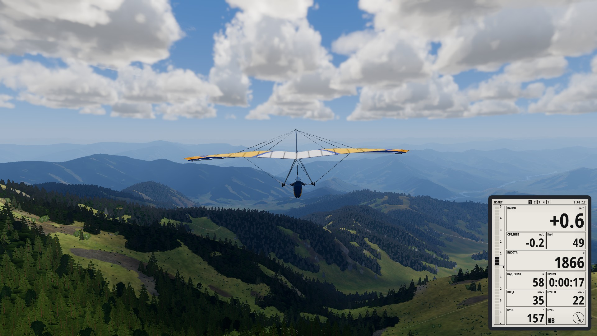
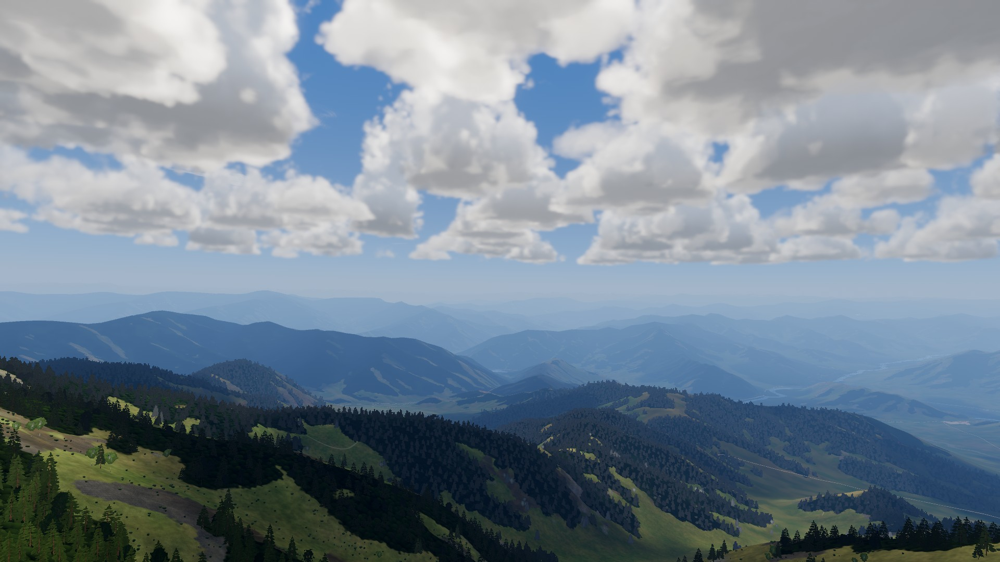
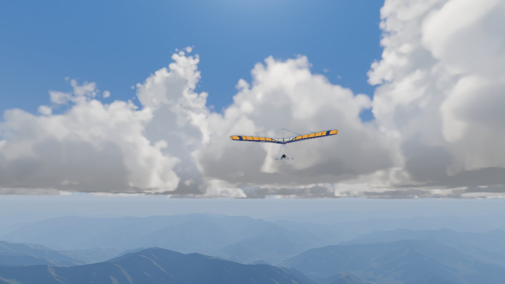

**English** | [Русский](README.ru.md)

# Deltaplan

A free-flight hang glider simulator: thermals, ridge lift and rotor turbulence, real terrain, real wings.
Open source, built with Godot 4 for Windows, Linux and macOS.

*The game and part of the documentation are in Russian; the project site has an English version.*

[Download on itch.io](https://thegriglat.itch.io/deltaplan) · Project site: [English](https://thegriglat.github.io/deltaplan/) / [Russian](https://thegriglat.github.io/deltaplan/ru/) ·
[What's new](CHANGELOG.md)



## Why

A game for people who already fly and want to fly once more at home, including at "their own" sites, and for those
curious what it is like to work a wing in a thermal over real mountains.

Principles: physics first (an honest model within its assumptions), everything else second; no HUD and no hints —
information comes only from the instruments and from what the pilot sees and feels; you can simply fly, with no
missions and no rush.

## Features

- **Flight** — weight-shift control, physically modelled launch run and takeoff, stall, hard landing and crash.
- **Wings** — 48 models in four groups, from training wings to sport topless gliders; geometry and characteristics
  come from manufacturer data sheets and [DHV](https://www.dhv.de) type tests, with a source given for every number.
- **Air** — the wind field over terrain is computed on the GPU (or by a neural network on the CPU, experimental):
  flow around slopes, rotor behind a ridge; thermals by time of day, dry and under cumulus clouds; turbulence.
- **Weather** — temperature, wind and cloud cover from a forecast; cumulus and cumulonimbus clouds, their shadows,
  thunderstorms.
- **Terrain** — any place by coordinates on the map.
- **Lift cues** — birds, dust, grass in the wind, other pilots.
- **Instruments** — variometer with audio, a tablet on the control bar.
- **Bots** — other pilots at launch and in the air.
- **Multiplayer** — fly with friends in the same sky (voice via an external voice chat).
- **Map view** — a free camera over the site with wind arrows.

Controls: keyboard, mouse, gamepad. More in the [Mechanics](https://thegriglat.github.io/deltaplan/mechanics/)
section of the site.

<p>
  
  
</p>

## Running from source

You need [Godot 4.7.2](https://godotengine.org/) (standard build, not .NET).

```bash
git clone https://github.com/thegriglat/deltaplan.git
cd deltaplan
godot --path .          # run the game
godot -e --path .       # open in the editor
```

The wind neural network runs through the `AirOnnx` GDExtension (ONNX Runtime, C++), which has to be built separately,
see [native/air_onnx/README.md](native/air_onnx/README.md). The game works without the extension: wind over terrain
is computed on the GPU or with a simplified model.

### Tests and build

```bash
tools/check.sh                    # linter, tests, Linux build, smoke run
tools/check.sh --filter=flight    # only tests whose name contains the substring
tools/gpu_tests.sh                # tests that need a GPU (windowed)
tools/build.sh all --release      # builds into build/<platform>/ (linux, windows, macos)
```

All scripts run Godot with a temporary profile (`XDG_DATA_HOME`), so your real settings and saves are not touched.
Game settings are JSON files in [configs/](configs/); in a build the `configs/` folder sits next to the game and can be edited without rebuilding.

### Multiplayer server

A relay written in Go, protobuf protocol: [server/README.md](server/README.md).

## Repository layout

| Directory | Contents |
|---|---|
| `scripts/`, `scenes/` | game code (GDScript) and scenes: flight, atmosphere, terrain, instruments, UI, network |
| `configs/` | parameters: wings, atmosphere, controls, sites, missions |
| `assets/` | models, textures, sounds, fonts; sources and licenses — [ASSETS.md](ASSETS.md) |
| `native/` | `AirOnnx` GDExtension (C++) |
| `server/` | multiplayer server (Go) |
| `tests/` | tests (`godot --headless --path . res://tests/run_tests.tscn`) |
| `tools/` | build, checks, Blender model generators, research (Python) |
| `docs/` | documentation: [docs/INDEX.md](docs/INDEX.md) is the entry point |
| `site/` | project site (Hugo, GitHub Pages) |

Game requirements — [REQUIREMENTS.md](REQUIREMENTS.md); module descriptions — `docs/guide/`; research and where the
model's numbers come from — `docs/research/` and the [Research](https://thegriglat.github.io/deltaplan/research/) section of the site.

## License

The code and the project's own materials — [MIT](LICENSE). Third-party assets (sounds, fonts, textures, models) are under their own
licenses, listed in [ASSETS.md](ASSETS.md); everything included in the game build allows commercial use (full license texts are in [licenses/](licenses/)).

## Acknowledgements

[DHV](https://www.dhv.de) (Deutscher Hängegleiterverband) — for the open data on wing data sheets and type tests.
The authors of the assets, fonts and sounds — see [ASSETS.md](ASSETS.md).
