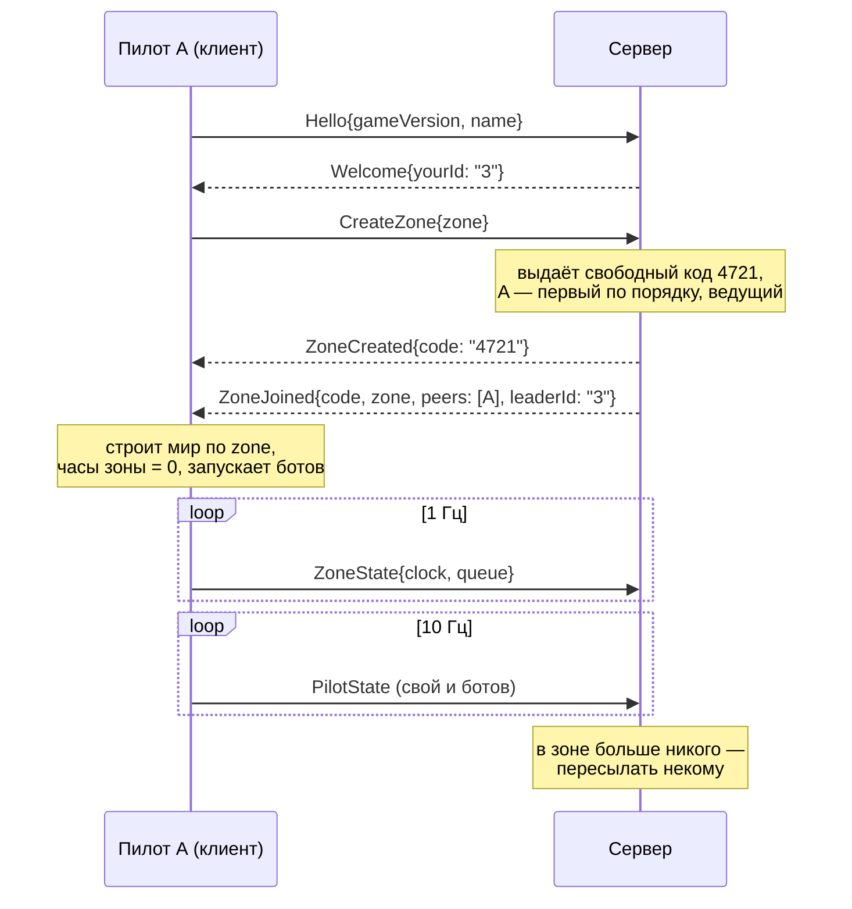
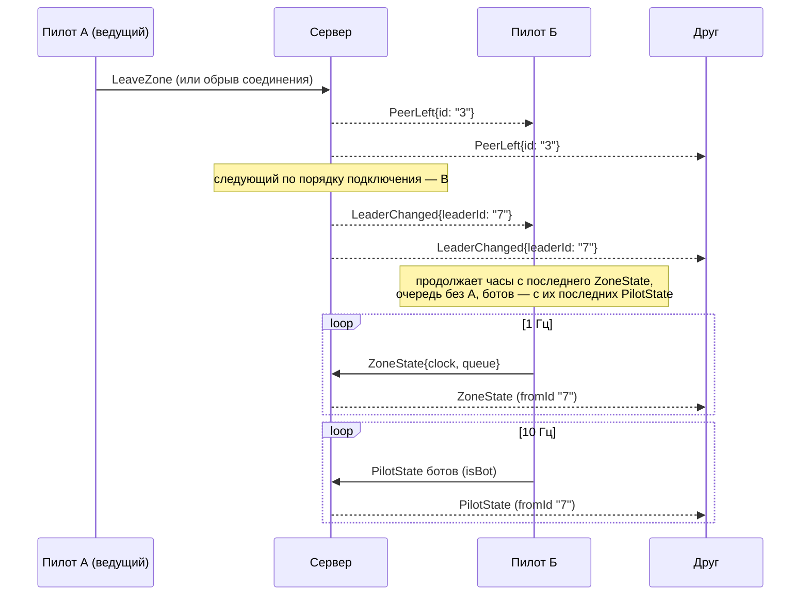
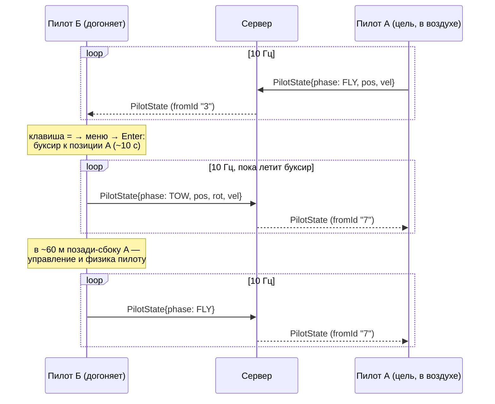

# Сетевой протокол Deltaplan

Единственный источник правды — `server/proto/deltaplan/v1/net.proto` (пакет `deltaplan.v1`). Этот документ объясняет его простыми словами, показывает пример каждого сообщения и основные сценарии. Если текст и `.proto` расходятся, прав `.proto`.

Все примеры JSON ниже проверяются машинно: `server/proto_examples_test.go` разбирает каждый блок ```` ```json ```` этого файла как `Envelope` (блоки ```` ```json lan-announce ```` — как `LanAnnounce`) и сверяет, что он совпадает с тем, что выдаёт Go `protojson`. Тесты клиента (NET-30) разбирают эти же блоки. Каждый пример стоит под заголовком `#### <ИмяСообщения>`.

Генерация Go-кода: `server/gen.sh` (`buf lint` + `buf generate` → `server/gen/deltaplan/v1/net.pb.go`).

## Транспорт

- Один WebSocket на клиента: `ws://IP:порт/v1/ws`. В Godot — встроенный `WebSocketPeer`.
- Каждый **текстовый** кадр — ровно одно сообщение `Envelope` в кодировке **proto3 JSON**. В `Envelope` задан ровно один вариант (`hello`, `pilotState`, …).
- Авторизации нет. Первым сообщением клиент шлёт `Hello`, до `Welcome` остальные сообщения сервер отклоняет (`ERROR_CODE_BAD_MESSAGE`).

### Что нужно учитывать клиенту на GDScript (proto3 JSON)

- **Ключи — lowerCamelCase**: поле `.proto` `pilot_id` в JSON — `pilotId`, `create_zone` — `createZone`. Сервер при разборе принимает и исходные имена (`pilot_id`), но клиент должен слать lowerCamelCase.
- **Значения по умолчанию опускаются.** Нет ключа — значит 0, `0.0`, `false`, `""`, пустой список или первое значение перечисления (`*_UNSPECIFIED`). Например, пилот над началом координат на высоте 0 придёт как `"pos": {}`, единичный кватернион — `{"w": 1}`, а `"isBot": false` вообще не приходит. Клиент обязан подставлять умолчания для любого отсутствующего ключа.
- **Перечисления — строками-именами**: `"phase": "PILOT_PHASE_FLY"`, `"code": "ERROR_CODE_ZONE_NOT_FOUND"`. Сервер принимает и числа, но клиент шлёт имена.
- **Целые 64-битные числа — строками.** В контракте их сейчас нет (используются `int32`/`uint32` — обычные числа JSON), но если появятся — придут как `"123"`.
- **Числа с плавающей точкой** — обычные числа JSON. Встроенный `JSON` Godot разбирает любые числа в `float`; целые поля (`month`, `seed`, `joinOrder`) приводить через `int()`. NaN/бесконечности не слать (в proto3 JSON это строки `"NaN"`, `"Infinity"` — их у нас не бывает).
- **Поля `optional`** (`pickLat`, `pickLon`): нет ключа — «не задано» (в `FlightSettings` это `NAN`); `0` — это настоящий ноль и в JSON присутствует.
- **Незнакомые ключи и незнакомые варианты `Envelope` пропускать молча** — это сообщения из более новой версии протокола.
- Пустое сообщение (`LeaveZone`) — пустой объект: `{"leaveZone": {}}`.
- `Envelope.fromId` заполняет только сервер при пересылке `PilotState`/`ZoneState` (id отправителя). Клиент его не шлёт (сервер затирает).

## Системы отсчёта и единицы

- **Координаты** (`pos`, `vel`): мир Godot, метры и м/с. X — восток, Y — вверх, −Z — север (+Z — юг). Начало координат — то же, что у локального мира, построенного по параметрам зоны (у всех одинаково).
- **Ориентация** (`rot`): кватернион Godot (`Quaternion(basis)` крыла), `{x, y, z, w}`.
- **Время зоны** (`ZoneState.clock`, `PilotState.t`): секунды от создания зоны, идёт ×1, паузой не останавливается. Время суток в зоне = `Zone.startHour + clock / 3600` часов.
- **Время сервера** (`Pong.serverTime`): секунды Unix с дробной частью. `Ping.clientTime` — любые монотонные часы клиента в секундах, сервер возвращает их без изменений.
- **Id пилотов** — строки. Живым выдаёт сервер (`"7"`), ботам — ведущий (`"bot-3"`); id бота не меняется при смене ведущего.
- **Код зоны** — 4 цифры строкой (`"4721"`). Для клиента это просто строка.

## Сообщения

| Сообщение | Кто шлёт → кому | Когда | Частота |
|---|---|---|---|
| `Hello` | клиент → сервер | сразу после подключения | 1 раз |
| `CreateZone` | клиент → сервер | «Создать» | по действию |
| `JoinZone` | клиент → сервер | «Присоединиться» | по действию |
| `LeaveZone` | клиент → сервер | «Выйти из зоны» | по действию |
| `Ping` | клиент → сервер | замер задержки и часов сервера | раз в 2 с |
| `Welcome` | сервер → клиент | ответ на `Hello` | 1 раз |
| `ZoneCreated` | сервер → создатель | ответ на `CreateZone`, сразу за ним `ZoneJoined` | по действию |
| `ZoneJoined` | сервер → вошедший | вход в зону (после создания или по коду) | по действию |
| `PeerJoined` | сервер → остальные в зоне | в зону вошёл пилот | по событию |
| `PeerLeft` | сервер → оставшиеся в зоне | пилот вышел или оборвался | по событию |
| `LeaderChanged` | сервер → все в зоне | ушёл ведущий (сразу после `PeerLeft`) | по событию |
| `Error` | сервер → клиент | ошибка в ответ на сообщение клиента | по событию |
| `Pong` | сервер → клиент | ответ на `Ping` | раз в 2 с |
| `PilotState` | клиент → сервер → остальные в зоне | своё состояние; ведущий — ещё и ботов | 10 Гц на пилота/бота |
| `ZoneState` | ведущий → сервер → остальные в зоне | часы зоны, очередь на старт, источники термиков из поля | 1 Гц |

Трафик: `PilotState` ~170 байт текста (раз в секунду полный, ~290 — см. «Экономия трафика» у примеров `PilotState`) × 10 Гц × ≤ 16 пилотов и ботов — единицы–десятки КБ/с на клиента на приём, ~1,9 КБ/с на отправку (у ведущего с ботами больше).

Коды ошибок (`ErrorCode`):

| Код | Когда |
|---|---|
| `ERROR_CODE_ZONE_NOT_FOUND` | `JoinZone` с кодом, которого нет среди активных зон |
| `ERROR_CODE_VERSION_MISMATCH` | версия игры (`Hello.gameVersion`) не совпадает с версией зоны (версией её создателя) или с версией, с которой запущен сервер |
| `ERROR_CODE_ZONE_FULL` | в зоне уже 16 живых пилотов |
| `ERROR_CODE_BAD_MESSAGE` | кадр не разобран или сообщение не к месту (до `Hello`, `JoinZone`/`CreateZone`, уже находясь в зоне, `PilotState` вне зоны) |

После `Error` соединение остаётся открытым. `Error.text` — пояснение для лога (по-английски); игроку игра показывает свой текст по `code`.

## Роль ведущего

- Ведущий — живой пилот зоны с наименьшим порядком подключения (`Peer.joinOrder`); решает сервер. Сначала это создатель. Ушёл ведущий — сервер шлёт `PeerLeft`, затем `LeaderChanged` со следующим по порядку.
- Ведущий **держит часы зоны**: раз в секунду шлёт `ZoneState.clock`. Остальные подстраивают свои часы (с поправкой на задержку). Новый ведущий продолжает с последнего полученного `ZoneState` без скачка.
- Ведущий **ведёт очередь на старт** (`ZoneState.queue`): сначала живые пилоты, потом боты; первый в очереди может разбегаться.
- Ведущий **считает ботов**: их число — `Zone.botsCount`, их состояния он рассылает как `PilotState` с `isBot: true` (в `Envelope.fromId` при этом id ведущего, в `pilotId` — id бота). Новый ведущий продолжает ботов с последних полученных состояний; число и имена ботов не меняются.
- Ведущий **выбирает источники термиков из поля воздуха** (`ZoneState.thermalSources`, AM-07, `docs/guide/air-model.md` → «Масштаб 2: термики из поля»): поле ветра каждый клиент считает сам на своей видеокарте, оно у всех чуть разное, и без ведущего источники (какие столбцы поля) расходятся (замер: 51 из 229 столбцов окна 100 м при шуме поля 1e-3·|u₀|). Ведущий шлёт подпись сетки (`grid`: "dx,x0,y0,nx,ny") и биты столбцов-источников (`mask`, base64, бит j·nx + i); сила, потолок и снос каждый считает по своему полю (расхождение — в пределах шума поля). Клиент с другой сеткой (или без поля) выбирает сам. Нет поля у ведущего — поля нет в сообщении. Новый ведущий переходит на свой выбор. Размер: сетка 96 × 96 — 1,5 КБ base64 в каждом `ZoneState`.
- `ZoneState` от не-ведущего сервер отбрасывает.

## Ключ мира (проверка, что мир одинаковый)

Мир каждый клиент строит сам по полям `Zone`. Чтобы заметить, что у двух клиентов миры разошлись (разные версии генератора мира, разное округление), создатель кладёт в `Zone` два поля:

- `worldKey` — канонический «ключ мира»: все параметры, от которых зависит мир, плюс версия генератора `v`, одной строкой в URL-виде. Ключи по алфавиту, формат чисел фиксирован (`lat`/`lon` точки старта — 5 знаков после точки), все ключи всегда (`hdg` — по желанию). Часы зоны не входят. Пример: `deltaplan://world?bots=4&date=2026-07-15&from=270&hour=13.00&lat=50.75120&lon=86.12030&seed=4711&sky=clear&temp=26.0&v=1&wind=3.0`. Точный формат задаёт игра (`FlightSettings.world_key(seed, botsCount)`).
- `worldHash` — первые 16 hex-символов (строчные) SHA-256 от `worldKey`; в GDScript `world_key.sha256_text().substr(0, 16)`.

Заполняет клиент создателя (`NetZone.create_zone`), сервер пересылает оба поля как есть и ничего с ними не делает. Вошедший строит мир по `Zone`, считает свой ключ и вызывает `NetZone.check_world(local_key)`: хэши не совпали — сигнал `world_mismatch(expected, actual)` и предупреждение в лог с обоими ключами. `worldHash` пуст (создатель старой версии) — проверка пропускается.

## Переподключение

Соединение оборвалось — пилот для сервера ушёл: остальным `PeerLeft` (и, если он был ведущим, `LeaderChanged`). Переподключение — это новое соединение: новый `Hello`, новый `Welcome` с **новым id**; клиент сам входит обратно по коду зоны (`JoinZone`) и встаёт в конец порядка подключения. Если за время обрыва из зоны вышли все, зона закрыта и код свободен — придёт `ERROR_CODE_ZONE_NOT_FOUND`.

Зона закрывается, когда из неё вышли все живые пилоты (боты зону не держат); код освобождается сразу.

## Поиск зон в локальной сети (LanAnnounce)

Главный случай — пилоты в одной комнате, зона на встроенном сервере игры (NET-22). Чтобы не диктовать адрес, игра с зоной объявляет её в локальной сети, а экран «Сетевая игра» у остальных показывает список «Рядом: зона 4721 — Коля».

- **Кто и когда:** игра со встроенным сервером, пока на нём есть зона — раз в секунду, одно объявление на каждую зону (первое — сразу при открытии зоны).
- **Как:** UDP broadcast на `255.255.255.255`, порт **8081** (`LanDiscovery.PORT`; WebSocket — 8080, рядом, чтобы открывать в брандмауэре парой). Одна датаграмма — proto3 JSON самого `LanAnnounce`, **без `Envelope`**: это не кадр WebSocket, другого содержимого на этом порту нет. Правила те же: lowerCamelCase, умолчания опускаются, незнакомые ключи пропускаются.
- **Адрес для входа:** получатель берёт IP отправителя датаграммы (он заведомо достижим из этой сети); поле `address` — только если адрес отправителя неизвестен. Подключение — `ws://<адрес>:<port>/v1/ws`, затем обычные `Hello` → `JoinZone{code}`.
- **Список у слушателя:** зона пропадает через **3 с** без объявлений. Зона другой версии игры (`gameVersion` ≠ своей) остаётся в списке, но помечена — войти в неё нельзя (`ERROR_CODE_VERSION_MISMATCH`). Своя зона (если игра и объявляет, и слушает) в списке тоже видна — это безвредно.
- **Ограничения:** broadcast не проходит через роутеры (только одна подсеть), уходит через сетевой интерфейс маршрута по умолчанию. На одной машине порт 8081 может слушать только один процесс; объявлять могут сколько угодно.

#### LanAnnounce
Пример блока — с меткой `json lan-announce` (проверяется как `LanAnnounce`, не как `Envelope`).
```json lan-announce
{"code": "4721", "hostName": "Коля", "address": "192.168.1.5", "port": 8080, "gameVersion": "0.7.1", "pilotsCount": 3}
```

## Примеры JSON

Все примеры — в точности то, что выдаёт Go `protojson` (порядок ключей для JSON не важен).

### Клиент → сервер

#### Hello
```json
{"hello": {"gameVersion": "0.7.1", "name": "Григорий"}}
```

#### CreateZone
Точка с карты не задана (`pickLat`/`pickLon` отсутствуют), встречный ветер на старте.
```json
{"createZone": {"zone": {"locationId": "altai", "siteId": "sinyukha_west", "month": 7, "day": 15, "startHour": 13.5, "forecast": {"temperatureC": 26, "windSpeedKmh": 10.8, "windIntoLaunch": true, "windFromDeg": 270, "sky": "partly"}, "seed": 918273, "botsCount": 4, "worldKey": "deltaplan://world?bots=4&date=2026-07-15&from=270&hour=13.50&lat=50.75120&lon=86.12030&seed=918273&sky=partly&temp=26.0&v=1&wind=3.0", "worldHash": "d46cfb35a9877d20"}}}
```

#### JoinZone
```json
{"joinZone": {"code": "4721"}}
```

#### LeaveZone
```json
{"leaveZone": {}}
```

#### Ping
```json
{"ping": {"clientTime": 1234.567}}
```

### Сервер → клиент

#### Welcome
```json
{"welcome": {"yourId": "7", "serverVersion": "1.0.0"}}
```

#### ZoneCreated
```json
{"zoneCreated": {"code": "4721"}}
```

#### ZoneJoined
Вход второго пилота в зону с точкой на карте; ведущий — создатель `"3"`.
```json
{"zoneJoined": {"code": "4721", "zone": {"locationId": "altai", "pickLat": 50.8125, "pickLon": 86.25, "month": 7, "day": 15, "startHour": 13, "forecast": {"temperatureC": 24, "windSpeedKmh": 7.2, "windFromDeg": 225, "sky": "clear"}, "seed": 42, "botsCount": 2, "worldKey": "deltaplan://world?bots=2&date=2026-07-15&from=225&hour=13.00&lat=50.81250&lon=86.25000&seed=42&sky=clear&temp=24.0&v=1&wind=2.0", "worldHash": "625460258ce20bd8"}, "peers": [{"id": "3", "name": "Пилот А", "joinOrder": 1}, {"id": "7", "name": "Пилот Б", "joinOrder": 2}], "leaderId": "3"}}
```

#### PeerJoined
```json
{"peerJoined": {"peer": {"id": "7", "name": "Пилот Б", "joinOrder": 2}}}
```

#### PeerLeft
```json
{"peerLeft": {"id": "3"}}
```

#### LeaderChanged
```json
{"leaderChanged": {"leaderId": "7"}}
```

#### Error
```json
{"error": {"code": "ERROR_CODE_ZONE_NOT_FOUND", "text": "zone 4721 not found"}}
```

#### Pong
```json
{"pong": {"clientTime": 1234.567, "serverTime": 1790000000.25}}
```

### Пересылаемые внутри зоны

#### PilotState
Живой пилот в полёте, как его получают остальные (сервер добавил `fromId`). Крен/курс — в кватернионе; расцветка паруса задана.
```json
{"fromId": "7", "pilotState": {"pilotId": "7", "name": "Пилот Б", "t": 845.3, "pos": {"x": 120.5, "y": 1850.25, "z": -340.75}, "rot": {"y": 0.6, "w": 0.8}, "vel": {"x": 9.5, "y": -1.25, "z": -6}, "phase": "PILOT_PHASE_FLY", "wing": "wings/sport", "colors": {"hueDeg": 222, "sat": 1, "value": 1}}}
```

#### PilotState (бот)
Бот стоит в очереди на старте; шлёт ведущий `"3"`.
```json
{"fromId": "3", "pilotState": {"pilotId": "bot-2", "isBot": true, "name": "Андрей", "t": 845.3, "pos": {"x": -12, "y": 1320.5, "z": 8.25}, "rot": {"w": 1}, "vel": {}, "phase": "PILOT_PHASE_STAND", "wing": "wings/laminar", "colors": {"hueDeg": 28, "sat": 1, "value": 1}}}
```

#### PilotState (обычный пакет)
Между полными пакетами: без `name`, `wing`, `colors` и без неизменившейся `phase` (см. ниже).
```json
{"fromId": "7", "pilotState": {"pilotId": "7", "t": 845.4, "pos": {"x": 121.45, "y": 1850.13, "z": -341.35}, "rot": {"y": 0.601, "w": 0.799}, "vel": {"x": 9.48, "y": -1.25, "z": -6.02}}}
```

**Экономия трафика `PilotState`** (клиент NetPilots, NET-32; `.proto` не меняется). Полный пакет со всеми полями — ~290 байт, ×10 Гц ≈ 3 КБ/с при бюджете клиента 2 КБ/с. Поэтому:
- числа округляются: `pos` — до 0,01 м, `vel` — до 0,01 м/с, `rot` — до 0,001, `t` — до 0,001 с;
- `name`, `wing`, `colors` — раз в секунду и сразу при изменении («полный пакет»). Признак полного пакета — непустой `wing`; в полном пакете нет `colors` — родная текстура. В остальных пакетах получатель держит последние известные;
- `phase` — при смене (3 пакета подряд, на случай потерь) и в каждом полном пакете; нет (`PILOT_PHASE_UNSPECIFIED`) — прежняя;
- `pilotId` шлётся всегда, `isBot: true` — в каждом пакете бота.

Итог (tests/net/test_interpolation.gd): обычный пакет ~165–175 байт, полный ~290; вместе с заголовком кадра WebSocket — ~1,9 КБ/с на отправку своего состояния.

#### ZoneState
Очередь: два живых пилота, затем два бота.
```json
{"fromId": "3", "zoneState": {"clock": 845.5, "queue": ["7", "3", "bot-1", "bot-2"]}}
```
С источниками термиков из поля (сетка 4 × 4 для примера: источники в столбцах 1 и 10).
```json
{"fromId": "3", "zoneState": {"clock": 845.5, "queue": ["3"], "thermalSources": {"grid": "400.000,-19200.000,-19200.000,4,4", "mask": "AgQ="}}}
```

## Сценарии

### 1. Создать зону



### 2. Войти в зону

```mermaid
sequenceDiagram
    participant B as Пилот Б (клиент)
    participant S as Сервер
    participant A as Пилот А (ведущий)
    B->>S: Hello{gameVersion, name}
    S-->>B: Welcome{yourId: "7"}
    B->>S: JoinZone{code: "4721"}
    alt нет зоны / другая версия / полна
        S-->>B: Error{ZONE_NOT_FOUND | VERSION_MISMATCH | ZONE_FULL}
    else
        S-->>B: ZoneJoined{code, zone, peers: [A, B], leaderId: "3"}
        S-->>A: PeerJoined{peer: B}
        A->>S: ZoneState{clock, queue: [.., "7", bots]}
        S-->>B: ZoneState (fromId "3")
        Note over B: строит мир по zone с часами clock,<br/>сверяет worldHash (check_world);<br/>ведущий на земле → в очередь,<br/>в воздухе → «догнать» (сценарий 4)
        A->>S: PilotState (свой и ботов)
        S-->>B: PilotState (fromId "3")
        B->>S: PilotState
        S-->>A: PilotState (fromId "7")
    end
```

### 3. Ведущий вышел



Если ушёл последний живой пилот — зона закрыта, код свободен.

### 4. Догнать

«Догнать» целиком на клиенте: отдельных сообщений нет. Клиент выбирает цель по последним `PilotState` других, ведёт буксир сам и продолжает слать своё состояние 10 Гц с фазой `PILOT_PHASE_TOW`; остальные видят обычное движение в позе полёта. Из очереди пилот при этом выходит — ведущий убирает его из `ZoneState.queue`, увидев фазу не на старте.



## Правила эволюции

- Только **добавлять** поля и сообщения — с новыми номерами. Номера, типы и смысл существующих полей не меняются; номера удалённых полей не переиспользуются (объявляются `reserved`).
- Новые варианты `Envelope` — новые номера в `oneof`.
- **Незнакомое игнорируется**: сервер разбирает кадры с `protojson` `DiscardUnknown`, клиент пропускает незнакомые ключи и незнакомые варианты `Envelope`. Поэтому старый клиент и новый сервер (и наоборот) продолжают работать, пока смысл старых полей не менялся.
- Несовместимое изменение — только новым пакетом (`deltaplan.v2`) и новым путём (`/v2/ws`).
- Совместимость проверяется `buf breaking` против предыдущей версии (правила `FILE` в `server/buf.yaml`).
- Версия игры (`Hello.gameVersion`) защищает от разных версий в одной зоне независимо от протокола.
