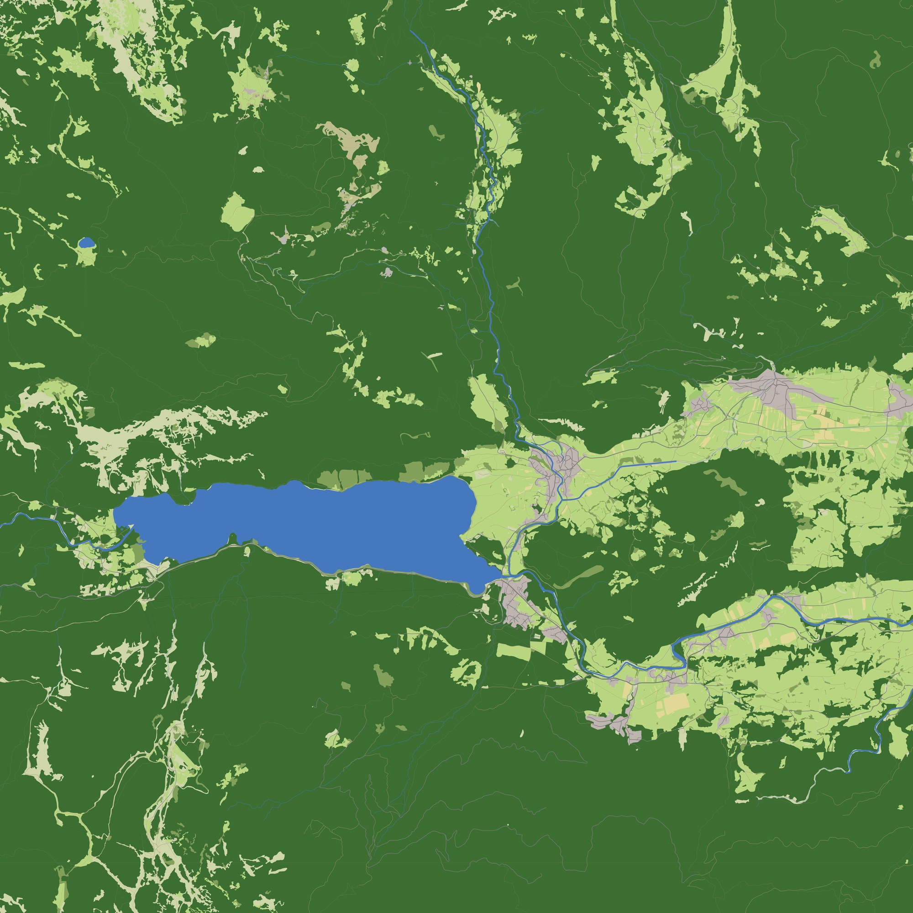

# Размер офлайн-пакета: вектор OSM + рельеф + покров (замер на Словении)

Замер к плану `offline_world_data.md` (этапы 0 и 1). 30.09.2026. Код игры не менялся. Код, числа,
картинки и команды — `tools/research/osm_pack/` (README там же).

**Коротко.** Вся Словения в нашем формате занимает **≈ 80 МБ**: вектор OSM 63 МБ, рельеф 30 м
14 МБ, покров 25 м 2,4 МБ. **81 % вектора — землепользование.** В Словении это импорт, очень
плотная разметка, так что оценка верхняя. Для Альп пакет выйдет порядка 150–300 МБ на страну.
**Россия одним пакетом — ~14 ГБ (оценка), почти всё — рельеф и покров, а не OSM.** Раздавать её
нужно по субъектам (Республика Алтай — порядка 90 МБ, оценка) или ячейками по запросу. Рисовать
подложку из вектора дёшево: квадрат 10×10 км при 1 м/пикс рисуется на CPU в один поток за
1–2 с.

## 1. Что замерили
- **Источник.** Geofabrik `europe/slovenia-latest.osm.pbf`, выгрузка от 28.09.2026 20:23Z.
  Фильтр слоёв — `osmium tags-filter` (`filter.txt`). Заборы (`barrier`) и дома (`building`) не
  брали.
- **Формат** (`osmpack.py`). Ячейка 0,25°×0,25° (≈ 19×28 км). В ячейке объекты разложены по
  потокам: дороги, track/path, ж/д, водотоки, водоёмы, покров, обрывы, place, «объекты для
  пилота», имена. На объект пишется класс (varint) и байт флагов (ширина, высота/ele, имя,
  тоннель, мост). Координаты — целые метры в локальной сетке ячейки: дельты по цепочке, zigzag,
  varint. Мультиполигоны собраны в кольца с дырами (pyosmium). Геометрия режется по границам
  ячеек и упрощается Дугласом–Пейкером с допуском 1 м. Каждая ячейка сжимается отдельно:
  brotli q11 и zstd 19.
- **Рельеф и покров** (`slovenia_rasters.py`). Взяты два пробных квадрата 0,5°: «горы» (Юлийские
  Альпы: Триглав, Бохинь, Соча) и «холмы» (к югу от Любляны). В каждом по 4 ячейки. Результат
  пересчитан на площадь страны. Рельеф — Copernicus GLO-30 в родной сетке (1″ ≈ 31×21 м).
  Высоты квантованы (int с шагом 1 м или 0,1 м от минимума ячейки), затем плоский предсказатель
  a+b−c, zigzag и разнос по байтовым плоскостям. Покров — классы ESA WorldCover (uint8) на 10 м
  и на 25 м (ближайший сосед). Скачано ≈ 83 МБ.
- **Итог по OSM** считали по 65 ячейкам, которые пересекают границу Словении (площадь
  20,4 тыс. км²).

## 2. Словения: таблица размеров
| Что | Сырое | brotli | zstd | байт/км² (brotli) |
|---|---:|---:|---:|---:|
| Исходный PBF Geofabrik (весь OSM) | 313,3 МБ | — | — | 15 460 |
| PBF после фильтра слоёв (с метаданными / без) | 252,9 / 235,7 МБ | — | — | — |
| (для сравнения: только `building=*`) | 47,8 МБ | — | — | — |
| **Наш вектор, всё** | 85,4 МБ | **63,2 МБ** | 64,0 МБ | **3 100** |
| Наш вектор без track/path | 80,1 МБ | 59,0 МБ | 59,7 МБ | 2 890 |
| — землепользование + natural (+обрывы) | 70,6 | **51,5** | 52,0 | 2 520 |
| — дороги (без track/path) | 6,6 | 5,3 | 5,3 | 260 |
| — track/path | 5,3 | 4,2 | 4,3 | 210 |
| — вода (линии 1,0 + площади 0,25) | 1,5 | 1,2 | 1,2 | 60 |
| — объекты для пилота (ЛЭП, канатки, аэродромы, старты, мачты, вершины) | 0,56 | 0,40 | 0,43 | 19 |
| — place (узлы и полигоны) | 0,55 | 0,42 | 0,44 | 21 |
| — ж/д | 0,11 | 0,09 | 0,09 | 4 |
| — имена (place, вершины, аэродромы, старты) | 0,23 | 0,12 | 0,13 | 6 |
| **Рельеф 30 м, шаг 1 м, с предсказателем** | — | **13,6 МБ** | 14,1 МБ | 670 (горы 709, холмы 633) |
| рельеф 30 м, шаг 0,1 м, с предсказателем | — | 26,0 МБ | — | 1 280 |
| рельеф 30 м, шаг 1 м, без предсказателя | — | 24,4 МБ | — | 1 200 |
| рельеф 30 м, float32 + brotli (как `data/terrain` сейчас) | — | 91,8 МБ | — | 4 530 |
| дальний рельеф ~90 м / ~210 м (средние 3×3 / 7×7), шаг 1 м | — | 2,2 / 0,5 МБ | — | 109 / 25 |
| **Покров WorldCover 25 м** | — | **2,4 МБ** | 2,5 МБ | 117 |
| покров WorldCover 10 м | — | 7,5 МБ | 8,5 МБ | 371 |
| **Пакет Словении целиком** (вектор + рельеф 30 м/1 м + покров 25 м + дальний 210 м) | — | **≈ 80 МБ** | — | ≈ 3 900 |

Разбивка по слоям — сумма потоков, каждый сжат отдельно в своей ячейке, поэтому она на ~1 %
больше «всего». Ячейка brotli: медиана 1,0 МБ, максимум 2,4 МБ. Рельеф и покров — пересчёт
двух квадратов (8 ячеек) на 20 271 км², то есть оценка по замеру.

**Время** (один поток Python, 20 ядер не использованы):
- фильтр `osmium tags-filter` — 9 с;
- разбор, сборка мультиполигонов, нарезка и упрощение (pyosmium + shapely) — 865 с;
- сжатие — 907 с. Это с тройной работой (весь блоб, вариант без track/path, каждый поток
  отдельно; brotli q11). В сборщике хватит одного прохода.

**Объекты для пилота в Словении** (число объектов OSM; в скобках — сколько из них с
`height`/`ele`):

| Тип | Сколько |
|---|---|
| Старты и посадки дельта/пара (`sport=free_flying`, `free_flying:*`) | **63**: старт 31 точка + 8 полигонов (20 с ele), «старт;верхняя посадка» 1, верхняя посадка 1, посадка 8 + 2, «площадка» без уточнения 8 + 4 |
| Аэродромы / взлётные полосы / вертолётные площадки | 40 (10) / 3 полосы-airstrip + 53 runway / 55 (3) |
| ЛЭП | линий 749, малых линий 3 615, опор 13 540 (4), столбов 44 104 (149) |
| Канатки | линий ≈ 250 (кресельные 56, бугельные 45+31+35, грузовые 24, тросовые спуски 23 и др.), опор 742 |
| Ветряки | 20 (0) |
| Мачты / башни / трубы / телебашни | 682 (80) / 2 317 (171) / 71 (11) / 5 (1) |
| Вершины / седловины с именем | 11 128 (11 107) / 364 (357) |

Высота у мачт и башен указана редко (6–12 %). Под `man_made=tower` попадают и колокольни, и
смотровые вышки. Заданной высоты у препятствий почти нет: её придётся брать по типу или из DSM.

## 3. Растеризация 10×10 км при 1 м/пикс (CPU)
Использовали skia-python: один поток, сглаживание, 10000×10000 пикс. Цвет задан по классу,
тоннели и точки не рисовали. Декодировали целые ячейки (2 шт., ≈ 970 км², хотя нужно 100 км²) на
чистом Python.

| Квадрат | Объектов | Декодирование | Сборка путей | Рисование |
|---|---:|---:|---:|---:|
| Бохинь (46,29° с. ш., 13,88° в. д.) | 49 119 | 1,5 с | 1,2 с | **1,7 с** |
| Триглав / Трента (46,39; 13,78) | 36 314 | 1,4 с | 1,0 с | **1,1 с** |

Пересчёт на плитку 2×2 км при 1 м выходит < 0,1 с на CPU (оценка), так что на GPU запас большой.

Картинки (уменьшенная копия 10×10 км и фрагмент 2×2 км в масштабе 1:1):
- `tools/research/osm_pack/results/bohinj_full_small.jpg`, `bohinj_crop_1m.jpg`
- `tools/research/osm_pack/results/triglav_full_small.jpg`, `triglav_crop_1m.jpg`



**Что видно.** Лес, луга, поля, посёлки, реки с шириной и дороги ложатся чисто, швов по
границам ячеек не видно. **Выше леса в районе Триглава OSM почти пуст.** `bare_rock`/`scree`
размечены пятнами, и большие площади остаются цвета «нет данных». Значит, WorldCover (класс 60 —
голый грунт, 70 — снег) нужен как подложка под вектором, а не вместо него.

## 4. Землепользование — куда уходит объём
Проверка на трёх ячейках (`lc_check.py`: две у Бохиня и одна у Любляны):
- **Общие вершины.** Уникальных вершин 61–70 % от всех: соседние полигоны импорта хранят
  общую границу дважды. Топологическое кодирование (общие рёбра один раз) даст порядка
  **−25…35 %** слоя (оценка по вершинам, не проверено).
- **Заранее растеризованный покров** (uint8-классы без сглаживания): на 5 м это 0,55–0,85 объёма
  вектора, на 2 м — 1,8–2,4. Вектор с точностью 1 м компактнее растра той же чёткости. Растр
  5 м меньше, но при подложке 0,5–1 м края полей будут ступенями по 5 м.
- **Выкинуть track/path** — это −7 % (4,2 МБ). Мало, а тропы и грунтовки видны с воздуха.

## 5. Экстраполяция (оценка)
Логика расчёта:
- **OSM «по доле PBF».** Наш пакет = 20,2 % исходного PBF Словении; эту долю переносим на
  размеры PBF других регионов (Content-Length на 30.09.2026). В Словении дома — всего 15 % PBF,
  а там, где их больше (города, Россия, мир), доля нужных слоёв ниже. Поэтому это оценка сверху.
- **OSM «по плотности».** 3,1 КБ/км² Словении × площадь. Годится только для так же плотно
  размеченных стран.
- **Рельеф + покров.** 790 байт/км² (рельеф 30 м с шагом 1 м — 670, покров 25 м — 117) ×
  площадь. Словения холмистая и гористая, равнины сжимаются лучше, так что и это оценка сверху.

| Регион | PBF | OSM (доля PBF) | OSM (плотность Словении) | Рельеф 30 м + покров 25 м | Итого (оценка) |
|---|---:|---:|---:|---:|---:|
| Словения (замер) | 313 МБ | 63 МБ | 63 МБ | 16 МБ | **≈ 80 МБ** |
| Швейцария | 547 МБ | 110 МБ | 129 МБ | 33 МБ | **≈ 150 МБ** |
| Австрия | 811 МБ | 164 МБ | 262 МБ | 66 МБ | **≈ 230–330 МБ** |
| Россия | 4,17 ГБ | ≤ 0,84 ГБ | (53 ГБ — неприменимо) | 13,5 ГБ | **≈ 14 ГБ** |
| Мир (planet, суша без Антарктиды) | 95 ГБ | ≤ 19 ГБ | — | 106 ГБ | **≈ 110–125 ГБ** |

Покров 10 м вместо 25 м добавляет примерно +25 % к растрам: Россия +4,3 ГБ, мир +34 ГБ.

**Разброс плотности OSM** (замер фильтра до отмены расширения на Алтай). Республика Алтай
(92,9 тыс. км², вырез из `siberian-fed-district` по границе, `complete_ways`): PBF 63,3 МБ,
то есть **680 байт/км² против 15 460 у Словении — в 23 раза реже**. Нужные слои составляют там
91 % PBF: домов мало, а покров размечен полигонами. Пакет Республики Алтай ≈ 0,2 × 63 ≈ 13 МБ
OSM + 93 тыс. км² × 790 байт ≈ 73 МБ растров ≈ **90 МБ (оценка; пакет не собирали)**. В
редко размеченных регионах основной объём занимают рельеф и покров.

## 6. Выводы
- **Смысл есть на уровне страны или субъекта, а не всей России.** Словения — 80 МБ, альпийская
  страна — 150–300 МБ, субъект РФ — десятки–сотни МБ (оценка). Россия целиком — ~14 ГБ, мир —
  ~110+ ГБ. Это уже не «положить рядом с игрой»: нужны пакеты по регионам или ячейки 0,25° по
  запросу (медиана 1 МБ на ячейку OSM плюс ~0,4 МБ растров).
- **Рельеф хранить как int16 с шагом 1 м и плоским предсказателем, brotli.** Это в 6,7 раза
  меньше, чем float32 + brotli сейчас: 670 против 4 530 байт/км². Шаг 0,1 м удваивает размер,
  а при шуме GLO-30 в метры смысла не имеет. Дальний слой (~210 м) почти бесплатный: 25 байт/км².
- **Покров WorldCover 25 м** (117 байт/км²) — как фон под вектором. Там, где OSM пуст (высокогорье
  Триглава), без него никак. 10 м — втрое дороже, и при векторе нужен мало.
- **OSM.** Формат «ячейка 0,25° + потоки по слоям + zigzag-varint + brotli» работает. brotli и
  zstd близки (zstd больше на 1–4 % у OSM и рельефа, на 13 % у покрова 10 м; распаковывается быстрее). Главный резерв — топология
  покрова (−25…35 %, оценка). track/path оставить. Заборы не берём (решение пользователя).
- **Точности хватает.** Квантование 1 м + Дуглас–Пейкер 1 м дают подложку 1 м/пикс без видимых
  изъянов (см. фрагменты 1:1).

**Риски**
- **Лицензия ODbL.** Пакет — производная база данных. Раздавать его можно с атрибуцией
  «© OpenStreetMap contributors» и на условиях ODbL (share-alike для базы, не для игры).
- **Скорость сборки.** Однопоточный pyosmium — 15 мин на Словению. На Россию (PBF в 13 раз
  больше) это часы. Нужен параллельный разбор по регионам или ячейкам либо сборщик на C++
  (libosmium).
- **Неоднородность OSM.** Импорт покрова есть не везде. Высоты препятствий размечены редко.
  Под `man_made=tower` попадают колокольни.
- **Сдвиг покрова.** Классы покрова в OSM и в WorldCover размечены по-разному: на стыке будет
  видна граница «вектор/растр».

## 7. Что не проверено
- Реальные пакеты Швейцарии, Австрии и Республики Алтай (там только оценка; сборка Алтая
  отменена).
- Топологическое кодирование покрова и уровни детализации для дали.
- Сетка 0,5 м и другие допуски упрощения.
- Растеризация на GPU и декодер не на Python.
- Рельеф и покров по всей Словении (замер по 8 ячейкам 0,25° из 65).
- Равнинные регионы (там рельеф сжимается лучше).

## 8. Минимальный пакет OSM (замер 10.10.2026, Словения)
Решение: из OSM брать минимум. Состав: **озёра** (маска 10 м, 1 бит/клетку; `natural=water`,
`water=*`, `landuse=reservoir|basin`; реки — `water=river|canal|stream|ditch|drain|riverbank|
stream_pool` и `waterway=*` не берём, дыры мультиполигонов честные), **посёлки** `place=*`
(точка + имя, площадной контур, если есть), **аэродромы** `aeroway=aerodrome|airstrip|helipad`
(точка/контур) и `runway` (линия), **старты** `sport=free_flying`, `free_flying:*`, **обрывы**
`natural=cliff`, **дороги** (по заданию добавлены) `highway=*` всех классов (класс сохранён,
флаги тоннель/мост, ширина; имён нет) и `railway=rail|narrow_gauge`. Больше ничего (ни landuse,
ни ЛЭП, зданий, мачт, вершин, канаток). Фильтр — `filter_min.txt`, сборка — `build_min.py`.

Источник: Geofabrik `europe/slovenia-latest.osm.pbf`, `Last-Modified` 2026-10-08 23:04 GMT,
299,0 МБ (313 335 209 в прошлом замере от 28.09), md5 `8e661b185bdebdec030be771c1d81f01`.
После фильтра — 54,6 МБ. Формат — как в §1 (ячейка 0,25°, метры ячейки, zigzag-varint дельты,
ДП 1 м, сетка 1 м); потоки ячейки сжаты zstd 19 по отдельности, целый блоб — отдельно (brotli
q11 даёт на 1–2 % меньше). Считано по 65 ячейкам 0,25°, пересекающим границу (20 423 км²).

### 8.1 Размер по потокам (zstd 19, байт; сумма по 65 ячейкам; в ячейке — среднее / медиана / макс по 65)
| Поток | Объектов (частей) | Всего | Байт/ячейка: среднее / медиана / макс |
|---|---|---|---|
| дороги без track/path/footway | 284 871 | 4 842 860 | 74 506 / 69 985 / 268 090 |
| **дороги track/path/footway** | 228 858 | **4 823 763** | 74 212 / 54 440 / 313 368 |
| ж/д | 6 683 | 93 673 | 1 441 / 756 / 9 969 |
| маска озёр (лучшая кодировка) | 3 882 озёрных частей | 71 604 | 1 102 / 497 / 7 240 |
| посёлки (`place`) | 11 840 | 441 401 | 6 791 / 6 383 / 17 704 |
| аэродромы | 157 | 3 427 | 53 / 30 / 372 |
| старты | 67 | 1 100 | 17 / 0 / 114 |
| обрывы | 1 190 | 28 442 | 438 / 59 / 9 623 |
| имена (общая таблица ячейки) | — | 72 036 | 1 108 / 1 088 / 3 160 |
| **Итого (блок без озёр + маска)** | | **10 389 389 (10,4 МБ)** | 159 837 / 179 346 / 579 242 |
Итого brotli q11 — 10 226 242. Это 509 Б/км². **Дороги = 93 % пакета (9,67 МБ), мелкие
track/path/footway — 46 % пакета (4,82 МБ)**; без дорог остальное — ≈ 0,7 МБ, из них посёлки с
именами 0,5 МБ. Без мелких дорог пакет 5,6 МБ. В классах «дорог без tp» остались `service`
(127 870), `unclassified`, `residential`, `steps`, `proposed`/`planned` (≈ 1 300; можно
отрезать), `platform`, `via_ferrata` и пр. — резать по классу можно и дальше.

### 8.2 Озёра: маска против вектора
Маска 10 м: 688 151 клетка = 68,8 км² воды в 58 ячейках; растр ячейки 1930×2780 (5,4 М бит,
0,67 МБ сырых). Кодировки (сумма, zstd): packbits по строкам 91 420 Б; **длины серий varint
71 650 Б** (бротли 67 148); лучшая из двух на каждую ячейку — 71 604. Вектор озёр (ДП 1 м,
сетка 1 м, 3 882 части): 119 006 Б (brotli 116 680). **Выбрана маска (кодировка длин серий):
72 КБ против 119 КБ, в 1,7 раза меньше**, и клетка готова для игры без растеризации; но ценой
10 м-ступеньки на берегу. На всю пакетную сумму разница — 0,4 %, решает не размер, а удобство.
Мелкие пруды < 10 м пропадают (пустых в маске частей — 0). Проверка: `results/bohinj_lake_mask.jpg`
(Бохинь, маска серым + вектор красным из той же ячейки, 6×6 км).

### 8.3 Мировой уровень (1° ячейка, сетка 10 м, ДП 20 м)
Состав: дороги только `motorway|trunk|primary|secondary` (без `_link`), ж/д `rail`; посёлки
`city|town|village` — точка + имя (площадные — `point_on_surface`); озёра ≥ 1 км² контуром
(ДП 20 м, не маска); аэродромы точкой; старты точкой + имя; обрывов нет.
Словения, 7 ячеек 1°, 20 423 км²: **211 336 Б zstd (198 КБ brotli) = 10,3 Б/км²**; макс. ячейка
55,9 КБ, медиана 23,9 КБ. По потокам: дороги 114 547, ж/д 37 817, посёлки 27 657 (4 912 точек),
озёра 1 502 (всего 8 озёр ≥ 1 км²), аэродромы 716 (98), старты 554 (67), имена 28 197.

### 8.4 Оценка на планету (оценка, а не замер)
PBF planet 94,98 ГБ (Content-Length на 30.09), суша 134 млн км².
| Уровень | Словения | По доле PBF (×303) | По плотности на км² |
|---|---|---|---|
| detail (с мелкими дорогами) | 10,4 МБ | 3,1 ГБ | 68 ГБ |
| world | 0,21 МБ | 64 МБ | 1,4 ГБ |
Расхождение в 20 раз — не ошибка, а граница оценки. Словения плотна по OSM (PBF 15 КБ/км², а
у планеты в среднем 0,7 КБ/км²; большая часть суши размечена слабо): плотность на км² даёт
верхнюю границу, доля PBF — нижнюю (по замеру второго региона не проверено), правда где-то
между. Ориентир (догадка): world — порядка 0,1–0,4 ГБ, detail — единицы–десятки ГБ. Главное:
в detail 93 % — дороги, 46 % — track/path/footway: без мелких дорог оценка делится примерно
на два, без дорог — падает в ≈ 14 раз. Разреженные
регионы (Сибирь, Сахара, Австралия) дадут десятки байт/км², а оценка по плотности для них
бессмысленна; по доле PBF — честнее. Здесь границы — эвристика, не подтверждённая замером
второго региона.

### 8.5 Время и стриминг
Сборка Словении (pyosmium, один поток, оба уровня за проход): разбор+геометрия 138 с, растр масок
+ запись ячеек 0,4 с, сжатие и анализ (16 процессов) 19 с; `osmium tags-filter` — 6 с.
**Мировой уровень потоком без хранения planet:** нет в одну команду — `osmium tags-filter`
без `-R` читает вход до трёх раз (стрейм из `curl | … -F pbf -` не годится), а с `-R` (один
проход) узлы ломаных не копируются, так что геометрии дорог и озёр не собрать; из stdin можно
только точечные слои (посёлки, аэродромы, старты). Дороги и озёра с геометрией требуют
индекса координат узлов на всю планету (у `sparse_file_array` — десятки ГБ на диске) или хранения
planet на время сборки (95 ГБ). Проверено по `osmium help tags-filter`, planet не скачивался.

### 8.6 Воспроизведение
```bash
D=/home/greg/deltaplan_data/osm_pack; cd tools/research/osm_pack
curl -sSL -o $D/slovenia-latest.osm.pbf https://download.geofabrik.de/europe/slovenia-latest.osm.pbf
osmium tags-filter -O -o $D/slovenia-min.osm.pbf $D/slovenia-latest.osm.pbf -e filter_min.txt
# граница: osmium getid -r r218657 ... (см. README), $D/slovenia_boundary.geojson
uv venv $D/venv && uv pip install -p $D/venv/bin/python osmium shapely numpy brotli zstandard pillow
$D/venv/bin/python -I build_min.py $D/slovenia-min.osm.pbf $D/out_min
$D/venv/bin/python -I analyze_min.py $D/out_min $D/slovenia_boundary.geojson results/slovenia_min.json
python3 -I summarize_min.py
$D/venv/bin/python -I fig_mask.py $D/out_min results/bohinj_lake_mask.jpg
```
Числа: `results/slovenia_min.json`, `results/summary_min.json`, `results/build_min_stats.json`.

### 8.7 Что странного
- Среди «дорог» — `highway=proposed|planned|no|elevator|ladder|platform` (≈ 1 300) — мусор класса.
- Всего 8 озёр ≥ 1 км² в Словении — на мировом уровне озёра почти ничего не стоят.
- Площадные `place` и аэродромы на мировом уровне превращены в точку (21 + 57 штук).
- Планетная оценка (§8.4) — на порядок неопределённая; число по доле PBF и по плотности нельзя
  усреднять.
