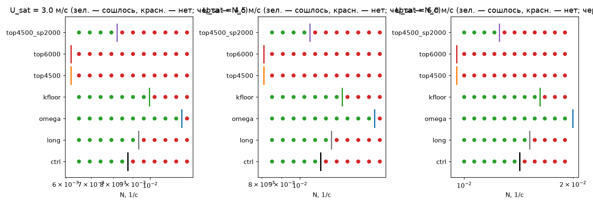
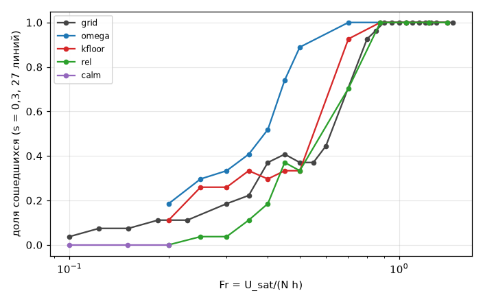
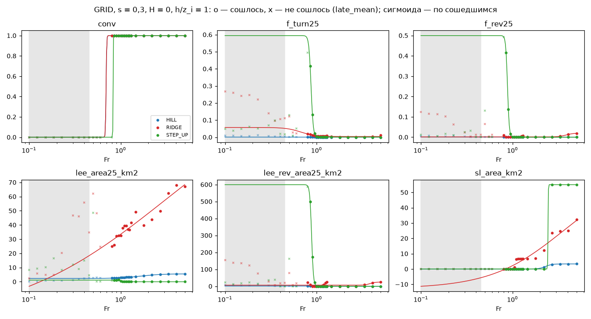
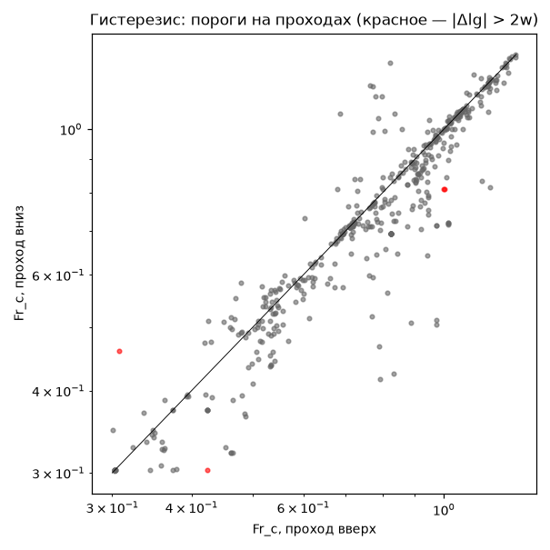
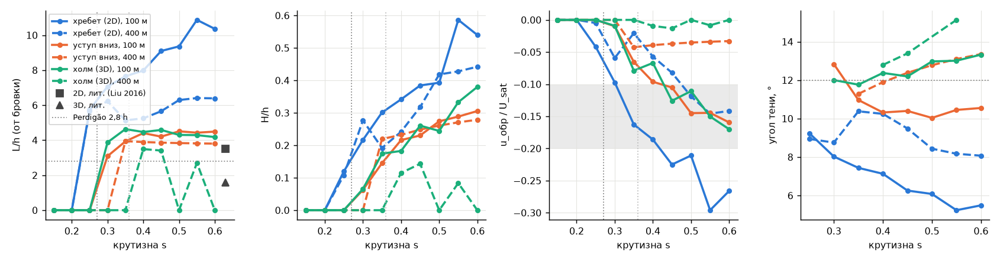
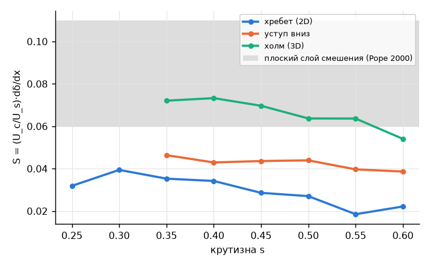
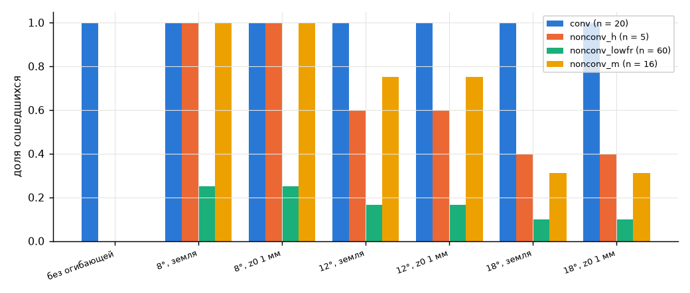
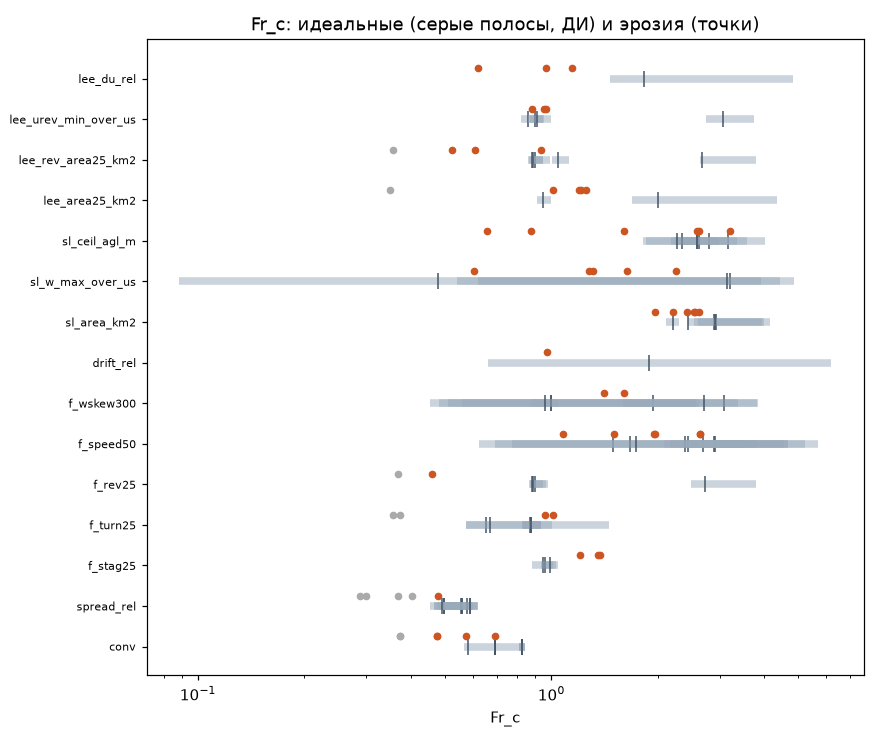

# air-phase, часть 3: итоги опытов на идеальном рельефе

Часть 1 — `air_phase.md` (физика, оси, план опытов), часть 2 — `air_phase_experts.md` (эксперты и сборка по фазам), литература — `air_phase_refs.md`. Здесь — результаты опытов модуля air-phase (планы `ap_v1`, `ap_v2`, `ap_v3`) и их разбора (задачи AP-7…AP-11, AP-13). Числа — из `tools/research/air_phase/analysis/<ID>/{section.md,summary.json}`; полные таблицы — `air_phase_results_tables.md`. Решатель масштаба 1 — стационарные RANS (K-замыкание, клетка 400 м, перенос 1-го порядка, итерации Пикара); «сошлось» — абсолютный критерий P4.

## 0. Краткий итог для сборки по фазам

**Что резко, что плавно** (GRID, только сошедшиеся решения; w — ширина сигмоиды, декады lg Fr; шаг сетки по Fr 0,05 = 0,02 декады, ширина меньше шага не разрешена):

| класс | параметры | где (Fr_c) | w |
|---|---|---|---|
| резкие | застой, обход, обратное течение перед препятствием; разрешённый ротор, глубина подветренной зоны; сход опускания за вершиной; привязка и густота источников термиков | уступ 0,9–1,0, хребет 1,1–2 (ротор хребта s ≥ 0,3 держится до Fr ≈ 3), ротор ≈ 1,0–1,25, опускание 0,84, источники ≈ 1,05 | 0,01–0,04 |
| промежуточные | торможение у земли, снос термиков (H > 0: 0,6–0,8; H = 0: ≈ 2), скачок слоя смешения ΔU (0,9), площадь подветренной зоны (1,3), потолок термиков | — | 0,1–0,25 |
| плавные | доля организованного подъёма при h/z_i = 3; подветренная зона при H > 0; обход на оси Fr при фиксированном ветре (AP-7: Fr_c 0,29–0,35) | — | > 0,3 (обход 0,55–0,8) |
| не фазы | сходимость Пикара (Fr 0,6–0,8; 0,32 при h/z_i = 0,3) — свойство решателя; подъём у склона > 1 м/с (Fr 2,4–2,5 ⇔ U10 ≈ 5,2 м/с) — пересечение порога игры (min_sink 1 м/с) плавной величиной w ≈ U·s | — | — |

Для веса фазы достаточно ступеньки или узкой сигмоиды. Полос гистерезиса по Fr не нужно: гистерезиса нет (AP-8).

**На какие оси смотреть классификатору (§15.1 `air_phase_experts.md`).**
1. **Fr = U_sat/(N·h)** — для блокирования D (обход, обратное течение, застой, ротор, подветренная зона): параметры порядка следуют Fr, неважно, через N или h он меняется (AP-7 п. 5).
2. **−z_i/L** — для потолка термиков (Fr_c ≈ 1,5 ⇔ −z_i/L ≈ 35), торможения и сноса при H > 0: в GRID при H > 0 ось Fr — одновременно ось U и −z_i/L ∝ U⁻³, а потолок следует конвективному масштабу, а не Fr (AP-8).
3. **h/z_i** — смещает ΔU и s_d вниз (0,3) и вверх (3: ΔU 1,2, глубина 1,5), снижает порог сходимости; для слоёв игры h и z_i нужны явно: одного Fr недостаточно (AP-7 п. 8).
4. **Форма** — главный фактор D/B: у холма застоя и обратного течения перед препятствием нет, у уступа и хребта есть. Крутизна s — слабый фактор, кроме ротора хребта (s = 0,5) и подъёма у склона.
5. Для срыва за бровкой — **крутизна**, а не Fr: обратное течение начинается при s ≈ 0,20–0,30 и есть при всех Fr 0,3–5 (AP-10).
6. **U10 / U/N не как фаза**: порог U/N ≈ 340–440 м (N_c ∝ U^0,7) — граница решателя (AP-13), в классификатор не входит.

**Что делать в фазе H (штиль, Fr ≲ 0,25 при N = 0,01 и h = 500 м ⇔ U10 ≲ 0,5 м/с).** Поле решателя там не решение, а блуждание итерации: невязка выходит на плато, блуждание 0,39–0,56 U_sat (Fr ≤ 0,25), в штиле Fr 0,1–0,2 не сошёлся ни один случай из 81 (0,63 U_sat). Поле считать статистикой (late_mean ± late_spread); подветренную зону из него не брать: late_mean воспроизводится только до ~0,1 U (разница Fr в 0,7 % меняет обратное течение у земли в 85 % пар) — брать из статистики или аналитики `lee`; термики — из формул масштаба 2 (сила и число источников от скорости не зависят).

**Где поле — отказ решателя, а не фаза.** Без нагрева при N > N_c(U) (U/N ≲ 340–440 м) помечать «не сошлось при ω = 1»: не «физически нестационарно» и не «физически стационарно». Недорелаксация ω = 0,5 сдвигает N_c в 1,4 раза и исправляет 15 из 17 несходимостей. В штилевой полосе Fr ≤ 0,25 при ω ≥ 0,5 (ω = 0,5 в AP-9; 0,3 в AP-13) Пикар стационарного решения модели не находит; существует ли оно у атмосферы, стационарная модель сказать не может. Поле несошедшегося решения для слоёв игры ненадёжно: у площади зоны отрыва разность пар 1,16 СКО против 0,39 у сошедшихся. Пороги параметров порядка ниже Fr ≈ 0,7 при H = 0 из поля не измеряются (нет сошедшихся точек) — «в пропуске» (`in_gap`).

**Для масштаба 1 в переходной полосе Fr 0,3–0,5 (U10 0,6–1,1 м/с):** сначала ω = 1, если к 300 итерациям нет сходимости — продолжение с ω = 0,5 (ω = 0,5 ничего не портит, но медленнее: медиана 296 против 181 итераций; ставить всегда нельзя).

## 1. Опыты и данные

Область 38,4 км, клетка 400 м, ветер с запада поперёк формы, h = 500 м, N = 0,01 с⁻¹ над z_i; формы — холм, хребет (20 км), уступ, s = 0,15 / 0,3 / 0,5; H = 0 / 100 / 250 Вт/м²; h/z_i = 0,3 / 1 / 3; Fr = U_sat/(N·h) (в GRID U_sat = 5·Fr). Один скрипт на все серии (`run_phase.py`, `run_all.sh`), GPU-батчи, счёт под `dp job --lock gpu`. План — `docs/plan/air-phase.md` §2–3, контракты — `docs/contracts/air-phase.md` (P1–P7).

**ap_v1 — 7686 случаев** (статусы: сошлось 5212, 1000 итераций без сходимости 2474, разошедшихся 0):

| серия | случаев | что |
|---|---|---|
| GRID | 2430 | холодный старт, 81 линия × 30 Fr (0,1…5; шаг 0,05 на 0,3–0,6 и 0,8–1,3) |
| SWEEP | 2916 | тёплый старт от соседней точки, проходы вверх и вниз на Fr 0,3–1,3 |
| RELAX | 1053 | ω = 0,5; K_min = 10 м²/с; относительный критерий; штиль Fr 0,1–0,2 (27 линий s = 0,3) |
| SEPARATION | 100 | окно 100 м, перенос 2-го порядка, и на 400 м; крутизна, Fr, нагрев, косой ветер |
| ENVELOPE | 300 | огибающая «линии тени» 8°/12°/18° × стенка, идеальные формы |
| ENVELOPE_REAL | 707 | то же на реальных крутых местах и контроль |
| ERODED | 180 | 6 рельефов с эрозией × 30 Fr, H = 0, h/z_i = 1 |

**ap_v2 — 296 случаев** (FIXED_U): ветер зафиксирован U_sat = 3 и 6 м/с (U10 = 1,28 и 2,56 м/с), Fr 0,15…3; ось N (h = 500, N = U_sat/(Fr·h) в 0,003…0,025, вне — h 250/1000/1500) и ось h (N = 0,01, h 260…1411); хребет и холм, s = 0,3, H = 0/250, h/z_i = 1. Сошлось 146, не сошлось 150. Причина серии: в ap_v1 Fr меняется только через U (Fr 0,1 = U_sat 0,5 м/с — штиль), и блокирование D не отделить от штиля H.

**ap_v3 — 231 случай** (порог U/N, AP-13): хребет s = 0,3, h = 500, H = 0, U_sat = 3; 4,5; 6 м/с × 11 значений N у порога × 7 вариантов (ctrl; long — 3000 итераций; omega — ω = 0,5; kfloor — K_min = 10; top4500, top6000, top4500_sp2000 — верх над вершиной и губка, опция Numerics P2 v5 / P4 v4). Плюс **ap_v3_calm** — 10 случаев штиля (Fr 0,15–0,25), контроль и ω = 0,3.

**Критерий качества (решение пользователя, P6).** Качество поля масштаба 1 — не ошибка скорости в м/с, а правильность того, что из поля берут следующие слои игры: `th_*` — термики (источники, сила, потолок, снос), `sl_*` — подъём у склонов (50–300 м над землёй), `lee_*` — подветренная зона и ротор. Таблицы признаков — `$AIR_SYNTH_DATA/phase/features_ap_v1.h5`, `features_ap_v2.h5` (`features.py`). Пороги «слой видит разницу» (0,2 м/с, 100 м, 0,3 м/с, 800 м, 20 %) выбраны в AP-9, физические, но предварительные (приложение §8).

## 2. AP-7: оси Fr и ветер (ap_v2)

**Вывод: отчасти.** Блокирование (D) и несходимость Пикара лежат на разных осях, но вторая ось — не «слабый ветер» сам по себе.

1. **Несходимость без нагрева определяется N относительно ветра.** Не сходится при N > N_c(U): N_c = 0,0089 1/с при U_sat 3 и 0,0135 при U_sat 6 (N_c ∝ U^0,6–0,7, U_sat/N_c = 335 и 444 м); h почти не влияет. Один порог по N даёт 0–4 ошибки на 37 случаев, по Fr — 0–5. Логистическая регрессия (148 случаев, CV-log-loss): lg Fr 0,267; lg U 0,669; lg N + lg U **0,132** (точность 0,97). Отношения коэффициентов lg h/lg N = 0,21 (у Fr было бы 1), lg U/lg N = −0,69: граница — N/U^0,7. Сигмоида по N резкая (ширина 0,06–0,09 декады), по Fr при U_sat 6 — 0,56: две оси размывают границу.
2. **Доля несошедшихся:** при U_sat 3, ось N: 1,00 (Fr 0,15–0,6) → 0,17 (0,6–0,9); при U_sat 6: 1,00 → 0,92 → 0,83 → 0,00 (Fr > 0,9), а ось h при тех же Fr сходится (N = 0,01 < N_c(6)). Ось ветра GRID лежит на той же границе: Fr_c = 0,69 в GRID, предсказано 0,72 (N_c(U) ⇒ U_sat,c = 3,6 м/с).
3. **Нагрев — отдельная (конвективная) несходимость:** при N < N_c и H = 250 не сходится 0,05 при w*/U10 < 0,8, 0,90 при 0,8–1, 0,44 при 1–1,3 (в SY-12: 0,26–0,50 при w*/U 0,75–1,5). Без нагрева в этой области сходится 70 из 70.
*Остальные пункты AP-7 (параметры порядка блокирования следуют Fr, SY-12, критическое замедление, метрики слоёв) — в приложении `air_phase_results_tables.md` §1; главное — в §0.*


## 3. AP-13: порог U/N — свойство итераций Пикара (ap_v3)

**Вывод: решатель (`threshold_cause = solver`); довод один — недорелаксация.** ω = 0,5 не меняет уравнения, но поднимает N_c в 1,4 раза (на 0,14 порядка, пять шагов сетки) при всех трёх ветрах; при U_sat = 6 сходится вся сетка до N = 0,019. Длинный счёт без ω (3000 итераций) даёт +1 шаг, значит сдвиг в основном от ω. Порог AP-7 — граница сходимости итераций при ω = 1, а не граница фазы течения.

N_c, 1/с при U_sat 3 / 4,5 / 6 м/с: ctrl 0,0087 / 0,0113 / 0,0142 (N_c ∝ U^0,70); long +1 шаг сетки; **omega 0,0121 / 0,0155 / > 0,0199 (+5 шагов)**; kfloor +2; top4500 и top6000 при губке 1000 м — ниже края сетки (< −5 шагов); top4500 при губке 2000 м — −1…−2 шага. Полная таблица — приложение §2.

Контроль воспроизводит AP-7 (U/N_c = 344, 398, 422 м; λ_z = 2,2–2,7 км), третий ветер даёт N_c ∝ U^0,70. По точкам: ω вылечил 15 из 17 несходимостей и ничего не испортил; K_min — 6 и 0; long — 3 и 0; top4500 и top6000 испортили по 16 из 16 сходившихся.

- **Верх и губка — двусмысленно, в довод не входит.** При верхе 4500/6000 м с губкой 1 км не сходится ни одна точка (U/N > 460–630 м), при губке 2 км порог почти возвращается. Это может быть отражением от потолка, но при Nh/U ≈ 1,2–1,5 — режим обрушения волн, и низкий верх с губкой 1 км (< λ_z = 2–3 км) мог гасить физическую волну; стационарный решатель эти объяснения не разделяет. Верх и губка меняют и сошедшееся решение на 3–10 % U_sat.
- *Поздняя динамика (период 20–26 итераций на пределе Найквиста, алиасинг не исключён; изменчивость у хребта) — приложение §2.*
- **K_min = 10 (гипотеза N1) — не лечение:** N_c на два шага (×1,14), решение меняется на 15–27 % U_sat — другая физика (как в AP-9).
- *Штиль ap_v3_calm: контроль не сходится (невязка стоит), ω = 0,3 снижает невязку в 3–90 раз, но не сходится ничего; при Fr ≤ 0,2 невязка растёт — та же потеря устойчивости итераций, глубже за порогом (приложение §2).*




## 4. AP-9: штилевая граница несходимости (RELAX)

**Вывод: граница смешанная (`calm_boundary = mixed`), между её частями есть порог.** Серия: 27 линий s = 0,3 (3 формы × H × h/z_i), холодный старт, эталон — GRID той же линии. Доля сошедшихся по U10:

Доля сошедшихся по U10 (GRID → ω = 0,5): < 1 м/с — 0,18 → 0,41; 1–1,5 — 0,40 → 0,89; 1,5–2 — 0,96 → 1,00; ≥ 2 — 1,00 (K_min = 10: 0,27 / 0,33 / 0,96; относительный критерий: 0,12 / 0,33 / 0,85; таблица — приложение §9).

- **Fr 0,3–0,5 (U10 0,6–1,1 м/с) — в основном численная.** ω = 0,5 находит неподвижную точку в 39 % случаев, где GRID не сошёлся (36 из 93); при Fr 0,5 доля сошедшихся растёт с 0,37 до 0,89, блуждание оставшихся падает с 0,46 до 0,07 U_sat. Где сошлись оба, поле одно (средняя |Δu| = 0,012 U_sat): ω гасит раскачку, но не меняет неподвижную точку. Стационарное решение модели есть, Пикар с ω = 1 его не находит.
- **Fr ≤ 0,25 (U10 ≤ 0,5 м/с) — фаза H** (§0): ни один из трёх рычагов не помогает (ω = 0,5: сходится 0,19–0,30, блуждание 0,39–0,56 U_sat; невязка на плато); в штиле Fr 0,1–0,2 не сошёлся ни один случай из 81 (блуждание 0,63 U_sat, в 4–6 раз больше порога ~0,1 U из §9 п. 4). При ω ≥ 0,5 Пикар стационарного решения модели не находит; AP-13 показал, что это та же потеря устойчивости итераций, глубже за порогом, а физическую нестационарность стационарная модель не отличит.
- **Гипотеза N1 в причинной части опровергнута:** K_min = 10 исправил 7 случаев, испортил 7 и меняет поле там, где сошлось всё (средняя |Δu| = 0,06 U_sat) — другая физика. Абсолютный критерий не виноват: при U_sat < 5 м/с он мягче относительного.
- *Траектории невязки (плато, а не медленная сходимость), проверка AP-5, влияние на слои — приложение §3.*




## 5. AP-8: границы фаз, резкость, гистерезис, второй старт (GRID и SWEEP)

Подгонка сигмоиды y = y₀ + Δy·σ((lg Fr − lg Fr_c)/w) по сошедшимся точкам: 733 принятые границы (x_c и ДИ в диапазоне, |Δy| ≥ физического минимума, R² ≥ 0,5, w ≤ 1 декады); 455 из них резкие по w < 0,1 декады. Главные границы — таблица §0 и `air_phase_results_tables.md` (полная таблица по параметрам с Fr_c, U10 при Fr_c, зависимостями).

1. **Резкие границы** (обратное течение и застой перед двумерными препятствиями, ротор, глубина подветренной зоны, сход опускания, привязка и густота источников) стоят в узкой полосе Fr ≈ 0,85–1,1, ширины 0,01–0,04 декады (±2–10 % по Fr); почти половина уже шага сетки — известны только сверху. **Промежуточные (0,1–0,25 декады)** — интегральные величины; потолок термиков следует −z_i/L (Fr_c ≈ 1,5 ⇔ −z_i/L ≈ 35), сила ядра термика от ветра не зависит (w0 = 1,24 w*).
2. **Сходимость Пикара (Fr 0,6–0,8) — резкая, но свойство решателя** (AP-13). Подгонки — по сошедшимся точкам; при H = 0 ниже Fr ≈ 0,7 нижняя сторона границ блокирования не видна (`in_gap`), подгонка по всем точкам даёт ложные «роторы» и «обход» в штиле (0,17–0,3).
3. **Гистерезиса нет.** Критерий: |lg Fr_c↑ − lg Fr_c↓| > 2·max(w↑, w↓, шаг сетки) и непересекающиеся 95 % бутстрэп-ДИ — сработал в 4 парах из 501, все объяснены (решатель, немонотонная кривая у уступа, мало точек в штиле); плоский критерий §9 даёт 51 срабатывание (22 — сходимость, 29 — сдвиги на 1–2 шага сетки). **Второй старт:** при Fr ≥ 0,8 то же решение в 97 % пар, расхождение растёт к порогу сходимости (критическое замедление, не ветви); единственный устойчивый случай — уступ вверх (кандидат в ветви, не подтверждён — §9). Слои от старта почти не зависят (≤ 5 % пар; подветренная зона: 2–4 % у сошедшихся, 15–47 % при блуждании; приложение §4).
4. **Флаг «ненадёжно»** для классификатора: у порога сходимости (Fr 0,6–1,0) и у уступа или хребта при h/z_i ≈ 1, Fr 0,85–0,95.

`f_speed50` (средняя |u_h| на 50 м / U_b, Fr_c 0,83) — **относительная величина**: медиана 2,8 > 1, потому что U_b — опорный профиль притока, не решённый; годится для положения перехода по Fr, но не как «разгон» в долях притока.






## 6. AP-10: срыв за бровкой и огибающая (SEPARATION, ENVELOPE)

**Числа для `lee`** (`configs/atmosphere.json`), окно 100 м, ветер поперёк формы, H = 0, Fr 2–5, 28 случаев с обратным течением; медиана [p25; p75]:

| параметр | в игре | из опыта | хребет / уступ / холм | литература |
|---|---|---|---|---|
| shadow_angle_deg | 12 | 9,9 [7,4; 11,8] | 7,3 / 10,5 / 12,4 | 2D 16°, Perdigão 19,7°, 3D 32° |
| rotor_reverse | 0,9 | 0,65 [0,57; 0,75] | 0,76 / 0,60 / 0,61 | 0,6–0,8 |
| rotor_height_fraction | 0,4 | 0,59 [0,52; 0,66] | 0,53 / 0,54 / 0,66 | — |
| depth_scale_m | 40 | 23 [−5; 44] | 25 / 29 / −12 | — |
| shear_layer_m | 60 | 408 [393; 507] | 407 / 631 / 395 | ~0,1 расстояния от отрыва |
| danger_sink_per_wind | 0,7 | 0,040 [0,031; 0,046] над линией; −0,008 под ней | 0,03 / 0,05 / 0,04 | 0,06–0,17 U_H |
| relief_scale_m | 60 | не определяется (одна h = 500) | — | — |

Угол линии тени у хребта занижен, обратная скорость завышена (причина — K-замыкание, ниже): для хребтов брать нижние края интервалов, угол — по литературе. Рекомендация AP-10 (**решает главная сессия**): угол 12° оставить или поднять до 14–16° для хребтов; rotor_reverse 0,9 → 0,6–0,7; rotor_height_fraction 0,4 → 0,6; depth_scale_m 40 оставить; shear_layer_m 60 → 300–400; danger_sink_per_wind 0,7 → 0,05–0,1 (0,7 в 5–20 раз больше любого измерения).

**Пороги.** Обратное течение начинается при s: хребет 0,20–0,25, уступ 0,25–0,30, холм 0,25–0,30 (литература 0,27 для 2D, 0,36 для 3D; в игре порог задаёт линия тени: tg 12° = 0,21). Порога по Fr в диапазоне 0,3–5 нет: пузырь есть при всех Fr; самый длинный при Fr ≈ 1 (11,7–13,4 h) — похоже на гидравлический прыжок под инверсией [Vosper 2004]. Нагрев 100–250 Вт/м² убирает пузырь при s = 0,3, а при s = 0,5 укорачивает с 9,3 до 4,3–5,4 h.

**Сетка 400 м против окна 100 м и причина длинного пузыря.** Длину и высоту пузыря поле 400 м даёт (0,78 и 0,90 от окна), обратную скорость — только 0,35: силу добавляет полуэмпирика. Длинный пузырь (4–11 h против 2,8–3,5 h по литературе) — свойство K-замыкания: слой смешения от гребня растёт в 2–4 раза медленнее турбулентного (S = 0,030 против 0,06–0,11), K ≈ 50 м²/с при нужных 110–200. Не причины: определение длины, численная схема, граница окна, стратификация. Выкладки и исправленные определения (`bubble.py`, `fr_local`) — приложение §5.


**Огибающая h_eff = max(h, линия тени)** (псевдоповерхность для Пикара 400 м).
- *Идеальные формы* (300 случаев): поле над огибающей **не ближе к эталону 100 м**, чем поле 400 м без неё (сумма ошибок хуже на 0,007–0,028 U_sat при всех углах); стенка ничего не меняет; причина — оторвавшийся слой смешения заменён прилегающим пограничным слоем.
- *Реальные крутые места* (707 случаев), доля сошедшихся (без огибающей / 8° / 12° / 18°): nonconv_h (5) 0 / 1,0 / 0,6 / 0,4; nonconv_m (16) 0 / 1,0 / 0,75 / 0,31; nonconv_lowfr (60) 0 / 0,25 / 0,17 / 0,10; conv (20) 1,0. Лечит несходимость в ветер, штилевую почти нет; цена — площадь тени 44–53 % / 29–38 % / 15–21 % области (подробности — приложение §5).
- *Рекомендация AP-10:* для сходимости — 12° с обычной стенкой (75 % nonconv_m, 60 % nonconv_h; тень около трети области); для точности поля над склоном огибающая не нужна. Подробности — приложение §5.







## 7. AP-11: перенос границ на рельеф с эрозией (ERODED)

6 рельефов `fs1_10k` (перепад 527–1051 м, p95 уклона 6,3–14,9°), Fr = U_sat/(N·перепад), H = 0, h/z_i = 1; сошлось 18–23 из 30 точек на рельеф. Пороги сравнены с 9 линиями идеальных форм H = 0, h/z_i = 1: доля порогов на эрозии в объединённом ДИ идеальных — **0,60** (25 из 42; 8 параметров с ≥ 3 идеальными порогами и ≥ 4 засчитанными рельефами). **Перенос частичный (`transfer = partly`).**

| параметр | идеальные Fr_c (медиана) | эрозия Fr_c (медиана) | в ДИ | сдвиг, декады |
|---|---|---|---|---|
| сходимость (решатель) | 0,69 | 0,47 | 2 из 6 | −0,17 |
| f_speed50 (средняя скорость) | 2,41 | 1,96 | 6 из 6 | −0,09 |
| sl_area_km2 (подъём у склона) | 2,88 | 2,48 | 5 из 6 | −0,07 |
| lee_rev_area25 (ротор) | 0,90 | 0,57 | 1 из 4 | −0,20 |

Застой (0 из 3, +0,15), слой смешения (0 из 3) и обратное течение (0 из 2, −0,33) — вне ДИ. Полная таблица (15 параметров) — `air_phase_results_tables.md` §9.

- **Хорошо переносятся** подъём у склона и средняя скорость (запас ≈ ±0,1 декады). **Плохо** — ротор, обратное течение (ротор появляется при меньшем Fr), застой (выше), слой смешения.
- **Главное отличие — ширина.** На идеальных формах w ≈ 0,003–0,02 декады (сходимость, застой, поворот, обратное течение), на эрозии 0,05–0,12: рельеф из многих гребней разной высоты переходит фазу по очереди, а не в одной точке Fr. Границы ротора и застоя на реальном рельефе брать с шириной и сдвигом, не острым порогом.
- **Сходимость на эрозии — свойство решателя:** порог ниже (0,47 против 0,69) и зависит от перепада (ранговая корреляция −0,95): не сходится при U/N порядка десятков метров, согласуется с AP-13 (приложение §6).
- **«Fr всей области» против местного Fr:** разброс lg Fr_c между рельефами 0,114 декады при Fr всей области против 0,107–0,146 при местном Fr (перепад до гребня в окне R = 1,5/3/6 км); лучший вариант (R = 3 км, медиана) лучше у 4 из 6 параметров на 0,01 декады — несущественно. **Местный Fr не оправдывает усложнения.**



## 8. Оговорки и границы модели

- **Клетка 400 м, Δz = 105 м, перенос 1-го порядка** (численная вязкость ~UΔx/2 ≈ 1000 м²/с при U = 5 м/с, Re_eff ≈ 10–50): s = 0,5 недоразрешён (a ≈ 0,86 км — 2 клетки), пузырь срыва — 1–2 клетки, застой перед формой не разрешён; срыв вихрей подавлен; ширины < 0,02 декады и резкость границ — верхняя и нижняя оценки соответственно.
- **K-замыкание:** валов и ячеек нет, «термики» — формулы масштаба 2 поверх среднего поля; оторвавшийся слой смешения недоописан (AP-10).
- **«Численная» граница** — существование неподвижной точки дискретной модели; физическая устойчивость по Пикару не видна, псевдовремя — не физическое время. Утверждение «стационарного решения нет» относится к модели, а не к атмосфере; сошедшееся решение при ω = 0,5 может быть физически неустойчивым (срыв волн при Nh/U ~ 1), проверить можно только нестационарной моделью. ω = 0,5 даёт близкое, но не тождественное решение (до 9 % U_sat): лечение сходимости, не доказательство единственности.
- **Пороги слоёв (AP-9) физические, но предварительные** (ревью AP-9): «заметно / не заметно», не точная граница. Регрессии AP-7 — по 37 случаев на группу: направление, не закон.
- **Остальное** (сцепление осей Fr ∝ U и −z_i/L в GRID; два ветра в ap_v2; одна форма в ap_v3; 6 рельефов в ERODED; одна высота и косой ветер в SEPARATION) — приложение §7.

## 9. Открытые вопросы

1. **Кандидат в ветви у уступа** (STEP_UP, H = 0, h/z_i = 1, Fr 0,85–0,95; AP-8 п. 6): досчитать 6–9 случаев (холодный, вверх, вниз при Fr 0,85/0,9/0,95) с критерием в 10 раз строже или относительным. Сойдутся к одному — ветви нет; нет — гидравлическая бистабильность уступа под инверсией.
2. **Пересчёт несошедшихся ap_v1, ap_v2 и SY-12 при ω = 0,5 и 2000 итераций** (AP-13): сколько из «отказов решателя» окажутся настоящими. Для штиля Fr ≤ 0,25 — ещё и ω ниже 0,5 (при 0,3 не сошлось).
3. **λ в K-замыкании для пузыря:** поднять длину перемешивания в оторвавшемся слое (нужно K 110–200 против ~50 м²/с) и посмотреть, как меняются угол тени хребта и обратная скорость; пока угол хребта — по литературе.
4. **Числа `lee` для игры — решение главной сессии** (§6): угол тени 12° или 14–16°, rotor_reverse, rotor_height_fraction, shear_layer_m, danger_sink_per_wind.
5. **Верх и губка** (AP-13): отражение или подавление физического обрушения волн при Nh/U ≈ 1,2–1,5. Проверить: губка ≥ λ_z (2–3 км) при верхе 6000 м вместе с ω = 0,5, du_max на каждой итерации (без алиасинга), вертикальные снимки, радиационное условие. Отличить обрушение от численной моды — только нестационарной моделью.
6. **f_speed50** — относительная величина (U_b ≠ решённого профиля): для перехода по Fr годится, как доля притока — нет.
7. **Нагрев:** конвективная несходимость (w*/U10 ≳ 0,8, AP-7) не разбиралась, ω на неё не проверялась; термики на эрозии не проверены.
8. **Штиль в ap_v2 (U10 < 1 м/с):** N_c ∝ U^0,70 подтверждён по трём ветрам (3; 4,5; 6 м/с), в штиле не проверен.

## 10. Воспроизведение

Окружение: `PY=/home/greg/deltaplan-air-synth/tools/research/air_nn_pilot/.venv/bin/python`; данные (только чтение) — `~/air_synth_data/phase/`: планы `ap_v1`, `ap_v2`, `ap_v3`, `ap_v3_calm`; результаты `<план>__s1-74644c4` (ap_v1, ap_v2), `<план>__s1-ee7be55` (ap_v3, ap_v3_calm); `features_ap_v1.h5`, `features_ap_v2.h5`. Код — `tools/research/air_phase/` (README).

```bash
$PY tools/research/air_phase/run_phase.py plan --name ap_v1        # план P2; ap_v3: plan_build.py --name ap_v3 --series threshold; ap_v3_calm: --series calm
/home/greg/deltaplan/tools/dp job --lock gpu start air-phase-run <таймаут_с> $PWD/tools/research/air_phase/run_all.sh   # весь счёт, AP_PLAN=ap_v3 для ap_v3
$PY tools/research/air_phase/run_phase.py status --plan ~/air_synth_data/phase/ap_v1
$PY tools/research/air_phase/features.py --plan <план> --results <результаты>   # таблица признаков P6, CPU
$PY tools/research/air_phase/analysis/AP-<N>/run.py   # N = 7 (≈1 мин), 9 (≈1), 13 (≈3), 11 (≈4), 10 (--jobs 16, ≈2), 8 (--workers 16, ≈70; --stage pairs|fits|fits_ok|report)
```

Рисунки копий — `docs/research/air_phase/ap<N>_fig_*.png` (исходники — `analysis/AP-<N>/fig_*.png`). Таблицы — `air_phase_results_tables.md`; полные числа каждой задачи — `analysis/<ID>/summary.json` (AP-7, AP-13: `tables.md`; AP-8: `boundaries`, `second_start`, `hysteresis`; AP-9: `layer_groups`, `cases.csv`; AP-10: `lee`, `lee_by_shape`, `length_diag`).
