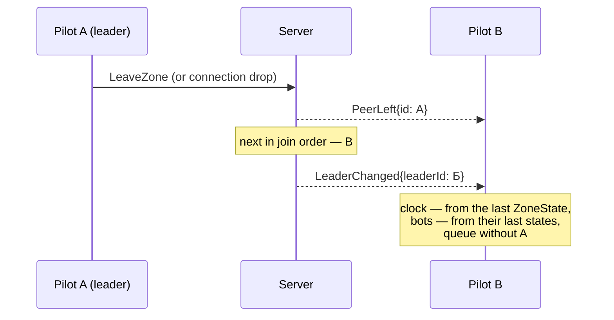

# Multiplayer

Deltaplan is built for a family and friends flying in the same sky at the same time — not for a public service with hundreds of players. The "Multiplayer" screen in the main menu: "Create" — pick a place, the game issues a 4-digit zone code; "Join" — enter a code. Almost nothing is sent over the network — each client computes the atmosphere itself, from shared world parameters.

## Zones and codes

A zone is one flight of several pilots together. "Create" only picks the place (wing, mass, time of day and weather come from the usual "Flight setup…" screen); the server issues a free 4-digit code (for example, `4721`), which the pilots pass to each other themselves — by voice or in a messenger, the game does not handle that. "Join" is just entering the code: the client builds the world (place, date, time, weather, seed) from the zone parameters received from the server.


A zone lives as long as at least one live pilot remains in it; when everyone has left, the zone closes and the code is freed immediately. Bots do not count as live pilots — they do not keep a zone open. At most 16 live pilots can be in a zone at once (`ERROR_CODE_ZONE_FULL` when trying to enter a full one).

### "Nearby" on the local network

The main scenario is pilots in one room, playing together on neighbouring computers. The "Server" field can be left empty: "Create" then starts a built-in server right on this computer (the same contract as the Go server), and for everyone else on that network the zone appears by itself in the "Nearby" list on the "Multiplayer" screen — `Enter` joins with one key, no code typing.

This works through UDP broadcast: while a game with a built-in server has a zone, it announces itself once a second on port 8081 (next to WebSocket port 8080 — convenient to open both in the firewall at once). The listener takes the sender's IP from the datagram — it is guaranteed to be reachable from the same network. A zone disappears from the list after 3 s without announcements; a zone of a different game version is visible but marked, and cannot be joined. Limitation: broadcast does not cross routers — it works only within one subnet. The built-in server has no leader change: the creator leaving closes the zone immediately — for a single room this is not a problem.


### Your own Go server

For play over the internet (pilots on different networks) a separate server is needed — the [server/](/server/README.md) folder in the repository, written in Go, deployed with a single command in Docker:

```bash
docker build -t deltaplan-server server/
docker run -d --name deltaplan-server --restart unless-stopped -p 8080:8080 deltaplan-server
```

The server is a pure relay: it computes neither the atmosphere nor the flight physics, it only issues and checks the 4-digit zone codes, determines the leader (the first to connect) and forwards `PilotState`/`ZoneState` between the clients of one zone. The state is entirely in memory, there is no authorization — `curl http://IP:8080/v1/status` without a password shows the list of active zones and participants (so this port should not be published more widely than needed for trusted players). The binary is static (`CGO_ENABLED=0`, no Go or libraries needed on the VPS). Players simply enter `IP:port` in the "Server" field.


## The leader and leader change

The leader is the live pilot with the lowest join order in the zone; the server decides this, not the players, and for the players a leader change is invisible. The first leader is the creator of the zone. The leader keeps the zone clock (sends `ZoneState.clock` once a second — the others adjust their clocks, compensating for latency) and runs the [start queue](/mechanics/bots/#start-queue), and also computes the zone's bots: it broadcasts their states the same way as the states of live pilots, only marked "bot". If the leader leaves (quits or the connection drops), the server sends `PeerLeft`, then `LeaderChanged` with the next one in order; the new leader continues the clock and the bots from their last known states, with no jump.

## "Catch up"

The `=` key opens a quick semi-transparent menu over the flight: a list of the zone's pilots other than yourself, live ones first, then bots; the nearest live pilot in the air is selected by default. Arrows choose, `Enter` — the wing flies by itself to the chosen pilot and hands control back next to them; `Esc` or `=` again closes the menu with no action.

The transfer is not a teleport but kinematic motion over the terrain (flight physics is switched off for that time, no collisions and no stall): usually ~10 s — smooth acceleration, a fast middle, smooth braking (smootherstep profile — acceleration at the start and end is zero, no jerk); the arrival altitude is the target's altitude, with the same smooth profile, even if that is a kilometre of climb. Within 60 m behind and to the side of the target, speed and heading are brought to the target's within 2–3 s, and control returns to the pilot. Others see the transfer as ordinary motion — "Catch up" has no separate network messages, it is all on the client.

You can catch up from anywhere on the ground — from the launch, from the queue, from the landing spot or after a crash (the pilot then leaves the start queue). If you enter a zone and the leader is already in the air, the transfer to them starts automatically. After landing or a crash, the flight summary window has a "Continue nearby" button (focused by default): it is the quick path into "Catch up" to the nearest friend in the air.


## Bots on the leader

The number of bots in a zone comes from the creator's settings ("Other pilots in the sky" — the same setting as in single-player) and is not recomputed when the leader changes. Bots are always computed by the leader — the same `BotPilots` as in single-player, but "watching" all live pilots of the zone at once rather than one player; the other clients see the same bots as ordinary other pilots, from their broadcast states. When the leader changes, the new one continues the bots from the last received states — the number and names of the bots do not change. Bots in the start queue are always after live pilots (more in [“Bots and the start queue”](/mechanics/bots/)).

## World determinism

The atmosphere is not transmitted over the network at all. Thermals, clouds and wind are a pure function of place, date, time of day, weather and seed: knowing these parameters, each client builds the same world on its own, including a "jump" straight to the zone's current time (it is not necessary to compute everything from scratch). Only the zone parameters, the zone clock, the start queue and the pilots' states go over the network — not a single cloud or thermal in the traffic.

To check that the worlds have not diverged (different generator versions, different rounding), the zone creator puts a "world key" into its parameters — all the world parameters in one string in URL form, for example:

```
deltaplan://world?bots=4&date=2026-07-15&from=270&hour=13.00&lat=50.75120&lon=86.12030&seed=4711&sky=clear&temp=26.0&v=1&wind=3.0
```

and the first 16 hex characters of its SHA-256 (`worldHash`). The joining client builds the world and computes its own key; if the hashes differ, a warning goes to the log with both keys (the game itself does not stop).

## Protocol: .proto over WebSocket

The message contract is the single source of truth: [server/proto/deltaplan/v1/net.proto](/server/proto/deltaplan/v1/net.proto) (Protocol Buffers), a human-readable description with examples of each message — [docs/guide/net-protocol.md](/docs/guide/net-protocol.md); if the text and the `.proto` disagree, the `.proto` is right. The server's Go code is generated from it — generated code is not edited by hand.

**Transport** — one WebSocket per client (`ws://IP:port/v1/ws`), in Godot the built-in `WebSocketPeer`, with no third-party add-ons. Each text frame is exactly one `Envelope` message (with a `oneof` — `hello`, `pilotState`, `zoneState` and so on). **Encoding** — proto3 JSON (Go — `protojson`, Godot — the built-in `JSON`): readable by eye when debugging traffic, while the contract is still the same `.proto`; binary protobuf (the GDScript generator `godobuf`) is planned for later, without changing the contract.

**Why not gRPC.** Godot has no gRPC (HTTP/2) — neither in the engine nor as a ready, maintained add-on; building a GDExtension with C++ grpc for each platform (Windows/Linux/macOS) is heavy and fragile for a project of this size. A bidirectional stream is provided by plain WebSocket, which Godot has out of the box.

Main messages: `Hello`/`Welcome` (handshake and game version), `CreateZone`/`ZoneCreated`, `JoinZone`/`ZoneJoined`, `PeerJoined`/`PeerLeft`/`LeaderChanged`, `Ping`/`Pong` (every 2 s — latency and server clock), and the messages forwarded within a zone: `PilotState` (10 Hz per pilot/bot — position, orientation, velocity, phase, wing, livery) and `ZoneState` (1 Hz, only from the leader — clock and queue). Traffic savings: numbers are rounded (position to 0.01 m, speed to 0.01 m/s), name/wing/livery are sent once a second, not in every packet — the result is about 1.9 KB/s for sending one's own state for an ordinary client.

Below is a simplified diagram of entering a zone (without the `PilotState`/`ZoneState` stream, details in [docs/guide/net-protocol.md](/docs/guide/net-protocol.md)):

```mermaid
sequenceDiagram
    participant Б as Pilot B (client)
    participant С as Server
    participant А as Pilot A (leader)
    Б->>С: Hello{gameVersion, name}
    С-->>Б: Welcome{yourId}
    Б->>С: JoinZone{code: "4721"}
    alt no such zone / different version / zone full
        С-->>Б: Error{code}
    else
        С-->>Б: ZoneJoined{zone, peers, leaderId}
        С-->>А: PeerJoined{peer: Б}
        Note over Б: builds the world from zone,<br/>checks worldHash;<br/>leader on the ground → into the queue,<br/>in the air → "Catch up"
    end
```

And the leader change:



## What was considered and rejected

From [docs/plan/multiplayer.md](/docs/plan/multiplayer.md) — the multiplayer plan, written before implementation:

- **Accounts, authorization, lobbies, server scaling** — rejected right away: multiplayer has about ten users (family and friends), not a public audience; this needs neither a separate registration service nor load balancing.
- **A Telegram bot and similar services** for exchanging zone codes — rejected: pilots already dictate the zone code to each other by voice or in an ordinary messenger, a separate bot is an extra part that has to be maintained.
- **gRPC instead of WebSocket** — rejected because of the lack of working support in Godot (see above).
- **WebRTC mesh** (P2P between clients, the server only for establishing the connection) instead of a relay through the server — left "for later": the protocol is deliberately not tied to the transport, so such a replacement can be made later without changing the game logic.
- **Binary protobuf on the wire** instead of proto3 JSON — also "for later": first it matters more that the traffic is easy to read when debugging; the traffic saving of a binary format will be needed if bandwidth starts to run short.

## Model limits

- **There is no in-game chat** — by design: voice communication goes through external programs (for example, an ordinary voice chat in a messenger), the game does not try to replace it with its own channel.
- The atmosphere is not synchronized over the network at all — if two clients' world generator versions have diverged (which is what `worldHash` checks), their thermals and clouds will differ, although the game keeps running without stopping, only with a warning in the log.
- Network latency is smoothed by interpolation and limited extrapolation at the receiver of other pilots' `PilotState`, but this is an estimate of position, not an exact copy — with large latency or packet loss another pilot may for a short time move not quite as they really do.
- The built-in server (for "Nearby" on the local network) does not survive the creator leaving — there is no leader change there, the zone closes immediately.
- There are no collisions between live pilots in the game — multiplayer, like single-player, does not compute the physics of wings colliding with each other.

## Details

- [docs/guide/game.md](/docs/guide/game.md) — the overall design of the game.
- [docs/plan/multiplayer.md](/docs/plan/multiplayer.md) — the multiplayer plan and architecture (roles, the NET-xx task roadmap, risks, what is "for later").
- [docs/guide/net-protocol.md](/docs/guide/net-protocol.md) — the full protocol: all messages, error codes, JSON examples, scenario diagrams.
- [server/README.md](/server/README.md) — how to bring up the Go server (locally and on a VPS via Docker).
- [server/proto/deltaplan/v1/net.proto](/server/proto/deltaplan/v1/net.proto) — the source message contract.
- [scripts/net/net_zone.gd](/scripts/net/net_zone.gd), [scripts/net/net_client.gd](/scripts/net/net_client.gd) — the in-game network client.
- [scripts/net/lan_discovery.gd](/scripts/net/lan_discovery.gd) — search for "Nearby" zones on the local network.
- [scripts/game/net_queue.gd](/scripts/game/net_queue.gd) — the start queue over the network.
- [scripts/ui/catch_up_menu.gd](/scripts/ui/catch_up_menu.gd) — the "Catch up" menu.
- [CHANGELOG.md](/CHANGELOG.md) — the "build 0.8.0" section.
