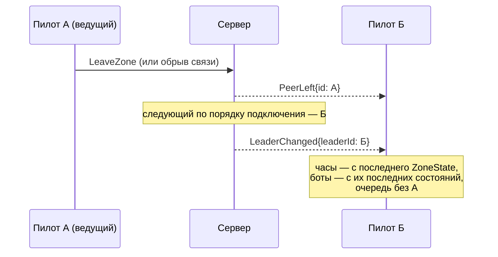

# Сетевая игра

Deltaplan рассчитан на семью и друзей, летающих в одном небе одновременно — не на публичный сервис с сотнями игроков. Экран «Сетевая игра» в главном меню: «Создать» — выбрать место, игра выдаёт 4-значный код зоны; «Присоединиться» — ввести код. По сети почти ничего не передаётся — атмосферу каждый клиент считает у себя сам, по общим параметрам мира.

## Зоны и коды

Зона — это один полёт нескольких пилотов вместе. «Создать» выбирает только место (крыло, масса, время суток и погода берутся из обычного экрана «Полёт…»); сервер выдаёт свободный 4-значный код (например, `4721`), который пилоты передают друг другу сами — голосом или в мессенджере, игра этим не занимается. «Присоединиться» — просто ввести код: мир (место, дата, время, погода, сид) клиент строит по параметрам зоны, полученным от сервера.


Зона живёт, пока в ней остаётся хотя бы один живой пилот; вышли все — зона закрывается и код сразу освобождается. Ботов в счёт живых пилотов не берут — они зону не удерживают. Одновременно в зоне — не больше 16 живых пилотов (`ERROR_CODE_ZONE_FULL` при попытке войти в заполненную).

### «Рядом» в локальной сети

Главный сценарий — пилоты в одной комнате, играющий вместе за соседними компьютерами. Поле «Сервер» можно оставить пустым: «Создать» тогда запускает встроенный сервер прямо на этом компьютере (тот же контракт, что у сервера на Go), а у остальных в этой сети зона сама появляется в списке «Рядом» на экране «Сетевая игра» — `Enter` входит одной клавишей, без набора кода.

Работает это через UDP broadcast: пока в игре со встроенным сервером есть зона, она объявляет себя раз в секунду на порт 8081 (рядом с портом WebSocket 8080 — удобно открыть оба сразу в брандмауэре). Слушатель берёт IP отправителя датаграммы — он заведомо доступен из той же сети. Зона пропадает из списка через 3 с без объявлений; зона другой версии игры видна, но помечена и войти в неё нельзя. Ограничение: broadcast не проходит через роутеры — работает только в одной подсети. У встроенного сервера нет смены ведущего: уход создателя сразу закрывает зону — для одной комнаты это не мешает.


### Свой сервер на Go

Для игры через интернет (пилоты в разных сетях) нужен отдельный сервер — папка [server/](/server/README.md) в репозитории, написан на Go, разворачивается одной командой в Docker:

```bash
docker build -t deltaplan-server server/
docker run -d --name deltaplan-server --restart unless-stopped -p 8080:8080 deltaplan-server
```

Сервер — чистый ретранслятор: сам не считает ни атмосферу, ни физику полёта, только выдаёт и проверяет 4-значные коды зон, определяет ведущего (первый подключившийся) и пересылает `PilotState`/`ZoneState` между клиентами одной зоны. Состояние целиком в памяти, авторизации нет — `curl http://IP:8080/v1/status` без пароля покажет список активных зон и участников (поэтому этот порт не стоит публиковать шире, чем нужно доверенным игрокам). Бинарник статический (`CGO_ENABLED=0`, без Go и библиотек на VPS). Игроки вводят в поле «Сервер» просто `IP:порт`.


## Ведущий и его смена

Ведущий — живой пилот с наименьшим порядком подключения к зоне; решает это сервер, не сами игроки, и для игроков смена ведущего незаметна. Первый ведущий — создатель зоны. Ведущий держит часы зоны (раз в секунду рассылает `ZoneState.clock` — остальные подстраивают свои часы с поправкой на задержку) и ведёт [очередь на старт](/mechanics/bots/#очередь-на-старт), а ещё считает ботов зоны: рассылает их состояния так же, как состояния живых пилотов, только с пометкой «бот». Ушёл ведущий (вышел или оборвалась связь) — сервер шлёт `PeerLeft`, затем `LeaderChanged` со следующим по порядку; новый ведущий продолжает часы и ботов с их последних известных состояний, без скачка.

## «Догнать»

Клавиша `=` открывает поверх полёта быстрое полупрозрачное меню: список пилотов зоны кроме себя, сначала живые, потом боты, по умолчанию выделен ближайший живой пилот в воздухе. Стрелками — выбор, `Enter` — крыло само летит к выбранному пилоту и отдаёт управление рядом с ним; `Esc` или повторный `=` закрывают меню без действия.

Перелёт — не телепорт, а кинематическое движение поверх рельефа (физика полёта на это время выключена, столкновений и сваливания нет): обычно ~10 с — плавный разгон, быстрая середина, плавное торможение (профиль smootherstep — ускорение в начале и конце нулевое, без рывка); высота прибытия — высота цели, тем же плавным профилем, даже если это километр набора. Дальше 60 м позади-сбоку цели скорость и курс за 2–3 с сводятся к скорости цели, и управление возвращается пилоту. Другие видят перелёт как обычное движение — отдельных сетевых сообщений у «Догнать» нет, всё на клиенте.

Догнать можно откуда угодно на земле — со старта, из очереди, с места посадки или после аварии (при этом пилот выходит из очереди на старт). Входишь в зону, а ведущий уже в воздухе — перелёт к нему начинается автоматически. После посадки или аварии в окне итога полёта — кнопка «Продолжить рядом» (по умолчанию в фокусе): она и есть быстрый путь в «Догнать» к ближайшему другу в воздухе.


## Боты у ведущего

Число ботов в зоне берётся из настроек создателя («Другие пилоты в небе» — та же настройка, что в одиночной игре) и не пересчитывается при смене ведущего. Ботов всегда считает ведущий — тот же `BotPilots`, что в одиночной игре, но «наблюдающий» сразу всех живых пилотов зоны, а не одного игрока; остальные клиенты видят тех же ботов как обычных чужих пилотов, по их рассылаемым состояниям. При смене ведущего новый продолжает ботов с последних полученных состояний — число и имена ботов не меняются. Боты в очереди на старт всегда после живых пилотов (подробнее — [«Боты и очередь старта»](/mechanics/bots/)).

## Детерминизм мира

По сети атмосфера не передаётся вообще. Термики, облака и ветер — чистая функция места, даты, времени суток, погоды и сида: зная эти параметры, каждый клиент строит один и тот же мир самостоятельно, включая «прыжок» сразу в текущее время зоны (не обязательно считать всё с нуля). По сети идут только параметры зоны, часы зоны, очередь на старт и состояния пилотов — ни одного облака или термика в трафике.

Чтобы проверить, что миры не разошлись (разные версии генератора, разное округление), создатель зоны кладёт в её параметры «ключ мира» — все параметры мира одной строкой в URL-виде, например:

```
deltaplan://world?bots=4&date=2026-07-15&from=270&hour=13.00&lat=50.75120&lon=86.12030&seed=4711&sky=clear&temp=26.0&v=1&wind=3.0
```

и первые 16 hex-символов SHA-256 от неё (`worldHash`). Вошедший клиент строит мир и считает свой ключ; хэши разошлись — предупреждение в лог с обоими ключами (сама игра при этом не останавливается).

## Протокол: .proto поверх WebSocket

Контракт сообщений — единственный источник правды: [server/proto/deltaplan/v1/net.proto](/server/proto/deltaplan/v1/net.proto) (Protocol Buffers), человеческое описание с примерами каждого сообщения — [docs/guide/net-protocol.md](/docs/guide/net-protocol.md); при расхождении текста и `.proto` прав `.proto`. Из него генерируется Go-код сервера — вручную сгенерированный код не редактируется.

**Транспорт** — один WebSocket на клиента (`ws://IP:порт/v1/ws`), в Godot — встроенный `WebSocketPeer`, без сторонних аддонов. Каждый текстовый кадр — ровно одно сообщение `Envelope` (с `oneof` — `hello`, `pilotState`, `zoneState` и так далее). **Кодировка** — proto3 JSON (Go — `protojson`, Godot — встроенный `JSON`): читается глазами при отладке трафика, контракт при этом тот же `.proto`; бинарный protobuf (генератор GDScript `godobuf`) — в планах на потом, без смены контракта.

**Почему не gRPC.** В Godot нет gRPC (HTTP/2) — ни в движке, ни готового живого аддона; сборка GDExtension с C++ grpc под каждую платформу (Windows/Linux/macOS) — тяжело и хрупко для проекта такого размера. Двунаправленный поток даёт обычный WebSocket, который в Godot есть из коробки.

Основные сообщения: `Hello`/`Welcome` (рукопожатие и версия игры), `CreateZone`/`ZoneCreated`, `JoinZone`/`ZoneJoined`, `PeerJoined`/`PeerLeft`/`LeaderChanged`, `Ping`/`Pong` (раз в 2 с — задержка и часы сервера), и пересылаемые внутри зоны `PilotState` (10 Гц на пилота/бота — позиция, ориентация, скорость, фаза, крыло, расцветка) и `ZoneState` (1 Гц, только от ведущего — часы и очередь). Экономия трафика: числа округляются (позиция до 0,01 м, скорость до 0,01 м/с), имя/крыло/расцветка шлются раз в секунду, а не в каждом пакете — итог около 1,9 КБ/с на отправку своего состояния у обычного клиента.

Ниже — упрощённая схема входа в зону (без потока `PilotState`/`ZoneState`, подробности — в [docs/guide/net-protocol.md](/docs/guide/net-protocol.md)):

```mermaid
sequenceDiagram
    participant Б as Пилот Б (клиент)
    participant С as Сервер
    participant А as Пилот А (ведущий)
    Б->>С: Hello{gameVersion, name}
    С-->>Б: Welcome{yourId}
    Б->>С: JoinZone{code: "4721"}
    alt нет такой зоны / другая версия / зона полна
        С-->>Б: Error{code}
    else
        С-->>Б: ZoneJoined{zone, peers, leaderId}
        С-->>А: PeerJoined{peer: Б}
        Note over Б: строит мир по zone,<br/>сверяет worldHash;<br/>ведущий на земле → в очередь,<br/>в воздухе → «Догнать»
    end
```

И смена ведущего:



## Что рассматривали и отвергли

Из [docs/plan/multiplayer.md](/docs/plan/multiplayer.md) — план сетевой игры, написанный до реализации:

- **Аккаунты, авторизация, лобби, масштабирование серверов** — отклонили сразу: пользователей у сетевой игры около десяти (семья и друзья), а не публичная аудитория; под это не нужен ни отдельный сервис регистрации, ни балансировка нагрузки.
- **Telegram-бот и подобные сервисы** для обмена кодами зон — отклонили: код зоны пилоты и так диктуют друг другу голосом или в обычном мессенджере, отдельный бот — лишняя часть, которую надо поддерживать.
- **gRPC вместо WebSocket** — отклонили из-за отсутствия рабочей поддержки в Godot (см. выше).
- **WebRTC-mesh** (P2P между клиентами, сервер — только для установления соединения) вместо ретранслятора через сервер — оставили «на потом»: протокол специально не завязан на транспорт, чтобы такую замену можно было сделать позже без изменения игровой логики.
- **Бинарный protobuf на проводе** вместо proto3 JSON — тоже «на потом»: сначала важнее, чтобы трафик было легко читать при отладке; экономия трафика бинарным форматом понадобится, если полос пропускания станет не хватать.

## Границы модели

- **Внутриигрового чата нет** — так задумано: голосовое общение идёт через внешние программы (например, обычный голосовой чат в мессенджере), игра не пытается заменить его собственным каналом связи.
- Атмосфера не синхронизируется по сети вообще — если у двух клиентов разошлись версии генератора мира (что и проверяет `worldHash`), термики и облака у них будут отличаться, хотя игра продолжит работать без остановки, только с предупреждением в логе.
- Задержки сети сглаживаются интерполяцией и ограниченной экстраполяцией на приёмнике чужих `PilotState`, но это оценка положения, а не точная копия — на большой задержке или потере пакетов чужой пилот может на короткое время двигаться не совсем так, как на самом деле у него.
- Встроенный сервер (для «Рядом» в локальной сети) не переживает уход создателя — смены ведущего там нет, зона закрывается сразу.
- Столкновений между живыми пилотами в игре нет — сетевая игра, как и одиночная, не считает физику столкновения крыльев друг с другом.

## Подробнее

- [docs/guide/game.md](/docs/guide/game.md) — общее устройство игры.
- [docs/plan/multiplayer.md](/docs/plan/multiplayer.md) — план и архитектура сетевой игры (роли, роадмап задач NET-xx, риски, что «на потом»).
- [docs/guide/net-protocol.md](/docs/guide/net-protocol.md) — полный протокол: все сообщения, коды ошибок, примеры JSON, диаграммы сценариев.
- [server/README.md](/server/README.md) — как поднять сервер на Go (локально и на VPS через Docker).
- [server/proto/deltaplan/v1/net.proto](/server/proto/deltaplan/v1/net.proto) — исходный контракт сообщений.
- [scripts/net/net_zone.gd](/scripts/net/net_zone.gd), [scripts/net/net_client.gd](/scripts/net/net_client.gd) — клиент сети в игре.
- [scripts/net/lan_discovery.gd](/scripts/net/lan_discovery.gd) — поиск зон «Рядом» в локальной сети.
- [scripts/game/net_queue.gd](/scripts/game/net_queue.gd) — очередь на старт в сети.
- [scripts/ui/catch_up_menu.gd](/scripts/ui/catch_up_menu.gd) — меню «Догнать».
- [CHANGELOG.md](/CHANGELOG.md) — раздел «сборка 0.8.0».
