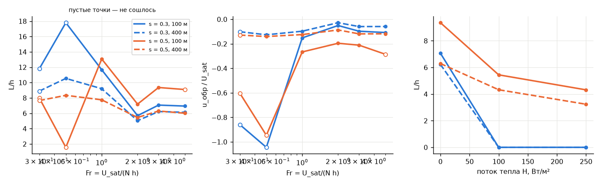
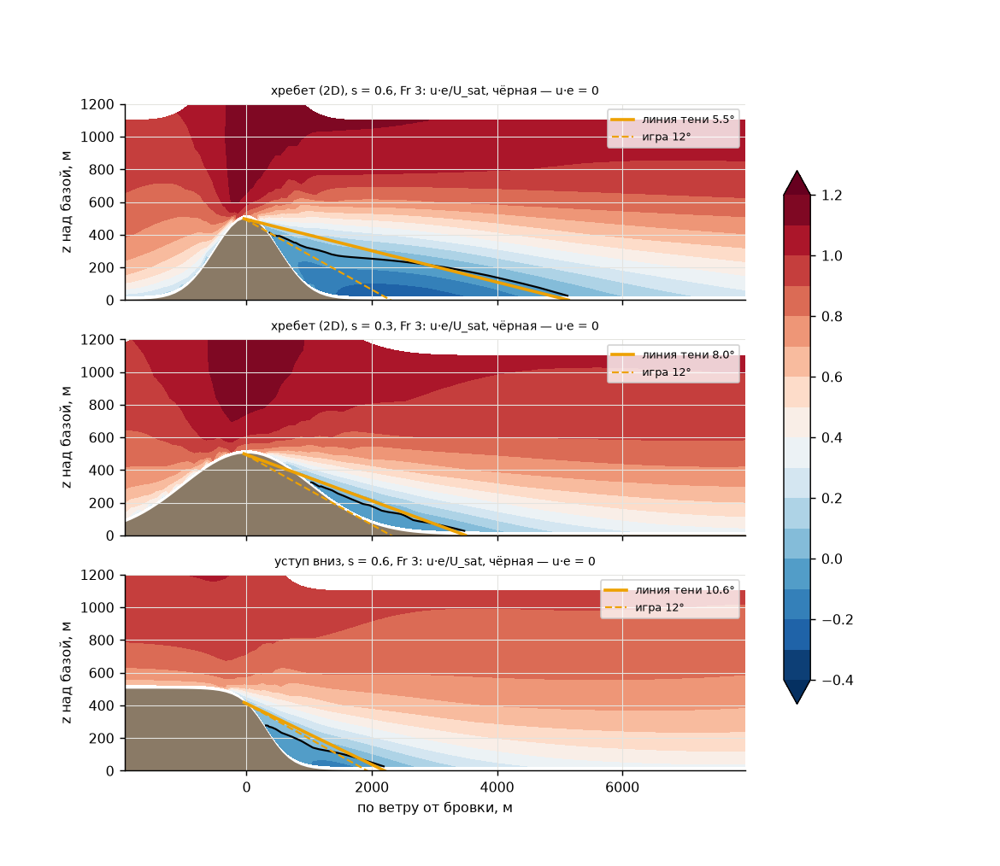
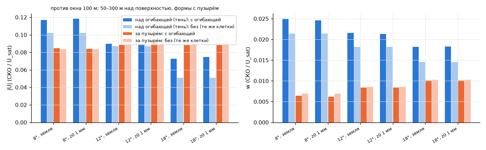

# Срыв за подветренной бровкой и огибающая «линии тени» (AP-10)

`/home/greg/deltaplan-air-synth/tools/research/air_nn_pilot/.venv/bin/python tools/research/air_phase/analysis/AP-10/run.py --jobs 16` (CPU, около 2 мин; план `~/air_synth_data/phase/ap_v1`, результаты `ap_v1__s1-74644c4`; пересчитанный `bubble` и диагностика по каждому случаю лежат в `out/bubble_v2.csv`)

## Вывод

1. **Откуда числа для `lee`.** Числа сняты по окну 100 м: ветер поперёк формы, без нагрева, Fr 2–5, 28 случаев с обратным течением. Решатель даёт угол линии тени 9,9° (межквартильный размах 7,4–11,8°). По формам: хребет 7,3°, уступ 10,5°, холм 12,4°. Обратная скорость у земли в пике — 0,25 от ветра профиля на 25 м, то есть rotor_reverse ≈ 0,65 при wind_reduction 0,6. Обратный слой поднимается на 0,27 h, отсюда rotor_height_fraction ≈ 0,6. Полная сила зоны наступает уже в 0–45 м под линией тени. Над линией поток возмущён ещё на ~400 м, а в игре сейчас 60 м. Опускание — 0,03–0,05 от ветра в полосе над линией, а под ней воздух слегка поднимается. В игре стоит 0,7.
2. **Пороги.** Обратное течение начинается при крутизне: хребет 0,20–0,25, уступ 0,25–0,30, холм 0,25–0,30. Литература даёт 0,27 для 2D и 0,36 для 3D. Порога по Fr в диапазоне 0,3–5 нет: пузырь есть при всех Fr. Самый длинный пузырь — при Fr ≈ 1 (11,7–13,4 h), это похоже на гидравлический прыжок под инверсией. Нагрев 100–250 Вт/м² убирает пузырь при s = 0,3, а при s = 0,5 укорачивает его с 9,3 до 4,3–5,4 h.
3. **Почему пузырь длинный (4–11 h против ~2,8–3,5 h).** Определение в `bubble.py` для ветра поперёк формы верное. Длина считается от бровки до присоединения у земли. От точки отрыва она на 0,8–2,2 h короче, но всё равно 5–10 h для хребта. Причина в модели. Слой смешения, оторвавшийся от гребня, растёт в 2–4 раза медленнее настоящего турбулентного. Для хребта S = 0,030 (0,018–0,039) против 0,06–0,11 для плоского слоя смешения (Pope 2000). Замыкание K = max(K_HB(z над землёй), l²|S|) с l ≤ λ = 40 м даёт в слое K ≈ 50 м²/с. По скорости роста слоя нужно 110–200 м²/с. Поэтому пузырь 2D-хребта длиннее, а обратный поток сильнее: до −0,27·U_sat против −0,1…−0,2 в аэротрубе. Отрыв начинается при меньшей крутизне. У холма (3D, боковой подсос) и у уступа слой растёт быстрее (S = 0,054–0,073 и 0,044), их пузыри 4,2–4,6 h. Это близко к обратному уступу (6–8 h для острого) и к правдоподобному для гладкого.
4. **Ошибки определений, исправлены в `bubble.py`.** (а) При косом ветре окно 100 м стоит у конца хребта и не содержит (0, 0). Сечение через (0, 0) окно не пересекало, поэтому у всех четырёх косых случаев выходило has_reverse = 0. Теперь сечение проходит через наибольший подветренный уклон или через бровку окна. После пересчёта при 300° и s = 0,5 пузырь длиной 3,9 h, а поперёк хребта обратное течение есть в трёх случаях из четырёх. (б) `fr_local` при Fr = 0,3 выходил 0,61, теперь 0,30. Колонна притока бралась в 5 клетках от края, это ровно граница боковой губки 2 км. У линий с окном область считается переносом 2-го порядка, при Fr ≤ 0,5 она не сходится, и в этой колонне сидит выброс 2,4–3,1 м/с при U_sat = 1,5 м/с (выше 1500 м поток даже обратный). Новое определение: fr_local = U(h)/(N·h) по невозмущённому профилю притока, как профиль ветра игры. При h ≥ z_sat = 345 м оно совпадает с Fr.
5. **Огибающая.** На идеальных формах поле над огибающей не ближе к эталону 100 м, чем то же поле 400 м без огибающей в тех же клетках. Сумма ошибок хуже на 0,007–0,028 U_sat при всех трёх углах. Тип стенки (земля или z0 = 1 мм) ничего не меняет (разница ≤ 0,002). Сходимость на идеальных формах та же: 96 % в обоих случаях. На реальных крутых местах огибающая лечит несходимость с ветром. При 8° сошлись все nonconv_m (16 из 16) и все nonconv_h (5 из 5), при 12° — 75 % и 60 %, при 18° — 31 % и 40 %. Штилевые nonconv_lowfr поправились лишь у 10–25 %: несходимость там физическая (штиль, AP-5). У сошедшихся контрольных случаев огибающая ничего не сломала (20 из 20 сошлись). Поле вне тени изменилось на 1,5–4 % U_sat, над огибающей — на 4,5–9 %. Цена — площадь: тень занимает 44–53 % области при 8°, 29–38 % при 12°, 15–21 % при 18°.

## Таблица для `configs/atmosphere.json` → `lee`

Ниже медиана [p25, p75] по 28 случаям окна 100 м (`summary.json` → `lee`, по формам — `lee_by_shape`). Параметры сняты по их смыслу в `_lee_flow`: опасность = 1, wind_reduction = 0,6 как в игре, u — ветер профиля на высоте над землёй.

| параметр | в игре | из опыта | хребет / уступ / холм | литература | комментарий |
|---|---|---|---|---|---|
| shadow_angle_deg | 12 | 9,9 [7,4; 11,8] | 7,3 / 10,5 / 12,4 | 2D 16°, Perdigão 19,7°, 3D 32° (L = 3,5 / 2,8 / 1,6 h) | у хребта занижен из-за длинного пузыря решателя; 12° лежит между уступом (обратный уступ 6–8 h → 7–9°) и 2D-хребтом (16°) |
| rotor_reverse | 0,9 | 0,65 [0,57; 0,75] (среднее по зоне 0,53) | 0,76 / 0,60 / 0,61 | u_обр/U = −0,1…−0,2 → 0,6–0,8 | у хребта завышено вместе с длиной |
| rotor_height_fraction | 0,4 | 0,59 [0,52; 0,66] | 0,53 / 0,54 / 0,66 | — | высота нуля u·e в колонне пика / (превышение · ln(rr/0,4)) |
| depth_scale_m | 40 | 23 [−5; 44] | 25 / 29 / −12 | — | сила полная почти сразу под линией тени |
| shear_layer_m (не в списке) | 60 | 408 [393; 507] | 407 / 631 / 395 | слой смешения ~0,1 расстояния от отрыва | возмущение над линией тени — толщина слоя смешения; в решателе она завышена слабо (у хребта слой растёт медленно) |
| danger_sink_per_wind (не в списке) | 0,7 | −0,008 под линией; 0,040 [0,031; 0,046] в полосе 200 м над ней | 0,03 / 0,05 / 0,04 | w в следе −0,06…−0,17 U_H | 0,7 выше любого из измерений в 5–20 раз |
| relief_scale_m | 60 | не определяется | — | — | в серии одна высота h = 500 м |

Пороги появления зоны по номинальной крутизне s (окно 100 м / сетка 400 м): хребет 0,20–0,25 / 0,20–0,25; уступ 0,25–0,30 / 0,30–0,35; холм 0,25–0,30 / 0,35–0,40. В игре порог задаётся самой линией тени: зоны нет, если склон положе tan θ, а это 0,21 при 12°. Это совпадает с порогом хребта в решателе и чуть ниже литературных 0,27 (2D).

Что из этого видно на сетке 400 м (50 пар случаев). Наличие пузыря совпадает в 86 % случаев; 7 пузырей видны только в окне, в основном холмы. Длина на 400 м — 0,78 [0,67; 0,88] от длины в окне, высота — 0,90. Обратная скорость — только 0,35 [0,14; 0,54] от окна, то есть на сетке игры она занижена примерно в 3 раза. Угол тени на 400 м 9,5° против 8,0° в окне (те же 31 случай). Значит, где зона, её длину и высоту поле 400 м даёт; силу обратного потока — нет, её добавляет полуэмпирика.

Рисунки: зависимость от крутизны — ; от Fr и нагрева — ; сечения u·e с линией тени — .

## Почему пузырь 4–11 h, а не ~2,8–3,5 h

Ниже разобрано по пунктам задания; числа — в `summary.json` → `length_diag`.

- **Определение.** Сечение по ветру через бровку, обратное течение — u·e < 0 на 25 м, присоединение — первый ноль за обратной зоной. Для поперечного ветра это верно: вторых обратных зон дальше по ветру нет ни в одном случае (`second_reverse = 0`), присоединение внутри окна. Длину можно мерить разными способами. Хребет s = 0,6: от бровки 10,4 h, от точки отрыва 9,6 h, от подножия (z < 0,05 h) 7,8 h, по сильному обратному течению (u·e < −0,05 U) 9,4 h. Хребет s = 0,3: 7,1 / 4,9 / 1,9 / 6,4 h. Значит, длину создаёт не определение: даже от подножия пузырь хребта при s ≥ 0,4 тянется 4–8 h. Литература (Liu et al. 2016, cos²-хребет, уклон 0,63) — 3,5 h.
- **Разрешение окна и численная вязкость.** На 100 м перенос 2-го порядка с ограничителем ван Лира. Окно 100 м и сетка 400 м с переносом 1-го порядка дают одинаковое: на сетке 400 м пузырь короче (0,78) и гораздо слабее (0,35). Больше численной вязкости — короче и слабее пузырь. Значит, в окне длину задаёт физическое K решателя, а не численная схема. По вертикали слой смешения 230–630 м толщиной покрыт 5–7 уровнями; ячейки решателя 50 м, так что слой разрешён.
- **K-замыкание — главная причина.** У хребта слой смешения от гребня растёт со скоростью dδ/dx = 0,05–0,09 (δ = z(0,9) − z(0,1)). Безразмерно S = (U_c/U_s)·dδ/dx = 0,030 [0,026; 0,034], а у плоского турбулентного слоя смешения S = 0,06–0,11 (Pope 2000, §5.4). При U_s ≈ 19 м/с и δ ≈ 600 м такой рост требует ν_T ≈ δ·S·U_s/(2π) ≈ 110–200 м²/с. Замыкание решателя даёт K = max(K_HB, l²|S|·F(Ri)). Первая часть — K_HB = κu*z(1 − z/h)² ≈ 47 м²/с на 400 м над землёй при u* = 0,56 м/с, h = 1480 м; она привязана к высоте над землёй, а не к оторвавшемуся слою. Вторая — l²|S| ≈ 40²·0,03 ≈ 50 м²/с при l ≤ λ = 40 м (Блэкадар). Итого в 2–4 раза меньше нужного. Медленно растущий слой поздно достаёт до земли. Пузырь получается длинным, обратный поток в нём сильным (до −0,27·U_sat против −0,1…−0,2 в аэротрубе), а отрыв начинается при меньшей крутизне (хребет 0,20–0,25 против 0,27). У холма слой растёт почти как надо (S = 0,054–0,073): поток подсасывается с боков. Его пузырь 4,2–4,6 h — длиннее литературных 1,6 h для 3D при уклоне 0,63, но расхождение меньше. Пузырь у уступа (S = 0,044) — 4,4 h от бровки, это правдоподобно для гладкого уступа (острый обратный уступ — 6–8 h).
- **Граница окна.** Окно −3 км … 15 h + 1,5 км по ветру от бровки (≥ 17 h до губки). Присоединение внутри окна во всех случаях, кроме несошедшихся. Граница длину не обрезает и не удлиняет.
- **Стратификация и Fr = 3.** Слой перемешивания нейтрален: z_i = 1667 м над базой, N = 0,01 с⁻¹ только выше. Ri в слое смешения ≈ 0, демпфирования K нет. От Fr длина зависит немонотонно: Fr 2–5 — 5,7–9,3 h, Fr 1 — 11,7–13,4 h (гидравлический прыжок под инверсией, ср. Vosper 2004). При Fr = 3 стратификация пузырь не удлиняет.
- **2D против 3D.** 2,8 h у Perdigão — долина между двумя хребтами (Menke et al. 2019). 3,5 h — одиночный 2D-хребет при уклоне 0,63, 1,6 h — 3D-холм. Наш хребет с s = 0,6 (10,4 h) длиннее 2D-литературы в 2,5–3 раза, холм (4,2 h) — в 2,6 раза. Холм короче хребта, как и должно быть.

Итог. Расхождение — свойство замыкания решателя, а не ошибка разбора. Для игры брать решатель как есть нельзя: угол тени хребта у него занижен (7° вместо ~16°), обратная скорость у хребта завышена. Рисунок роста слоя: .

## Огибающая h_eff = max(h, линия тени)

**Идеальные формы (ENVELOPE, 300 случаев против эталона — окна 100 м на абсолютной высоте, усреднённого 4×4 в клетки 400 м).** Медианы СКО по высотам 50–300 м над поверхностью, формы с пузырём, в долях U_sat:

| огибающая | тень: скорость | тень: w | за пузырём: скорость | за пузырём: w | без огибающей, те же клетки (тень / за пузырём): скорость |
|---|---|---|---|---|---|
| 8°, земля | 0,117 | 0,025 | 0,085 | 0,006 | 0,102 / 0,083 |
| 12°, земля | 0,090 | 0,022 | 0,089 | 0,008 | 0,087 / 0,091 |
| 18°, земля | 0,073 | 0,018 | 0,088 | 0,010 | 0,051 / 0,091 |
| 8° / 12° / 18°, z0 1 мм | 0,118 / 0,089 / 0,075 | как у «земли» ± 0,001 | 0,084 / 0,091 / 0,088 | как у «земли» | — |

Над огибающей поле хуже, чем без неё: на 50 м над огибающей при 8° 0,165 против 0,114, при 18° 0,053 против 0,037. За пузырём поле то же. Простые метрики подветренной зоны тоже почти не меняются: среднее w по зоне за бровкой отличается от эталона на 0,004–0,007 U_sat и с огибающей, и без. Доля опускания w < −0,05 U ошибается на 0,05–0,09 против 0,05–0,10 без огибающей. По сумме лучший вариант — 18°, земля, но и он на 0,026 хуже поля без огибающей. Сходимость на идеальных формах та же: 96 % (48 из 50 у каждой огибающей и у базы). Тип стенки не влияет. Причина понятна: псевдосклон у Пикара 400 м — обычная стенка, над которой поток прилегает. Настоящий же поток над пузырём — оторвавшийся слой смешения, ниже которого почти покоящийся воздух. Огибающая заменяет его прилегающим пограничным слоем, и над ней получается лишняя скорость (смещение +0,02…+0,04 U_sat на 50–100 м).

**Реальные места (ENVELOPE_REAL, 707 случаев)**, доля сошедшихся:

| variant (n) | без огибающей | 8° | 12° | 18° |
|---|---|---|---|---|
| nonconv_h (5) | 0 | 1,0 | 0,6 | 0,4 |
| nonconv_m (16) | 0 | 1,0 | 0,75 | 0,31 |
| nonconv_lowfr (60) | 0 | 0,25 | 0,17 | 0,10 |
| conv (20) | 1,0 | 1,0 | 1,0 | 1,0 |

Стенки (земля или z0 = 1 мм) дают одинаковые доли. Площадь тени (медиана, без краёв): 44–53 % при 8°, 29–38 % при 12°, 15–21 % при 18°. Изменение поля у сошедшихся контрольных случаев, медиана СКО скорости на 100 м: вне тени 0,038 / 0,027 / 0,015 U_sat, над огибающей 0,089 / 0,069 / 0,045 U_sat (8° / 12° / 18°). Огибающая лечит несходимость в ветер, порождённую отрывом на крутых склонах. Чем положе угол, тем лучше она лечит, но тем больше площадь, где поле над склоном заменено «прилегающим». Штилевая несходимость (Fr < 0,3, AP-5) почти не лечится.

**Рекомендация.** Если огибающая нужна для сходимости, разумен компромисс 12° с обычной стенкой. Он чинит 75 % nonconv_m и 60 % nonconv_h, тень — около трети области, поле вне тени меняется на ≤ 3 % U_sat. 8° чинит всё в ветер, но затеняет половину области. Подветренную зону под огибающей в любом случае даёт полуэмпирика игры. Для точности поля над склоном огибающая не нужна: на идеальных формах она его не улучшает.

Рисунки: , .

## Оговорки и границы модели

- Решатель — установившиеся RANS (Буссинеск, K-замыкание Холтслага–Бовилля + длина перемешивания Блэкадара λ = 40 м, сетка-«лесенка», окно 100 м/50 м по вертикали). Оторвавшийся слой смешения замыкание недоописывает (часть «Почему…»), поэтому длины и обратные скорости пузыря 2D-хребта завышены, а угол тени занижен. Нестационарность ротора (пульсации, сход вихрей) в установившемся решении отсутствует. Окна при s ≥ 0,55 и Fr ≤ 0,5 не сошлись (late mean нет — окно отдаёт последнюю итерацию).
- Серия — одна высота h = 500 м и один профиль (α = 0,24, z_sat = 345 м). relief_scale_m и зависимость от h не определяются. fr_local при h ≥ z_sat совпадает с Fr: порог по местному Fr на этой серии неотличим от порога по Fr.
- Косой ветер: окно 100 м поставлено у конца хребта (y ≈ −8,7…−9,2 км, конец плато — 8,6 км). Это трёхмерный конец, а не середина хребта, поэтому числа для 300°/330° — только качественные.
- Параметры `lee` сняты на сечении по их смыслу (`lee_direct`). Полная подгонка формы `_lee_flow` к полю вырождена: D и rotor_reverse, wind_reduction и rotor_reverse компенсируют друг друга. Она улучшает СКО u·e в зоне с 0,43 (игра сейчас) до 0,10 U_sat и w — с 0,21 до 0,03, но параметры подгонки (`lee_by_shape` → `fit_*`) не однозначны.
- У игры `upwind_distances_m` ≤ 1600 м, так что линия тени не уходит дальше ~1,6 км за гребень. При h = 500 м и L = 3,5 h (1,75 км) зона обрезается; у гребней выше 500 м — сильнее.
- Метрики `lee_*` — свои простые (P6 AP-6 ещё не влита): среднее и 5-й процентиль w, доля w < −0,05 U, средняя |U| на высотах h_eff + 50…300 м по ветру от бровки.
- Литература (числа сняты с рисунков, ±0,03 по уклону): Finnigan et al. 2020, BLM 177:247 (порог отрыва 0,27/0,36); Liu, Ishihara et al. 2016, JWEIA 153:1 и Liu et al. 2020, JWEIA 201:104178 (L = 3,5 h для 2D и 1,6 h для 3D при уклоне 0,63); Menke et al. 2019, ACP 19:2713 (Perdigão: L ≈ 2,8 h, u_обр до 0,22·U); Pope 2000, *Turbulent Flows*, §5.4 (рост слоя смешения S = 0,06–0,11); Eaton & Johnston 1981, AIAA J 19:1093, и Driver & Seegmiller 1985, AIAA J 23:163 (обратный уступ 6–8 h); Vosper 2004, QJRMS 130:1723 (роторы и инверсия при Fr ≈ 1).
