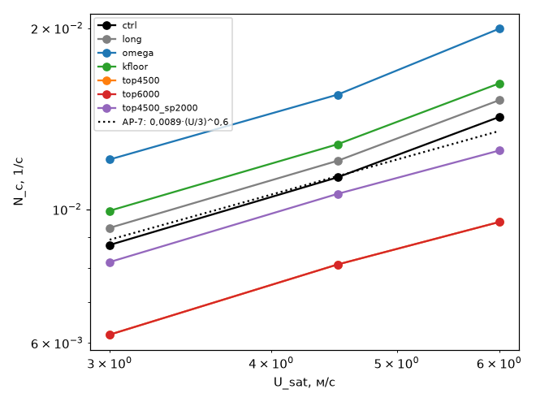
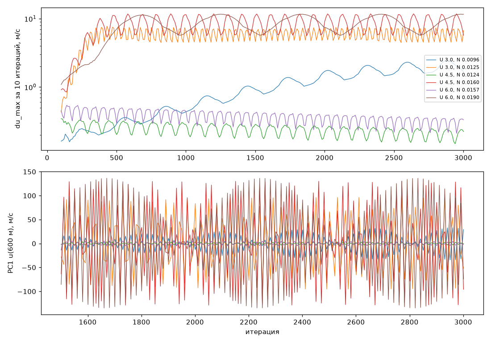
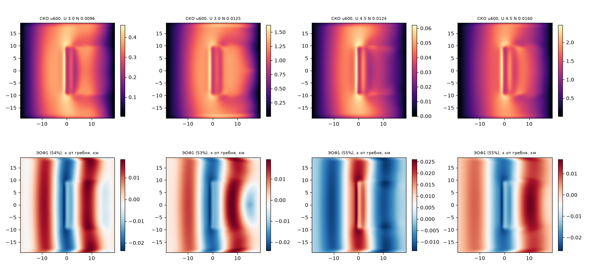

## Порог несходимости U/N ≈ 340–440 м: физика или решатель (планы ap_v3, ap_v3_calm)

`/home/greg/deltaplan-air-synth/tools/research/air_nn_pilot/.venv/bin/python tools/research/air_phase/analysis/AP-13/run.py` (CPU, ≈ 3 мин; числа — `summary.json`, все таблицы — `tables.md`; планы — `plan_build.py --name ap_v3 --series threshold` и `--name ap_v3_calm --series calm`, счёт — `AP_PLAN=ap_v3 run_all.sh` под `dp job --lock gpu`)

**Вывод: решатель (`threshold_cause = solver`), а решающий довод — один: недорелаксация.** ω = 0,5 не меняет уравнения, но поднимает N_c на 0,14 порядка (×1,4, пять шагов сетки) при всех трёх ветрах; при U_sat = 6 м/с сходится вся сетка до N = 0,019. Вариант omega считался 2000 итераций против 1000 у контроля, но длинный счёт без ω (3000 итераций) даёт лишь +1 шаг, значит сдвиг в основном от ω. Порог AP-7 — это граница сходимости итераций Пикара при ω = 1, а не граница фазы течения.

Чувствительность к верху и губке двусмысленна, и в довод за решатель она не входит. Поднять верх до 4500 или 6000 м при губке 1000 м — и не сходится ни одна точка сетки (U/N > 460–630 м); при губке 2000 м порог почти возвращается (−1…−2 шага). Это может быть численным отражением от потолка. Но у порога Nh/U ≈ 1,2–1,5 — режим обрушения волн по линейной теории: низкий верх с губкой 1 км (меньше λ_z = 2–3 км) может гасить волну, а подъём верха — обнажать её физический рост. Стационарный решатель эти два объяснения не разделяет.

Выше порога решатель выходит на периодический цикл: по снимкам через 10 итераций период 20–26 итераций. Это на пределе Найквиста, алиасинг не исключён, поэтому довод «период не зависит от ветра» слабый, и как довод за решатель он не используется. Пол K = 10 м²/с (гипотеза N1) поднимает N_c лишь на два шага (×1,14), а решение при этом меняется на 15–27 % U_sat. Это другая физика, а не лечение, как и в AP-9.

### Данные
231 случай ap_v3, все посчитаны. Хребет s = 0,3, h = 500 м, H = 0, h/z_i = 1, холодный старт. U_sat = 3; 4,5; 6 м/с, по 11 значений N с логарифмическим шагом 0,026–0,028 порядка у порога AP-7 (0,0065–0,0125; 0,0085–0,016; 0,010–0,019 1/с). Семь вариантов: ctrl (как ap_v2); long (3000 итераций, снимки через 10); omega (ω_u = ω_k = 0,5, 2000 итераций); kfloor (K_min = 10 м²/с); top4500, top6000 (верх над вершиной при губке 1000 м); top4500_sp2000 (верх 4500, губка 2000 м). Верх и губка — новая опция Numerics: P2 v5 / P4 v4 (`top_above_m`, `sponge_top_m`). Значения по умолчанию дают ту же сетку и побитно то же поле (тест `test_top_sponge_default_bitwise`). Отдельно план ap_v3_calm по ревью AP-9: 10 случаев штиля GRID (N = 0,01, h = 500, Fr 0,15–0,25, U_sat 0,75–1,25), контроль и ω = 0,3, по 2000 итераций.

### Числа

**1. N_c по вариантам** (у всех порогов 0 ошибок: сходимость по N монотонна, переход в пределах одного шага сетки):

| вариант | N_c при U_sat 3 | 4,5 | 6 | сдвиг, шагов | p в N_c ∝ U^p |
|---|---|---|---|---|---|
| ctrl | 0,0087 | 0,0113 | 0,0142 | — | 0,70 |
| long (3000 итераций) | 0,0093 | 0,0120 | 0,0152 | +1 | 0,70 |
| omega (ω = 0,5) | 0,0121 | 0,0155 | > 0,0199 | +5 | 0,71 |
| kfloor (K_min = 10) | 0,0099 | 0,0128 | 0,0162 | +2 | 0,70 |
| top4500, губка 1000 | < 0,0062 | < 0,0081 | < 0,0095 | < −5 | — |
| top6000, губка 1000 | < 0,0062 | < 0,0081 | < 0,0095 | < −5 | — |
| top4500, губка 2000 | 0,0082 | 0,0106 | 0,0125 | −1…−2 | 0,62 |

Контроль воспроизводит AP-7: U/N_c = 344, 398 и 422 м; λ_z = 2πU/N = 2,2–2,7 км. Третий ветер подтверждает показатель N_c ∝ U^0,70 (AP-7 по двум ветрам давал 0,6–0,7). Против контроля по точкам: ω вылечил 15 из 17 несходимостей и ничего не испортил, K_min — 6 и 0, long — 3 и 0. top4500 и top6000 испортили по 16 из 16 сходившихся точек, губка 2000 м — 4.

**2. Поздняя динамика** (long, 14 несошедшихся, снимки 1500–3000 через 10 итераций, u на 600 м). du_max за последнюю треть счёта такой же, как за первую (медиана отношения 1,00): нет ни роста, ни затухания. Главная ЭОФ несёт 53–59 % дисперсии. Её главная компонента периодична: вершина АКФ 0,91–1,00, период по спектру 20–26 итераций (псевдовремя 2400–3100 с при Δτ_u = 120 с). Он почти одинаков при U_sat 3 и 6 м/с, а при U_sat 3 слегка растёт с N (21 → 26). Но снимки шли через 10 итераций, это предел Найквиста для такого периода: истинный период может быть короче (алиасинг), так что независимость от ветра не доказана. Изменчивость сидит у хребта: 64 % дисперсии в полосе от −6 до +10 км от гребня, максимум в 0,8–1,2 км с наветренной стороны от гребня; в боковых губках только 9–11 %, это меньше их доли площади. Масштаб ЭОФ по x — вся область (17–34 км), а не подветренный волновой цуг. Разброс поздних итераций у несошедшихся: 0,5–1,0 м/с в контроле, 1,9–3,9 м/с при высоком верхе, 0,05–0,19 м/с при K_min = 10.

**3. Сошедшиеся решения разных вариантов в одних и тех же точках** (max|Δu, Δv| по 13 высотам / U_sat). long совпадает с контролем побитно (те же итерации). omega: медиана 0,025, максимум 0,088; разница больше при слабом ветре (U 3: 5–9 %) и не растёт к порогу. top4500 с губкой 2000: 0,03–0,10, то есть верх области заметно меняет и сошедшееся решение (отражение волн). kfloor: 0,15–0,27.

**4. Штиль (ap_v3_calm, Fr 0,15–0,25 при N = 0,01).** Это далеко за порогом: U/N = 75–125 м против N_c ≈ 0,0087·(U/3)^0,7. Контроль за 2000 итераций не сходится; невязка стоит на месте (≈ 0,011, отношение поздних окон 0,99–1,03), разброс 0,56–0,88 м/с. При ω = 0,3 невязка в 3–90 раз ниже, а разброс 0,01–0,19 м/с. Но и так ничего не сошлось: при Fr 0,25 невязка 1,3e-4 (порог 2e-5) и стоит, а при Fr ≤ 0,2 растёт от окна 1000–1500 к окну 1500–2000 (×2,0–2,4). Значит, при Fr ≤ 0,25 одна недорелаксация не спасает: это не просто медленная сходимость, а та же потеря устойчивости итераций, только глубже за порогом.

### Что это значит для фазовой диаграммы
- Граница несходимости без нагрева U/N ≈ 340–440 м (AP-7, SY-12 при U10 2–3 м/с) — это граница сходимости итераций Пикара при ω = 1 (верх 3000 м, губка 1000 м). В фазовой диаграмме такие случаи помечать как «не сошлось при ω = 1»: не «физически нестационарно» и не «физически стационарно».
- Верх и губка меняют и сошедшееся решение на 3–10 % U_sat, то есть постановка верха влияет на волны в любом случае. Почему она двигает порог — численное отражение или подавление физического обрушения волн при Nh/U ≈ 1,2–1,5, — эта серия не решает.
- Что делать дальше:
  - пересчитать несходимости ap_v1, ap_v2 и SY-12 при ω = 0,5 и 2000 итерациях;
  - для 2–3 случаев у порога писать du_max на каждой итерации, без алиасинга, и вертикальные снимки: так период и место моды будут измерены честно;
  - для верха проверить губку не тоньше λ_z (≥ 2–3 км) при верхе 6000 м, вместе с ω = 0,5, и подумать о радиационном условии на верхней границе;
  - отличить обрушение волн от численной моды можно только нестационарной моделью.

### Оговорки и границы модели
- Модель стационарная: неподвижная точка ищется итерациями Пикара по псевдовремени. Период 20–26 итераций измерен в итерациях псевдовремени и физическим временем не является. Существует ли в реальной атмосфере устойчивое стационарное решение выше N_c, этот решатель сказать не может: сошедшееся решение при ω = 0,5 может быть физически неустойчивым (срыв волн при Nh/U ~ 1 по линейной теории), но проверить это можно только нестационарной моделью.
- ω = 0,5 сходится к близкому, но не тождественному решению: разница до 9 % U_sat при U_sat 3 и меньше при более сильном ветре. Возможная причина — ω_k масштабирует внутреннюю релаксацию замыкания K (k_relax), у которой есть память. Возможно и то, что абсолютный критерий останова допускает такую разницу. Поэтому ω — лечение сходимости, но не доказательство единственности решения.
- При высоком верхе с губкой 1000 м порог ушёл за нижний край сетки, известна только оценка сверху (< 0,0062–0,0095). top4500 и top6000 по сетке неразличимы.
- Снимки — только 25 и 600 м над землёй: вертикальную структуру моды (сидит ли она у потолка) по трассам не видно. Вывод про отражение опирается только на сдвиг порога.
- Одна форма (хребет s = 0,3, h = 500, h/z_i = 1), H = 0, один угол ветра. Холм и нагрев не проверялись. Конвективная несходимость (AP-7, w*/U10 ≳ 0,8) — отдельный механизм, к нему вывод не относится.

### Рисунки
-  — сошлось/нет по N при трёх ветрах, ряды — варианты, черта — N_c.
-  — N_c против U_sat по вариантам и оценка AP-7.
-  — du_max и главная компонента u(600 м) длинного счёта у порога и вдали от него: периодический цикл (снимки через 10 итераций, возможен алиасинг).
-  — СКО поздних u(600 м) и ЭОФ1 (x — от гребня, км).
