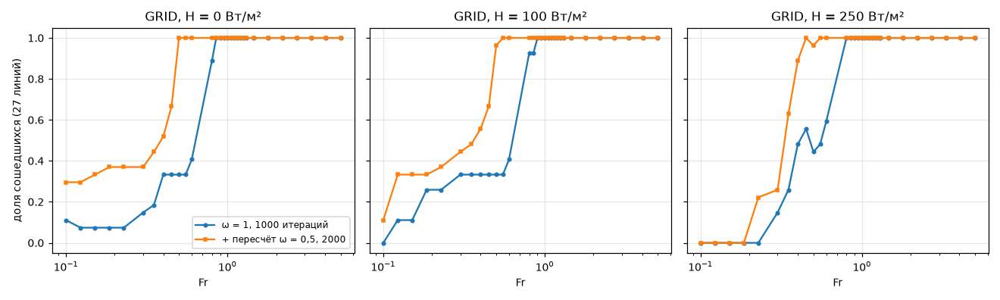
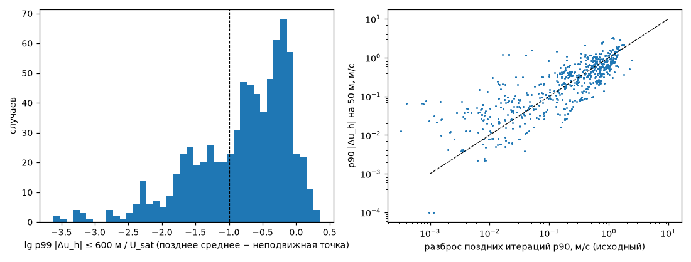
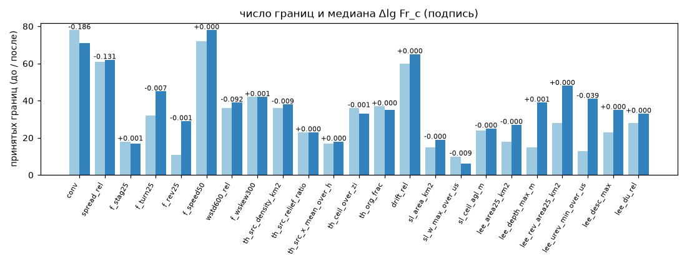
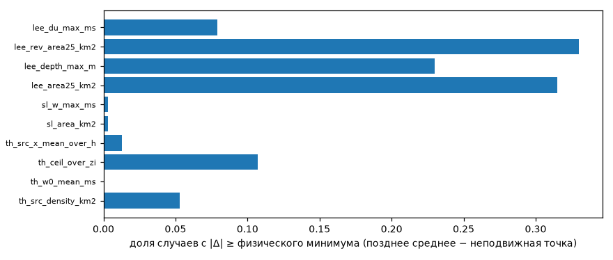

## AP-14: пересчёт несошедшихся при ω = 0,5 и 2000 итерациях (план ap_v1r, серия RERUN)

`PY=/home/greg/deltaplan-air-synth/tools/research/air_nn_pilot/.venv/bin/python; $PY tools/research/air_phase/plan_build.py --name ap_v1r --rerun ap_v1,ap_v2; AP_PLAN=ap_v1r dp job --lock gpu start ap1r-run 25200 …/run_all.sh; $PY tools/research/air_phase/features.py --plan ~/air_synth_data/phase/ap_v1r --results ~/air_synth_data/phase/ap_v1r__s1-ee7be55; $PY tools/research/air_phase/analysis/AP-14/run.py --workers 14` (GPU 3 ч 58 мин; CPU: признаки 1 мин, подгонки «до» ≈ 50 мин один раз, «после» ≈ 10 мин; таблицы — `tables.md`, числа — `summary.json`)

**Вывод.** В переходной полосе Fr 0,45–1,0 недорелаксация ω = 0,5 с 2000 итерациями находит неподвижную точку почти всегда (GRID: 98 % пересчитанных при Fr 0,45–0,6, 100 % при Fr ≥ 0,6). Граница сходимости Пикара в GRID сдвигается с Fr ≈ 0,8 (H = 0 и 100) и 0,6 (H = 250) до 0,40 и 0,35. Сами границы фаз, которые были видны и до пересчёта, почти не сдвинулись: медиана Δlg Fr_c общих границ равна 0 (|Δ| ≤ 0,08 декады у 90 % для застоя, обратного течения и источников термиков), резкость сохранилась. Новое — границы, которые раньше лежали в пропуске несходимости: в пропуске сетки было 16 границ, осталось 1; принятых границ стало 868 (было 733). Позднее среднее несошедшегося счёта при ω = 1 — не замена неподвижной точки: p99 |Δu_h| ≤ 600 м — 0,50 U_sat (медиана GRID), а у 60 % случаев GRID неподвижная точка лежит вне разброса поздних итераций. Для слоёв игры это важно только в подветренной зоне (площадь и глубина различаются выше физического порога в 23–33 % случаев); термики и подъём у склона почти не меняются (≤ 11 % и ≤ 0,3 %).

**Что пересчитано.** План ap_v1r — 1875 случаев: все несошедшиеся (status ≠ 0) ap_v1 и ap_v2 кроме SWEEP. ω_u = ω_k = 0,5, max_outer 2000, позднее окно 1500/50, остальное как у исходной линии (критерий, K_min, огибающая, окно 100 м). Старт холодный — как RELAX и AP-13: недорелаксация не меняет уравнений, значит и неподвижной точки; состояния 300-й итерации исходного счёта не сохранены, и продолжение «ω = 1 до 300, затем ω = 0,5» стоило бы +300 итераций на случай и двухступенчатой схемы, которой нет в P2/P4. SWEEP (749 случаев) пропущены: холодный пересчёт тёплой точки — тот же случай GRID той же конфигурации, а честный тёплый пересчёт — вся цепочка заново. Объединённые таблицы: `features_ap_v1_merged.h5`, `features_ap_v2_merged.h5` (исходный случай, если сошёлся, иначе пересчёт).

| исходная серия | случаев | сошлось при ω = 0,5 | доля |
|---|---|---|---|
| GRID | 747 | 294 | 0,39 |
| FIXED_U (ap_v2) | 150 | 61 | 0,41 (ось h 0,85; ось N 0,25) |
| RELAX | 486 | 147 | 0,30 (kfloor 0,60; rel 0,30; omega 0,11; calm 0,04) |
| ENVELOPE_REAL | 419 | 221 | 0,53 |
| ERODED | 55 | 19 | 0,35 |
| ENVELOPE, SEPARATION | 18 | 16 | 0,89 |
| всего | 1875 | 758 | 0,40 |

Сошедшиеся — медиана 481 итерация (90 % — 1230), разошедшихся нет. Доля сошедшихся в GRID по Fr: ≤ 0,2 — 0,14; 0,2–0,3 — 0,24; 0,3–0,45 — 0,38; 0,45–0,6 — 0,98; ≥ 0,6 — 1,0. Вся сетка GRID: сошлось 0,69 → 0,81. Ось N в ap_v2 при N ≥ 0,02 не сходится и при ω = 0,5 — порог U/N (AP-13) сдвинут, но не снят.

**Границы AP-8 до и после** (подгонки и критерии AP-8 без изменений, по сошедшимся точкам; «чистые» — Fr_c > 0,45 и не в пропуске; полная таблица — `tables.md`):

| параметр | Fr_c чистых до → после | w, дек до → после | линий с границей до → после |
|---|---|---|---|
| сходимость Пикара (решатель) | 0,69 → 0,47 (все линии: 0,37) | 0,003 → 0,001 | 78 → 71 |
| обход f_turn25 | 0,96 → 0,89 | 0,03 → 0,03 | 32 → 45 |
| обратное течение f_rev25 | 0,97 → 0,96 | 0,02 → 0,02 | 11 → 29 |
| застой f_stag25 | 1,39 → 1,26 | 0,03 → 0,03 | 18 → 17 |
| ротор: площадь u·e < 0 | 1,25 → 1,25 | 0,02 → 0,02 | 28 → 48 |
| ротор: min u·e / U | 1,05 → 0,83 | 0,04 → 0,05 | 13 → 41 |
| глубина подветренной зоны | 1,12 → 0,99 | 0,01 → 0,01 | 15 → 39 |
| наклон опускания s_d | 0,84 → 0,77 | 0,04 → 0,07 | 23 → 35 |
| торможение f_speed50 | 0,83 → 0,58 | 0,12 → 0,10 | 72 → 78 |
| снос термиков | 0,68 → 0,59 | 0,12 → 0,12 | 60 → 65 |
| площадь подветренной зоны | 1,28 → 0,96 | 0,16 → 0,19 | 18 → 27 |
| густота источников термиков | 1,07 → 1,03 | 0,03 → 0,05 | 36 → 38 |
| потолок термиков / z_i | 1,50 → 1,46 | 0,15 → 0,14 | 36 → 33 |
| подъём у склона (площадь) | 2,44 → 2,44 | 0,07 → 0,07 | 15 → 19 |

Сдвиг медиан Fr_c вниз — от состава: добавились линии, у которых граница раньше была не видна (в пропуске несходимости Fr 0,45–0,8). Общие границы до и после почти совпадают; заметно (|Δlg Fr_c| > max(2w, шаг сетки)) сдвинулись 4–9 границ на параметр у интегральных величин (f_speed50, снос, ΔU, σ_w на 600 м; в основном H > 0) и единицы у блокирования (обход — 4, площадь обратного течения — 3: хребет при h/z_i = 3 с Fr_c ≈ 1,0 на 0,40–0,44). Из 208 новых границ 148 лежат в штиле (Fr_c ≤ 0,45): обратное течение, ротор и глубина подветренной зоны появляются у неподвижных точек при Fr 0,12–0,45.

**Позднее среднее против неподвижной точки** (758 сошедшихся после пересчёта): p99 |Δu_h| ≤ 600 м / U_sat — медиана 0,23 (GRID 0,50, FIXED_U 0,11, ENVELOPE_REAL 0,05); > 0,1 U_sat у 68 % (GRID 90 %); p90 |Δu_h| на 50 м вне разброса поздних итераций у 52 % (GRID 60 %). Метрики слоёв (`layer_diff`, физические минимумы AP-8): площадь подветренной зоны — 32 % случаев выше порога, обратное течение — 33 %, глубина — 23 %, ΔU — 8 %; потолок термиков — 11 %, густота источников — 5 %, сила ядра — 0; подъём у склона — 0,3 %.

**Оговорки.**
- Абсолютный критерий P4 (2·10⁻⁵ м/с²) при U_sat < 5 м/с мягче относительного в (5/U_sat)² раз: в штиле Fr ≤ 0,45 (U_sat ≤ 2,25 м/с) «сошлось» — невязка ниже порога, но в относительных единицах в 5–100 раз выше, чем при Fr = 1. Это касается и исходного счёта, и AP-8; новые штилевые границы ротора и обратного течения (148) — по таким точкам, их положение ненадёжно (решатель находит неподвижную точку за 11–60 итераций у части штилевых случаев — поле почти фоновое).
- Пересчитаны только несошедшиеся: у сошедшихся при ω = 1 неподвижная точка уже есть (AP-13: ω не меняет уравнений; AP-9: до 9 % U_sat между ω = 1 и 0,5 у сошедшихся обоими способами). Единственность неподвижной точки не проверялась (ветвь у уступа — AP-15).
- SWEEP не пересчитан: гистерезис и второй старт (AP-8 п. 3) — по-прежнему по исходному счёту; шум стартов для критерия резкости пересчитан по объединённой таблице.
- Решатель пересчёта — `s1-ee7be55` (AP-13: верх и губка в Numerics, по умолчанию побитно как `s1-74644c4`).

