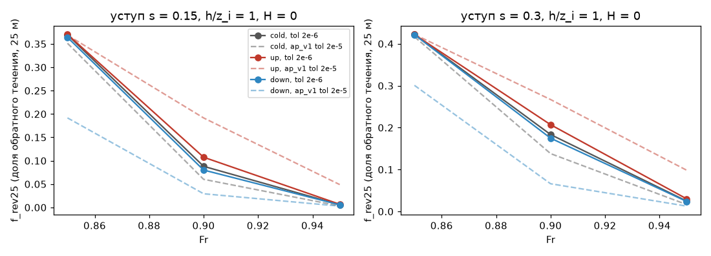
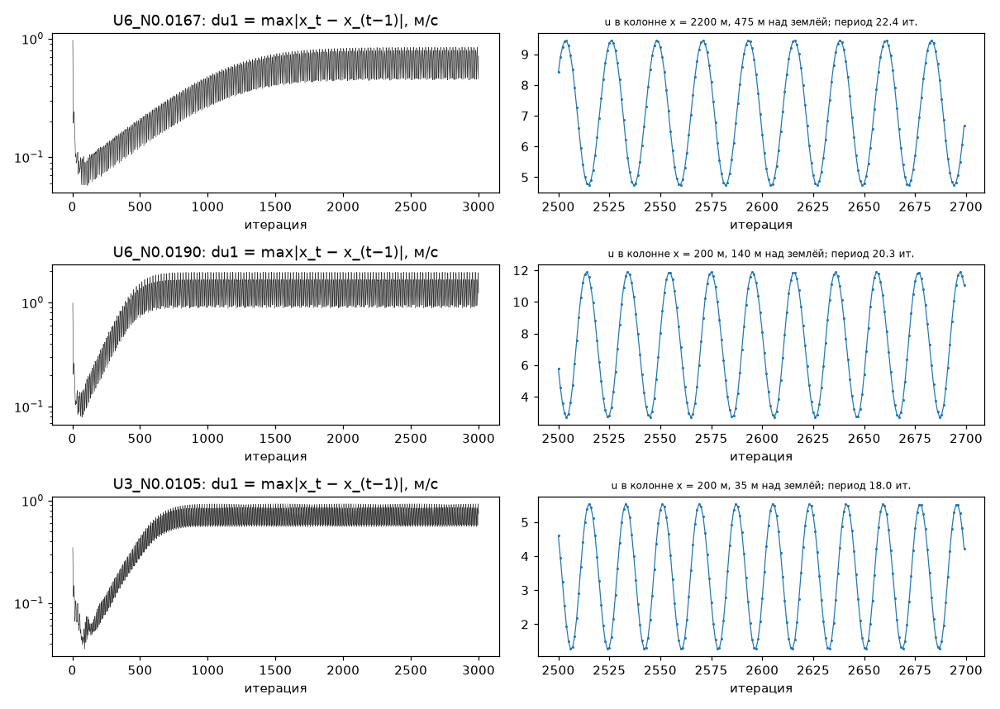
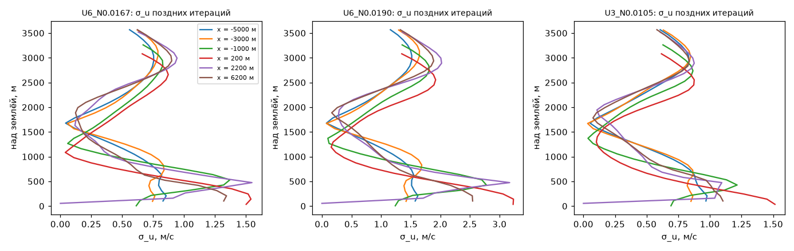
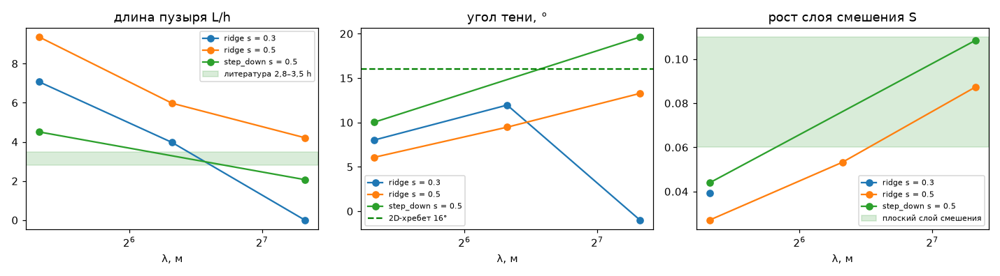
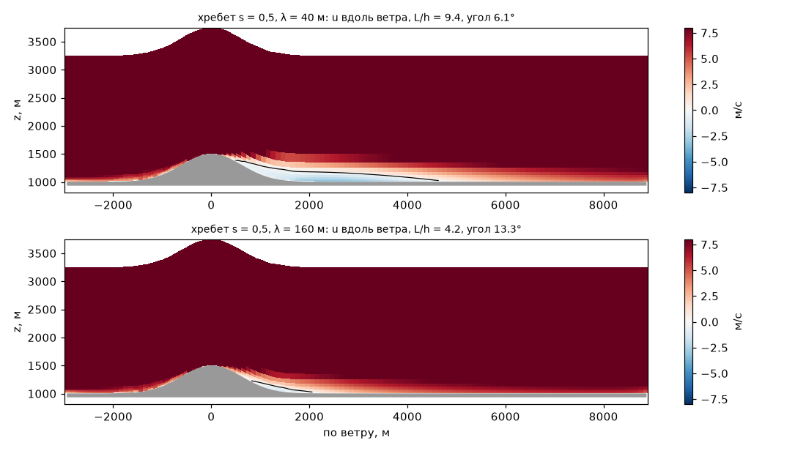

## AP-15: малые пробы — ветвь у уступа, период цикла у порога U/N, λ K-замыкания

`$PY tools/research/air_phase/probe_build.py run` (GPU, под `dp job --lock gpu`, план `ap_probe`, 45 случаев, 4 мин счёта) → `$PY tools/research/air_phase/analysis/AP-15/run.py` (CPU, < 1 мин); дозамер ветви: `probe_build.py run --plan $AIR_SYNTH_DATA/phase/ap_probe_t` (26 случаев, tol 2e-7), затем снова `run.py`. `$PY` = `/home/greg/deltaplan-air-synth/tools/research/air_nn_pilot/.venv/bin/python`.

**Вывод.**
1. **Ветвь у уступа — `unclear`, скорее нет.** При критерии в 10 раз строже (tol 2e-6) сошлись все 18 случаев и все 18 пар состояний (холодный, тёплый снизу, тёплый сверху). Три «разных» состояния AP-8 почти слились. Пример — s = 0,3, Fr 0,9: f_rev25 был 0,27 / 0,14 / 0,07 (вверх / холодный / вниз), стал 0,21 / 0,18 / 0,17. В 17 парах из 18 доля клеток с |Δu| > 0,1 U_sat стала < 1 %, а p99 |Δu| упал в 3–32 раза. Меньше чем в 3 раза он упал в двух случаях. Первый — пары, где расхождение и при tol 2e-5 было ≤ 0,01 U_sat. Второй — пары при s 0,3, Fr 0,9: холодный против снизу (2,9) и снизу против сверху (2,3). Одна пара осталась на грани критерия: s = 0,3, Fr 0,9, вверх против вниз — 1,35 % объёма > 0,1 U_sat, max 0,21 U_sat, Δf_rev25 = 0,032. Против tol 2e-5 её p99 сжался лишь в 2,3 раза (доля объёма — в 8 раз, Δf_rev25 — в 6). Fr 0,9 — точка самого медленного схождения (холодный старт — 731 итерация против 491 при Fr 0,95), и там ошибка ~ε/(1−ρ) больше всего. Это говорит за критическое замедление, но порог 3× формально не пройден. Дозамер tol 2e-7 при Fr 0,9 (план `ap_probe_t`) стоит в очереди GPU после AP-14. Если p99 упадёт ещё в ≥ 3 раза и доля станет < 1 % — `no`, если не изменится — `yes`; `run.py` решает это сам.
2. **Цикл у порога U/N — численная мода всей колонны; период зависит от U/N, алиасинга в AP-13 не было только при U_sat 6.** du_max и колонны записаны на каждой итерации (3000 итераций, 2999 записей на случай). Период по спектру u в колоннах, пик несёт 99,9 % мощности полосы, АКФ на периоде 0,98–0,99:

   | U_sat, м/с | N, 1/с | Fr | N/N_c (long, AP-13) | период, итераций | период / Fr | λ_z/(период·Δz) |
   |---|---|---|---|---|---|---|
   | 6 | 0,0167 | 0,72 | 1,10 | 22,4 | 31,2 | 0,96 |
   | 6 | 0,019 | 0,63 | 1,25 | 20,3 | 32,2 | 0,93 |
   | 3 | 0,0105 | 0,57 | 1,13 | 18,0 | 31,6 | 0,95 |

   Период одинаков во всех шести колоннах (−5…+6 км от гребня) и в невязке; du1 = max|x_t − x_{t−1}| колеблется с половинным периодом (11,2 / 10,2 / 9,0). Период не постоянен: P ≈ 31,6·Fr ± 2 % (при h = 500 м это ∝ U/N). Иначе: за итерацию фаза уходит на ~1 ячейку по вертикали (λ_z = 2πU/N, Δz = 105 м). Значит, для U_sat 3 цикл в AP-13 шёл с алиасингом: снимки через 10 итераций, 18 итераций короче двух шагов, и видимый период выходил 22–26. Рост периода с N у U_sat 3 там — артефакт. При U_sat 6 период 20–22 лежит выше предела Найквиста, и AP-13 его не исказил. Цикл не затухает: du1 в последней трети такой же, как в первой (отношение 1,00–1,32). **Где по высоте:** колебание занимает всю толщу до верха области. У u две пучности. Нижняя — 100–550 м над землёй, σ_u 1,1–1,5 м/с. Верхняя — 2,4–3,0 км, σ_u ≈ 0,85 м/с, в губке и под ней (губка начинается в 2,1–2,6 км над землёй колонн). Узел — на 1,1–1,4 км. У θ′ пучность в середине (0,8–2 км, σ 0,8–1,2 К). Доли дисперсии u: ≤ 300 м — 16–18 %, 300–1000 м — 31–35 %, 1–2 км — 5–6 %, выше 2,5 км — 34–37 %. По горизонтали сильнее всего у гребня и в 1–2 км за ним и перед ним, но амплитуда той же фазы есть и в 5–6 км. Картина — стоячая мода всей колонны между землёй и верхом, губка её не гасит. Это поддерживает подозрение AP-13 (§9 п. 5) на верх и губку и на то, что цикл — свойство итераций Пикара, а не волновой цуг за хребтом.
3. **λ K-замыкания — причина длинного пузыря: `partly` (главная причина, но не вся).** Окно 100 м, Fr 3, H = 0, h/z_i = 0,3. При λ = 40 м пузыри совпадают с SEPARATION ap_v1 до 4 знаков (L/h 7,07 / 9,36 / 4,51) — проверка постановки.

   | форма | λ, м | L/h | угол тени, ° | u_обр/U_sat | H/h | S (рост слоя смешения) |
   |---|---|---|---|---|---|---|
   | хребет s 0,3 | 40 / 80 / 160 | 7,07 / 3,97 / — | 8,0 / 12,0 / — | −0,10 / −0,015 / 0 | 0,22 / 0,07 / 0 | 0,039 / — / — |
   | хребет s 0,5 | 40 / 80 / 160 | 9,36 / 5,97 / 4,21 | 6,1 / 9,5 / 13,3 | −0,21 / −0,18 / −0,08 | 0,39 / 0,29 / 0,17 | 0,027 / 0,053 / 0,087 |
   | уступ вниз s 0,5 | 40 / 160 | 4,51 / 2,07 | 10,0 / 19,6 | −0,15 / −0,03 | 0,27 / 0,08 | 0,044 / 0,108 |

   Рост λ в 4 раза поднимает S хребта до литературного 0,06–0,11 (0,087) и укорачивает пузырь хребта s 0,5 в 2,2 раза (9,4 → 4,2 h). Угол тени растёт с 6° до 13°, обратный поток слабеет с −0,21 до −0,08 U_sat, то есть входит в аэротрубные −0,1…−0,2. Значит, медленный рост слоя смешения из-за малого λ — действительно главная причина длинного пузыря AP-10. Но до литературы хребет не доходит: 4,2 h против 2,8–3,5 h и 13° против ~16°. При том же λ = 160 у хребта s 0,3 (у порога отрыва 0,27) обратное течение исчезает совсем, а пузырь уступа (2,1 h, 19,6°) становится короче, чем у обратного уступа (6–8 h). Одно глобальное λ не подходит сразу для хребта и уступа. Длину перемешивания, видимо, надо привязать к оторвавшемуся слою, а не к высоте над землёй (длина Блэкадара), — это отдельная задача, здесь не проверялось.

**Рекомендации.** Ветвь: в классификатор фаз ветвь не вводить. Флаг «ненадёжно» у уступа и хребта при h/z_i ≈ 1, Fr 0,85–0,95 оставить до дозамера. Цикл: в сборке по фазам не верить полю несошедшихся случаев выше N_c (late mean усредняет моду всей колонны, в том числе у верха). Для проверки AP-13 §9 п. 5 нужен прогон с высоким верхом и толстой губкой — при нём мода должна сменить период или исчезнуть. Для `lee` игры: угол хребта брать по литературе (14–16°), как советовал AP-10. Решатель при λ = 160 даёт 13°, а при λ = 40 занижает угол вдвое.

**Оговорки и границы модели.**
- Решатель — установившиеся RANS по псевдовремени (Пикар, Буссинеск, K = max(K_HB, l²|S|·F(Ri)), l = (1/κz + 1/λ)⁻¹ — длина Блэкадара от земли), float32, сетка-«лесенка» 400 м / Δz 105 м, окно 100 м / 50 м с переносом 2-го порядка. «Период» — в итерациях псевдовремени, физическим временем он не является (×Δτ_u = 120 с даёт 2200–2700 с, но это пересчёт, а не время). Устойчиво ли стационарное решение выше N_c в реальной атмосфере, этот решатель сказать не может.
- Ветвь: критерий «> 0,1 U_sat в ≥ 1 % объёма» (как AP-8), слой ≤ 600 м, 13 уровней S5. Состояния сравниваются при одинаковом абсолютном пороге: tol 2e-6 м/с² (θ и ∇·u — в том же отношении). Невязка в float32 при этом достигается (1,5–2,0·10⁻⁶). Цепочка «снизу» идёт от Fr 0,5, а точки 0,5–0,8 не сходятся за 3000 итераций (цикл; 0,8 — почти: 1·10⁻⁵). Тёплый старт для 0,85 берётся из состояния 0,8 после 3000 итераций, а не из неподвижной точки. В AP-8 SWEEP начинался с 0,3, так что история чуть другая.
- Цикл: три случая, один хребет (s 0,3, h 500), H = 0, h/z_i = 1, верх 3000 м над вершиной, губка 1000 м. Разделить P ∝ Fr и P ∝ λ_z/Δz при фиксированных h и Δz нельзя, нужен прогон с другим Δz или h. Колонны — сырые значения сетки решателя (u, v, w на гранях, θ′ в центре), без интерполяции к уровням. Проверка каждой итерации (CHECK_EVERY = 1) не меняет траекторию: состояние после 201 итерации побитно то же, что при проверке через 10 (`check_every.json`).
- λ: опция действует на всю область и окно, не только на оторвавшийся слой. Растёт и K в верхней части прилегающего пограничного слоя (у земли l ≈ κz от λ почти не зависит). Сравнение — один Fr (3) и одно h/z_i (0,3). S — по сечению через бровку (AP-10 `bubble_diag`), при отсутствии пузыря (хребет s 0,3, λ 160; s 0,3, λ 80 — слой слишком короткий) не определён.

**Рисунки** (агенты их не открывали):
-  — f_rev25 против Fr: холодный, снизу, сверху при tol 2e-6 (сплошные) и ap_v1 при tol 2e-5 (пунктир); звёзды — tol 2e-7, если дозамер посчитан.
-  — du1 на каждой итерации и u в колонне наибольшей σ на итерациях 2500–2700.
-  — σ_u(z) поздних итераций по колоннам: пучности у земли и у верха, узел на 1,1–1,4 км.
-  — L/h, угол тени, S против λ и литература.
-  — u вдоль ветра при λ 40 и 160 м, линия u = 0.
