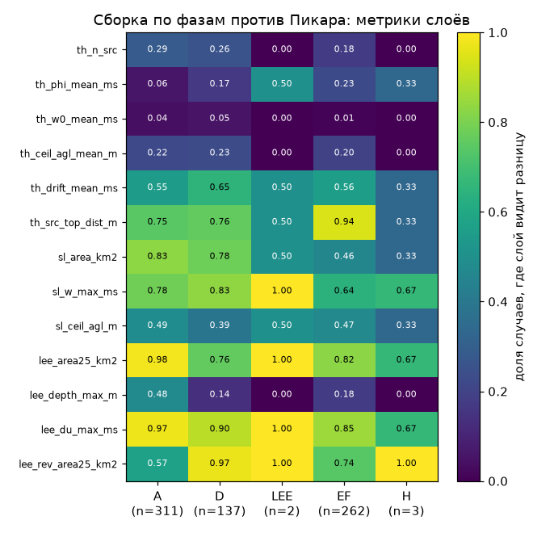
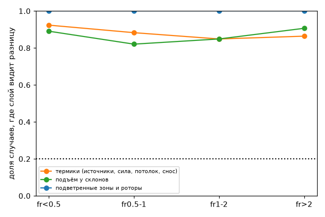
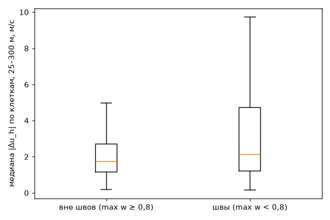
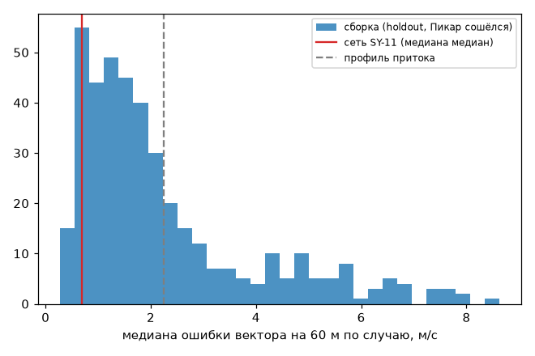
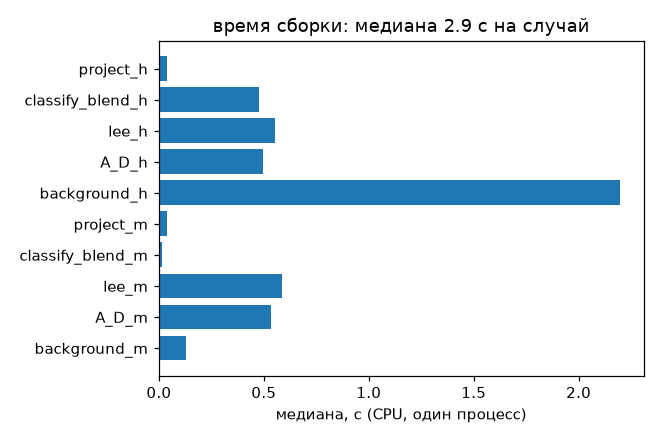

## AP-17: прототип сборки поля по фазам против Пикара (SY-12)

Воспроизведение: `bash tools/research/air_phase/assembly/run_all.sh && python tools/research/air_phase/analysis/AP-17/oracle.py && python tools/research/air_phase/analysis/AP-17/run.py` (интерпретатор — `/home/greg/deltaplan-air-synth/tools/research/air_nn_pilot/.venv/bin/python`; данные — `$AIR_SYNTH_DATA/phase/assembly_v1*`).

**Вывод: сеть убрать нельзя (`can_drop_network = no`).** Сборка по фазам первой версии (классификатор + A через DCT + D: разделяющая линия тока и слои Лапласа + огибающая 12° с пузырём + E/F: θ′, анабатика и подобие + H: статистика + один шаг проекции) ни в одной фазе не воспроизводит то, что берут из поля слои игры, с точностью порогов AP-9: разницу с Пикаром видят термики в 88 % случаев, подъём у склонов — в 87 %, подветренные зоны — в 100 %. Ошибка ветра на 60 м — 1,78 м/с (медиана медиан по случаям) против 0,70 м/с у сети SY-11 и 2,24 м/с у профиля притока: сборка снимает около пятой части ошибки профиля притока, сеть — около 70 %. Достаточна сборка только для величин термиков, которые задаёт нагрев, а не поле: сила ядра w0 (разницу видят 3 % случаев), средний поток Φ (14 %), число источников (24 %), потолок (21 %).

### Выборка и метод
- Все 480 случаев holdout и каждый 20-й обучающий случай из тех, где Пикар сошёлся (правило в `run_assembly.select`). Собрано 782 случая. Сравнение — на 715 случаях, где Пикар сошёлся в обоих решениях (m и h): 413 из holdout и 302 из train.
- Сборка получает только рельеф `inputs/hc`, поток тепла `inputs/heat_flux` (вход решателя, функция рельефа и условий) и строку условий S2. Поле решателя она не читает.
- Метрики слоёв считаются по P6 `layer_metrics` (w_mech — w решения без нагрева). «Слой видит разницу» — по порогам AP-9 `LM_KEYS`; пороги **предварительные**. Слой считается достаточным в фазе, если разницу видят ≤ 20 % случаев. Это правило тоже предварительное.
- Фаза случая — фаза с наибольшей средней площадью веса. Распределение: A — 311 случаев, D — 137, E/F — 262, LEE — 2, H — 3. Фаза H почти не попадает в выборку по построению: при Fr ≲ 0,25 Пикар обычно не сходится.

### По фазам и слоям: доля случаев, где слой видит разницу

| фаза | n | термики | термики без положения источника | склоны | подветренные зоны | ошибка на 60 м, м/с | смещение скорости 25–300 м, м/с |
|---|---|---|---|---|---|---|---|
| все | 715 | 0,88 | 0,69 | 0,87 | 1,00 | 1,78 | +0,14 |
| A | 311 | 0,83 | 0,63 | 0,95 | 1,00 | 2,34 | +1,12 |
| D | 137 | 0,81 | 0,74 | 0,94 | 1,00 | 2,07 | −0,02 |
| E/F | 262 | 0,98 | 0,73 | 0,74 | 1,00 | 1,40 | −0,74 |
| LEE | 2 | 0,50 | 0,50 | 1,00 | 1,00 | 1,10 | +0,20 |
| H | 3 | 0,33 | 0,33 | 0,67 | 1,00 | 0,66 | −0,44 |

Медианы по величинам (Пикар → сборка, доля «видит»):
- площадь подветренной зоны на 25 м — 96 → 18 км² (0,88);
- скачок слоя смешения ΔU_max — 7,0 → 4,8 м/с (0,91);
- обратное течение — 4,0 → 1,4 км² (0,71);
- площадь подъёма у склона > 1 м/с — 8,5 → 6,4 км² (0,68);
- наибольший подъём у склона — 1,78 → 1,70 м/с (0,74);
- снос термиков — 7,0 → 6,9 м/с (0,57);
- расстояние сильнейшего источника от вершины — разницу видят 0,82. Величина неустойчива: это arg max по почти равным Φ.

Положение подветренных зон почти не совпадает: медиана IoU 0,08. Положение подъёма у склонов — IoU 0,26. Источники термиков совпадают (IoU 0,99), потому что их задаёт нагрев. Полная таблица — `tables.md`.

### Что именно не так (диагностика)
- **Средний профиль.** У Пикара ветер у земли на 25–40 % ниже профиля притока до высоты ~1 км: внутренний пограничный слой K-замыкания плюс сопротивление формы рельефа. Столб фона (то же замыкание, разгон от края, сопротивление формы ½·C_d·λ_f с C_d = 0,3 из литературы, без подгонки) даёт только часть дефицита. В фазе A скорость в слое 25–300 м завышена на 1,1 м/с, в E/F и при Fr < 0,5 занижена на 0,7–1,0 м/с: у Пикара перемешивание при нагреве сильнее.
- **«Оракул профиля»** (`oracle.py`, только диагностика, не результат сборки): средний по области профиль u, v, θ′ на каждой высоте заменили профилем Пикара. Снос термиков исправляется (доля «видит» 0,57 → 0,23), ошибка на 60 м падает до 1,53 м/с, термики без положения источника — до 0,44. Но склоны (0,87) и подветренные зоны (1,00) не меняются. Значит, дело не в одной кривой на случай, а в пространственной структуре. Линейная теория симметрична («+» на вершине, «−» в ложбине) и не даёт нелинейного затенения долин и подветренных склонов. А именно на него опираются признак отрыва поля (`lee_flag`) и подъём у склона. Огибающая 12° закрывает тенью всего 3–7 % площади, а у Пикара подветренная зона — около 100 км².
- **Анабатика** — простая форма, помечена в коде. Без неё (вариант `assembly_v1_noana`) склоны и подветренные зоны не меняются, а средний поток термиков Φ хуже: доля «видит» 0,30 против 0,14. Поэтому она оставлена в основном варианте.

### Швы
Швы — клетки с max w_φ < 0,8, это 18 % площади (медиана по случаям). Ошибка |Δu| в слое 25–300 м: в швах 2,14 м/с, вне швов 1,75 м/с. Ошибка |Δw|: 0,26 и 0,19 м/с. В случаях с фазой A швы — это пятна огибающей и нагрева, там ошибка 4,95 против 1,96 м/с. При Fr около 1 вся область — шов (D: 91 % площади), и ошибка там та же, что вне швов (2,33 и 2,35). Ошибку определяет не сшивка, а механизмы. Проекция работает: дивергенция на гранях — до округления (max 1,3·10⁻¹⁴ 1/с), в центрах rms падает с 2,7·10⁻³ до 4,3·10⁻⁴ 1/с.

### Время
- **CPU.** Медиана 2,9 с на случай (p90 5,2 с), один процесс numpy, оба варианта (m и h). Больше всего — столб фона с нагревом (2,2 с, 24 столба), огибающая с повторным A/D (0,55 с) и A + D (0,5 с). Проекция — 0,04 с.
- **GPU.** Это оценка по числу операций, не замер (§15.2). Порядок 15–50 мс на пересчёт: DCT матричным умножением ~3·10⁹ FLOP — 2–4 мс; слои Лапласа V-циклом — 5–30 мс; марши и столб — ~10 мс; проекция — 1–5 мс. Для сравнения Пикар на GPU: 3,6 мс × 100–1000 итераций = 0,4–3,6 с. По скорости сборка проходит с большим запасом. Не проходит по качеству.

### Сравнение с сетью SY-11
Источник — `eval_holdout.json`, только ошибка на 60 м. Метрик слоёв у сети нет, поэтому сравнить по слоям нельзя.

| | ошибка на 60 м, медиана медиан по случаям, м/с |
|---|---|
| сеть SY-11, 480 случаев holdout (вместе с несошедшимися) | 0,70 |
| сборка, 413 случаев holdout, где Пикар сошёлся | 1,64 |
| сборка, все 715 сравниваемых случаев | 1,78 |

У профиля притока медиана по клеткам 2,24 м/с.

### Где сборки достаточно и что нужно
- **Достаточно:** число, сила и средний поток термиков, потолок (при поправленном профиле — снос). Эти величины слой масштаба 2 берёт из нагрева и формул (w*, Аллен), поле влияет на них слабо.
- **Недостаточно, нужно другое:**
  - Подъём у склонов (A, D, E/F — 74–95 % случаев) и подветренные зоны (100 %). Нужно нелинейное затенение и отрыв за рельефом. Его даёт Пикар (короткий тёплый старт из собранного поля, 20–50 итераций, по маске в полосах швов и подветра — «Идеи» плана) или поправка, обученная на разности «Пикар − сборка». Это и есть сеть как поправка к аналитике (§15.6, H11).
  - Средний профиль пограничного слоя над рельефом (торможение массивом). Нужно сопротивление формы, откалиброванное на Пикаре или на измерениях. C_d из литературы мало, а подгонять его под Пикар задача запрещала.
  - Фаза C (Fr около 1, D↔A) — вся область в шве. Механизма C нет, нужен Пикар (§15.2).
- **Рекомендация:** сеть оставить. Сборку по фазам использовать как физическую основу: карта фаз для отладки, тёплый старт Пикара, база для поправки. Не использовать её как замену поля.

### Оговорки и границы модели
- Эталон — Пикар 400 м с K-замыканием. Его подветренный пузырь длиннее литературного (AP-10), так что «отличается от Пикара» не всегда значит «неверно физически». Но для шлюза вопрос именно такой: заменить сеть, обученную на Пикаре.
- Пороги «видит разницу» предварительные (AP-9), правило «≤ 20 % случаев» — тоже. С порогами вдвое мягче вывод не изменился бы: у склонов и подветренных зон доли «видит» 0,7–1,0, у ключевых величин расхождения в разы (площадь зоны 96 против 18 км²).
- Механизмы — первые рабочие версии:
  - A — терраин-следующие высоты и одна U_ref на моду (средний слой JH75); ограничение возмущения 0,8·U(z) — страховка;
  - N_eff — двухслойная замена;
  - D — потенциал по слоям (предел Fr → 0), H_c по 5-му процентилю и максимуму;
  - пузырь — r = 0,2 по литературе;
  - анабатика — масштаб Hunt et al. 2003 по памяти, длина склона 2 км — допущение;
  - θ′ — баланс столба без горизонтальной диффузии;
  - механизма C нет;
  - H — среднее равно полю D, а разброс 0,45·U_sat отдаётся в stats.
- Пороги классификатора взяты из идеальных форм; ширина D — 0,1 декады по AP-11. На реальном рельефе (AP-11) границы размыты в 5–10 раз.
- Фазы H и LEE как доминирующие почти не представлены: 3 и 2 случая. Выводы по ним — не статистика.

