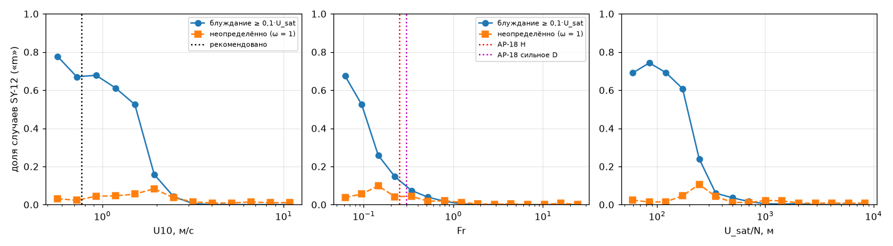
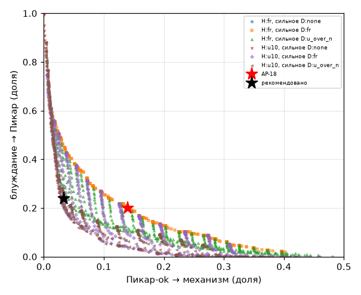
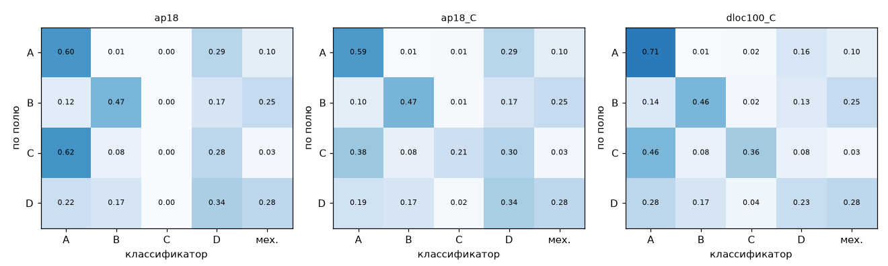
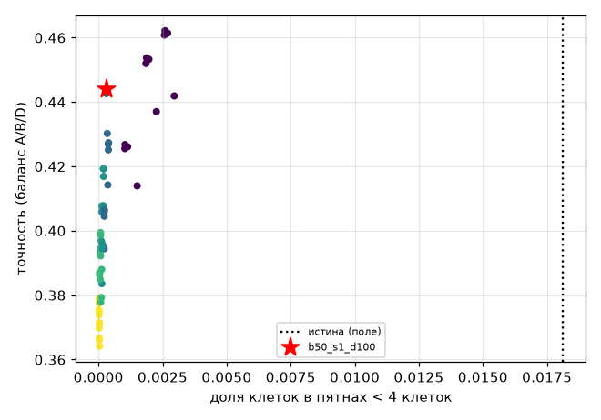
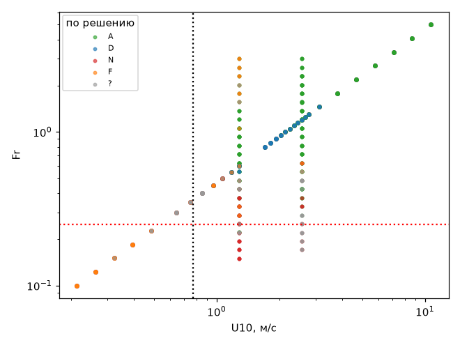

## AP-23: проверка классификатора фаз (P15) — куда классификатор отправляет случай и верно ли это

`PY=/home/greg/deltaplan-air-synth/tools/research/air_nn_pilot/.venv/bin/python; dp lock cpu ap23 -- $PY tools/research/air_phase/analysis/AP-23/run.py --stage all --workers 8` (≈ 1 мин счёта на 8 процессах + 30 с отчёта; решения не пересчитываются, GPU не нужен).

**Вывод (`verdict = needs_work`; по реальному рельефу при ω и бюджете игры все условия выполнены, не выполнено одно — на идеальном хребте GRID).**
- Главное для маршрута — ось штиля. Несходимость Пикара в SY-12 следует **ветру U10**, а не Fr: при U10 ≥ 3 м/с Пикар сходится в 95–100 % случаев при любом Fr, в том числе при сильном блокировании Fr 0,15–0,25.
- Поэтому правило AP-18 «Fr < 0,3 — вся область механизмам» отдаёт механизмам сходящиеся случаи.
- Все 1212 несошедшихся при ω = 1 решений SY-12 пересчитаны при ω = 0,5 — и те, что идут в Пикар, и те, что идут механизмам (раздел 5). По этим меткам, с бюджетом игры 1000 итераций, AP-18 отдаёт механизмам **16–17 %** сходящихся решений.
- Рекомендованный конфиг: область замораживается, если U10 < 0,77 м/с (штиль H) или U_sat/N < 250 м (сильное D).
- Ошибки рекомендованного на SY-12 по меткам ω = 0,5:

  | решение | блуждание → Пикар | сходящийся → механизм | AP-18 |
  |---|---|---|---|
  | «m» | 0,102 (24 из 235) | **0,047** | 0,123 / 0,160 |
  | «h» | 0,147 | 0,053 | 0,123 / 0,167 |

- Остаток «блуждание → Пикар» закрывает запасной путь P12 v2: цена — время GPU, не плохое поле.
- Механизмам рекомендованный конфиг отдаёт в основном верно: из решений, блуждавших при ω = 1 и отданных механизмам, при ω = 0,5 за ≤ 1000 итераций сходятся лишь 26 %, ещё 52 % блуждают с разбросом ≥ 0,1·U_sat.
- **Порог сильного D пересмотрен по меткам ω = 0,5** (`threshold_scan`). Сумма ошибок на SY-12 почти плоская на U_sat/N_c 230–270 м: 0,178 / 0,175 / 0,177. Минимум — 250 м.
  - 230 м снижает «сходящийся → механизм» на GRID с 0,18 до 0,145 ценой +0,013 «блуждание → Пикар» на SY-12;
  - 200 м даёт на GRID 0,11, но на SY-12 сумма ошибок 0,187 («блуждание → Пикар» 0,14–0,18).
- Невыполненное условие: на идеальном хребте GRID «сходящийся → механизм» 0,18 (полоса Fr 0,4–0,5, U_sat/N < 250 м: Пикар при ω = 0,5 сходится там в 85 % случаев). Ниже 0,10 его не опускает ни один порог U_sat/N ≥ 200 м.
- Местные фазы (B, C, D по клеткам) угадываются средне. Маршрут от них не зависит — эти клетки всё равно считает Пикар.
- «Шахматки» нет ни в одном варианте.

### Правила «истинной» фазы (по решению Пикара; полностью — `summary.json → truth_rules`)
- **Пикар-ok:** status 0 или разброс поздних итераций < 0,05 м/с; у пересчёта AP-14 (2000 итераций) — ещё и ≤ 1000 итераций (бюджет игры).
- **Блуждание hard:** не сошлось и разброс ≥ 0,1·U_sat. Такое блуждание ω не лечит (AP-9: в штиле 0,39–0,63 U_sat; после ω = 0,5 — 0,07).
- **Неопределённо:** промежуток между ними — в знаменатели ошибок не входит.
- **F:** решение с нагревом блуждает, а без нагрева сходится.
- **N:** блуждает и без нагрева. Это H или сильное D, по полю их не различить; оба — механизмы.
- **D:** у сошедшихся — не меньше двух из трёх признаков на 25 м: застой f_stag25 ≥ 0,023, обход f_turn25 ≥ 0,044, обратное течение f_rev25 ≥ 0,18. Пороги — середины сигмоид AP-8 (медиана y₀ + Δy/2 по линиям).
- **A:** остальные сошедшиеся.
- **B есть:** площадь обратного течения за гребнем ≥ 4 км².
- **C есть:** max |w(600 м)| ≥ 1 м/с (min_sink дельтаплана).
- **По клеткам** (сошедшиеся поля «m», 25 м):
  - B — обратное течение в тени гребня (выше клетки на 50 м в пределах 2 км против ветра);
  - D — застой, обход или обратное течение вне B;
  - C — |w(600 м)| ≥ 1 м/с;
  - иначе A.

Классификатор — `tools/research/air_phase/classifier_ref.py`: формулы AP-18 (`hybrid/pipeline.py` + `assembly/assemble.classify`) в порядке фаз игры P10. Входы — рельеф, строка условий S2 и поток тепла.

### 1. Маршрут по случаям: AP-18 против рекомендованного
Доли случаев: «бл → П» — блуждание отправлено в Пикар, «ok → мех» — сходящийся случай отправлен механизму.

| набор (счёт Пикара) | n ok / hard | AP-18: бл → П | AP-18: ok → мех | рек.: бл → П | рек.: ok → мех |
|---|---|---|---|---|---|
| SY-12 «m», метки ω = 1 (для справки) | 6692 / 472 | 0,199 | 0,139 | 0,239 | 0,033 |
| **SY-12 «m», ω = 0,5, ≤ 1000 итераций (раздел 5)** | 6969 / 235 | 0,123 | 0,160 | **0,102** | **0,047** |
| **SY-12 «h», ω = 0,5, ≤ 1000 итераций** | 6987 / 252 | 0,123 | 0,167 | 0,147 | **0,053** |
| SY-12 «h» без G, метки ω = 1 | 6768 / 448 | 0,156 | 0,148 | 0,230 | 0,040 |
| ap_v1 GRID (ω = 0,5 после AP-14) | — | 0,156 | 0,067 | **0,005** | 0,180 |
| ap_v2 (ω = 0,5 после AP-14) | — | 0,492 | 0,039 | 0,477 | 0,015 |
| ap_v3, ω = 0,5 (4 блуждающих) | — | 1,0 | 0 | 0,75 | 0,034 |
| ERODED (после AP-14) | 150 / 28 | 0 | 0,047 | 0 | 0,060 |

Доля области, отданной механизмам на SY-12 «h» с G: 0,197 у AP-18, 0,099 у рекомендованного.

Сравнение вариантов — `summary.json → candidates`. Ни одно правило не хорошо везде. Порог, лучший на SY-12 при ω = 1 (U10 < 2,2 м/с), на идеальных формах при ω = 0,5 отдаёт механизмам 47 % сходящихся случаев. Лучший по идеальным формам (Fr < 0,40 или U/N < 196 м) на SY-12 даёт «ok → мех» 0,21. Рекомендованные пороги взяты из замеров при ω игры, а не подогнаны:
- **U10_c = 0,77 м/с.** При ω = 0,5 GRID сходится в 50 % случаев при Fr 0,36 (среднее по H = 0/100/250, пересчёт AP-14), что в GRID соответствует U10 = 2,14·Fr. Согласуется с AP-9: при ω = 0,5 сходится 0,41 при U10 < 1 м/с и 0,89 при 1–1,5 м/с.
- **(U_sat/N)_c = 250 м** — минимум суммы ошибок на SY-12 по меткам ω = 0,5 (`threshold_scan`). Согласуется с AP-13: U/N_c при ω = 0,5 на хребте — 248 и 290 м при U_sat 3 и 4,5 м/с; прежняя рекомендация — 270 м.

**Какая ось.** Логистическая регрессия на SY-12 («m», блуждание hard против ok), CV log-loss:

| оси | lg Fr | lg U10 | lg U_sat/N | lg U10 + lg Fr | lg U10 + lg N + lg h |
|---|---|---|---|---|---|
| CV log-loss | 0,143 | **0,111** | 0,125 | 0,104 | 0,105 |

При ω = 1 центр по U10 — 1,26 м/с (ширина 0,10 дек), по Fr — 0,10 (ширина 0,21 дек, размыто). Fr сам по себе — плохой предиктор: в SY-12 перепад h = 240–2700 м, и Fr 0,25 соответствует U_sat от 0,6 до 6,8 м/с.

**Матрица по случаям, SY-12 «m», рекомендованный конфиг, метки ω = 1 (по меткам ω = 0,5 — `errors_full.recommended.sy12_omega05`).** Строки — фаза по решению, столбцы — фаза классификатора. Ds — сильное D (заморозка).

| по решению \ класс. | A | D | H | Ds |
|---|---|---|---|---|
| A | 2409 | 711 | 21 | 133 |
| D | 1156 | 2192 | 9 | 61 |
| N (блуждание) | 2 | 111 | 92 | 267 |
| неопределённо | 19 | 106 | 4 | 27 |

У AP-18 в строке D — 542 случая в H и 225 в Ds: сильное блокирование при ветре, которое Пикар сводит. Матрицы «h» и идеальных наборов — `confusion_sy12_cases`, `confusion_ideal`.

**F и G.**
- Несходимость от нагрева в SY-12 редка: 41 случай из 7320. Её доля растёт с w*/U10: 0,1 % при < 0,6, 6 % при 0,8–1, 9 % при 1–1,3, 15 % при 1,3–2, 25 % при > 2.
- Заморозка F (w* ≥ U_sat в клетке) срабатывает почти во всех случаях с w*/U10 ≥ 1. Значит, как детектор несходимости она слабая: большинство замороженных F случаев Пикар бы свёл. Как физический режим свободной конвекции (−z_i/L ≳ 25, Weckwerth 1999) она оправдана.
- Тепловая несходимость при w*/U10 0,8–1,3 на идеальных формах (AP-7: 0,44–0,90) классификатором не ловится.
- G включён в 611 случаях SY-12, заморозка ≥ 0,5 — в 26. Сверять с Пикаром нельзя: у Пикара нет потока тепла < 0. Поэтому G в ошибки не входит.

### 2. Местные фазы по клеткам (SY-12, ≈ 6500 сошедшихся полей «m», 86 × 86 клеток)

| вариант | точность (без замороженных) | средняя полнота | полнота A / B / C / D | точность B / D |
|---|---|---|---|---|
| AP-18 (D однородно, C нет) | 0,61 | 0,44 | 0,67 / 0,62 / 0 / 0,47 | 0,28 / 0,20 |
| + C по клеткам | 0,61 | 0,49 | 0,66 / 0,62 / 0,22 / 0,47 | 0,28 / 0,20 |
| + D ниже H_c (рек.) | **0,70** | **0,53** | 0,79 / 0,62 / 0,37 / 0,32 | 0,28 / 0,24 |

- AP-18 ставит D по всей области при Fr < 1, поэтому треть клеток A помечена как D.
- D ниже разделяющей линии тока H_c = base + (h_max − base)(1 − Fr) (Sheppard 1956; Snyder et al. 1985) убирает большую часть этих ошибок, но теряет D на склонах выше H_c.
- B по огибающей 12°: полнота 0,62, точность 0,28. Огибающая шире, чем разрешённое обратное течение (поле 400 м даёт обратную скорость лишь на 0,35 от окна 100 м, AP-10).
- B и C по случаям (есть/нет, идеальные формы, сошедшиеся): B — полнота 0,41, точность 0,68; C — полнота 0,46, точность 0,78; на SY-12 C — полнота 0,27, точность 0,98. Порог C осторожный.
- Для маршрута это не важно: A, B, C и слабое D считает Пикар. Метка влияет только на тёплый старт и отладочный слой.

### 3. ERODED: ширины и сглаживание против «шахматки»
- Варианты: глубина B 50/100/200 м × гаусс 0/1/1,5/2/3 клетки × D ниже H_c (выкл/50/100/200 м); всего 60.
- Мера «шахматки» — доля клеток в связных пятнах < 4 клеток и доля клеток со сменой фазы у соседа (граница).
- **У самого поля Пикара** пятна — 1,8 %, граница — 0,136. У классификатора пятна не больше 0,3 % клеток даже без сглаживания: H, D и сильное D — величины случая, по клеткам меняются только B, C и H_c.
- Выбран вариант b50_s1_d100 (= AP-18 по B и сглаживанию + D ниже H_c с переходом 100 м): пятна 0,03 %, граница 0,032, точность 0,84, средняя полнота 0,45.
- Сглаживание ≥ 1,5 клетки стирает B (полнота B 0,28 → 0,18 → 0,11 при 1, 1,5, 2 клетках). Большая глубина B делает то же.
- Размытие порогов в 5–10 раз на эрозии (AP-11: ширины 0,09–0,12 дек у обхода и ротора) уже покрыто шириной D 0,10 дек. Ширины сигмоид на «шахматку» не влияют, пока Fr и U10 — величины случая.

### 4. Границы классификатора против измеренных (`boundaries_vs_measured`)

| граница | AP-18 | рекомендовано | измерено |
|---|---|---|---|
| H (заморозка) | Fr < 0,25 | U10 < 0,77 м/с (w 0,10) | GRID при ω = 0,5: 50 % сходимости при Fr 0,36 (U10 0,77); SY-12 при ω = 1: U10 1,26 (w 0,10 дек) |
| сильное D | Fr < 0,3 | U_sat/N < 250 м | AP-13 при ω = 0,5: 248–290 м; при ω = 1: 344–422 м; SY-12 при ω = 0,5: минимум ошибок 250 м (плоский на 230–270) |
| D (вес) | Fr_c 1,0, w 0,10 | то же + ниже H_c | AP-14: застой 1,28, обход 0,89, обратное течение 0,96 (w 0,02–0,03); эрозия w 0,09–0,12 |
| B | огибающая 12° (tg 0,21), 50 м | то же | AP-10: обратное течение при s 0,20–0,30, по Fr порога нет |
| F | −z_i/L 35; заморозка w* ≥ U_sat | то же | AP-14: потолок термиков Fr_c 1,47 ⇔ −z_i/L ≈ 35; SY-12: тепловая несходимость 6–25 % при w*/U10 > 0,8 |
| ω-полоса | Fr 0,3–1,1 или U10 0,6–1,5 м/с | то же | 95 % ошибок «блуждание → Пикар» рекомендованного конфига внутри полосы |

### 5. Пересчёт при ω = 0,5 (`rerun.py`, `summary.json → rerun_omega05`, `threshold_scan`)
`dp job --lock gpu start ap23-rerun 21600 $PY tools/research/air_phase/analysis/AP-23/rerun.py solve` (≈ 45 + 60 мин GPU), выборка — `rerun.py select` → `selection.json`. Путь — `batch_solver.solve_batch` с `cond_row` (как ENVELOPE_REAL), холодный старт, ω_u = ω_k = 0,5, до 2000 итераций. Поля — `$AIR_SYNTH_DATA/phase/ap23_rerun/` (317 МБ + доработка, локально).

Пересчитаны **все** решения SY-12, не сошедшиеся при ω = 1, — и те, что рекомендованный конфиг (первой версии, U/N 270) отправляет в Пикар, и те, что он отдаёт механизмам. Множество механизмов при пороге 270 включает множества для любого порога ≤ 270 м, поэтому выбор 200–270 м сравнивается на полных метках.

| группа | n | сошлось ≤ 1000 | ≤ 2000 | блуждание ≥ 0,1·U_sat | медиана итераций |
|---|---|---|---|---|---|
| в Пикар, блуждали при ω = 1, «m» | 97 | 0,64 | 0,72 | 0,11 | 546 |
| в Пикар, блуждали, «h» | 88 | 0,53 | 0,64 | 0,25 | 566 |
| в Пикар, неопределённые «m» / «h» | 116 / 73 | 0,72 / 0,66 | 0,73 / 0,71 | 0 | 391 / 471 |
| механизмам, блуждали, «m» | 375 | 0,26 | 0,30 | 0,52 | 481 |
| механизмам, блуждали, «h» | 360 | 0,26 | 0,32 | 0,54 | 586 |
| механизмам, неопределённые «m» / «h» | 40 / 31 | 0,90 / 1,00 | 0,93 / 1,00 | 0 | 331 / 321 |
| контроль: сошлись при ω = 1, полоса ω | 24 | 1,00 | 1,00 | 0 | 166 |
| воспроизведение S5 тем же путём при ω = 1 | 8 | 0 из 8 (как в S5) | — | разброс совпал в 7 из 8 | — |

- **Правило меток «как в игре»:** сошлось за ≤ 1000 итераций — Пикар; иначе блуждание (запасной путь). Сошедшиеся при ω = 1 считаются сошедшимися и при ω = 0,5 (контроль 24 из 24). Неперечитанных не-ok решений не осталось.
- **Сравнение порогов, «m», бюджет 1000** (полностью — `threshold_scan`, по «h» картина та же):

  | U_sat/N_c, м | 200 | 230 | 250 | 270 |
  |---|---|---|---|---|
  | блуждание → Пикар | 0,140 | 0,115 | 0,102 | 0,089 |
  | сходящийся → механизм | 0,026 | 0,038 | 0,047 | 0,060 |
  | GRID: сходящийся → механизм | 0,108 | 0,145 | 0,180 | 0,180 |

  U10_c = 1,0 м/с даёт на SY-12 сумму меньше (0,159 при 250 м), но 50 % сходимости GRID при ω = 0,5 лежит у U10 0,77 м/с — порог H оставлен по физике.
- Клетки сошедшихся при ω = 0,5 решений «m» (трудные, у границы) — точность 0,46. Чаще всего ошибается правило «D ниже H_c»: клетки A помечены как D. Для маршрута это не важно.

### Что осталось (почему `needs_work`)
Условия вердикта — **утверждены координатором, предварительные**: блуждание → Пикар ≤ 0,15 (SY-12 «m» по меткам ω = 0,5), вне полосы ω ≤ 0,05; сходящийся → механизм ≤ 0,10 (SY-12 «m» и GRID); клетки ≥ 0,6; пятна ≤ 1 %.

Не выполнено одно: на GRID сходящийся → механизм 0,18. Варианты:
1. **Принять с U_sat/N_c = 250 м.** Минимум ошибок на реальном рельефе; на идеальном хребте при Fr 0,4–0,5 вместо медленно сходящегося Пикара — поле механизма D.
2. **Взять 230 м.** GRID 0,145; на SY-12 сумма почти та же (0,178 против 0,175).
3. **Взять 200 м.** GRID 0,11 (условие всё ещё не выполнено); на SY-12 «блуждание → Пикар» 0,14–0,18 — больше работы запасному пути.

Тепловая несходимость (w*/U10 ≳ 0,8) классификатором не ловится; её закрывает запасной путь.

### Оговорки и границы
- SY-12 считан при ω = 1; все несошедшиеся решения пересчитаны при ω = 0,5 с холодного старта (раздел 5). В игре старт тёплый от сборки и ω по карте — итераций может быть меньше, ошибки «блуждание → Пикар» по бюджету 1000 — верхние.
- Идеальные формы после AP-14 считаны при ω = 0,5, но с холодного старта и до 2000 итераций.
- Истинная D по доле клеток в области взята с идеальных форм (одно препятствие на 38 км). На реальном рельефе доли другие, поэтому матрица D/A по случаям SY-12 грубая; поклеточная проверка точнее.
- Тень для истины B — геометрическая (гребень выше на 50 м в пределах 2 км), не огибающая классификатора, но близкая по смыслу.
- Порог волн 1 м/с — по min_sink, не по замеру.
- G и F по существу (против литературы) здесь не проверялись — это P14 (AP-19).
- Поклеточные матрицы (раздел 2) посчитаны с заморозкой AP-18 (Fr < 0,3); рекомендованная заморозка меняет только столбец «механизм».

