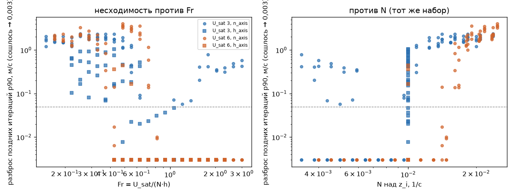
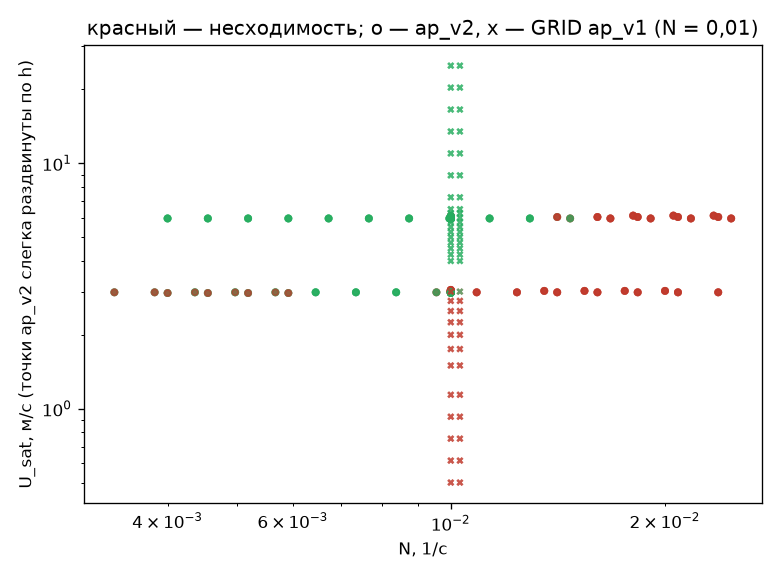
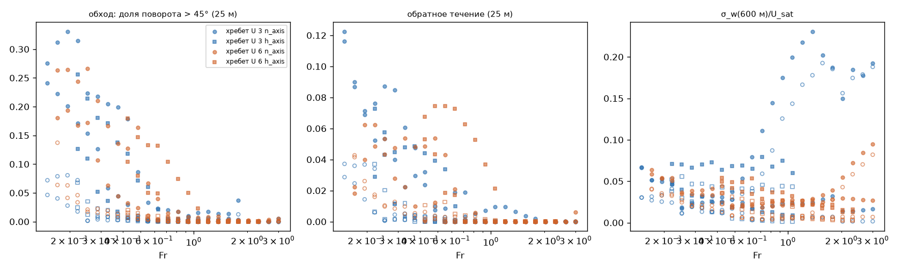
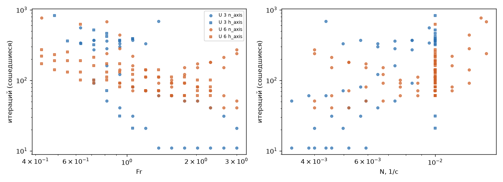

## Fr и слабый ветер: разные оси? (серия FIXED_U, план ap_v2)

`/home/greg/deltaplan-air-synth/tools/research/air_nn_pilot/.venv/bin/python tools/research/air_phase/analysis/AP-7/run.py` (CPU, ≈ 1 мин; метрики слоёв — из `$AIR_SYNTH_DATA/phase/features_ap_v2.h5`; числа — `summary.json`, все таблицы — `tables.md`)

**Вывод.** Отчасти. Блокирование (фаза D) и несходимость Пикара лежат на разных осях, но вторая ось — не «слабый ветер» U10 сам по себе. Параметры порядка блокирования (обход, обратное течение у земли) зависят от Fr = U_sat/(N·h), и неважно, через N или через h меняется Fr. А несходимость без нагрева определяется устойчивостью свободной атмосферы *относительно ветра*: решение не сходится при N > N_c(U), где N_c ≈ 0,0089 1/с при U_sat = 3 м/с и 0,0135 1/с при U_sat = 6 м/с (N_c ∝ U_sat^0,6). Высота формы h на это почти не влияет. При U10 = 1,28 м/с (по SY-12 это «зона штиля», 69 % несходимости) решение сходится за 20–370 итераций, если N < 0,0085. С нагревом добавляется третий механизм: конвективная несходимость при w*/U10 ≳ 0,8. Значит, вывод §5.2 «несходимость — это прежде всего слабый ветер» на идеальных формах уточняется: при фиксированном ветре решает N (через Fr или нет — h не важна), при фиксированном Fr решает ветер, и одной оси (U10 или Fr) не хватает. Блокирование D видно и в сошедшихся решениях: у хребта при U_sat = 6 и N = 0,01 решение сходится при Fr 0,43–0,72, а доля обхода там 0,10–0,18.

### Данные
296 случаев, все посчитаны: сошлось 146, 1000 итераций без сходимости 150, разошедшихся 0. U_sat = 3 и 6 м/с фиксированы (U10 = 1,28 и 2,56 м/с), Fr 0,15…3. Ось N (n_axis): h = 500 м и N = U_sat/(Fr·h) в пределах 0,003…0,025; где N выходит за эти пределы, h = 250/1000/1500. Ось h (h_axis): N = 0,01, h = 260…1411 м. Формы — хребет и холм, s = 0,3, H = 0/250 Вт/м², h/z_i = 1, холодный старт. Для сравнения взяты GRID ap_v1 (тот же s и h/z_i, N = 0,01, h = 500, т. е. U_sat = 5·Fr — ось ветра; 120 случаев) и SY-12 hgw24 (7320, решение m).

### Числа

**1. При фиксированном ветре Fr значим, но через N, а не через h.** Доля несошедшихся (все формы и H):

| U_sat | ось | Fr 0,15–0,4 | 0,4–0,6 | 0,6–0,9 | 0,9–1,4 | 1,4–3 |
|---|---|---|---|---|---|---|
| 3 | N (h = 500) | 1,00 | 1,00 | 0,17 | 0,19 | 0,50* |
| 3 | h (N = 0,01) | 1,00 | 0,83 | 0,42 | 0,25 | — |
| 6 | N (h = 500) | 1,00 | 0,92 | 0,83 | 0,00 | 0,00 |
| 6 | h (N = 0,01) | — | 0,25 | 0,00 | 0,00 | 0,00 |

\* Только H = 250, конвективная несходимость (п. 4); при H = 0 все сходятся.

Парное сравнение при одном Fr и U_sat (форма и H тоже одни): оси N и h расходятся в 28 из 108 пар. При U_sat = 6 и Fr 0,43–0,82 ось N (N 0,014–0,025) не сходится, разброс поздних итераций 0,01–3,6 м/с, а ось h (N = 0,01, h 740–1410 м) сходится за 100–270 итераций (кроме одного случая с нагревом). При U_sat = 3 наоборот: на оси h N = 0,01 > N_c, и хребет «почти сходится» (разброс 0,02–0,05 м/с), а на оси N при Fr > 0,7 (N < 0,0085) сходится.

**2. Один порог по N объясняет несходимость лучше порога по Fr** (H = 0, по 37 случаев на форму и ветер):

| U_sat | форма | N_c, 1/с | ошибок порога N | Fr_c | ошибок порога Fr | U_sat/N_c, м |
|---|---|---|---|---|---|---|
| 3 | хребет | 0,0089 | 0 | 0,82 | 3 | 335 |
| 3 | холм | 0,0089 | 4 | 0,67 | 0 | 335 |
| 6 | хребет | 0,0135 | 0 | 0,43 | 5 | 444 |
| 6 | холм | 0,0135 | 0 | 0,43 | 5 | 444 |

Логистическая регрессия на H = 0 (148 случаев; кросс-валидация 10×20, log-loss — чем меньше, тем лучше): lg Fr — 0,267; lg Fr + lg U — 0,252; lg U — 0,669; lg N + lg U — **0,132** (точность 0,97); lg N + lg U + lg h — 0,107. Если бы несходимость зависела только от Fr, коэффициенты при lg N и lg h были бы равны, а при lg U — противоположны им. На деле отношение lg h/lg N = 0,21, а lg U/lg N = −0,69: граница — «N/U^0,7 при слабой поправке на h». Форма и нагрев к этой модели почти ничего не добавляют. Сигмоида несходимости по N при фиксированном ветре очень резкая: N₅₀ = 0,0099 (U_sat 3) и 0,0141 (U_sat 6), ширина 10–90 % — 0,06 и 0,09 декады. По Fr при U_sat 6 ширина 0,56 декады: смесь двух осей размывает границу.

**3. Ось ветра GRID ложится на ту же границу.** В GRID ap_v1 (N = 0,01, h = 500) несходимость 1,00 при Fr < 0,6 (U_sat < 3), 0,19 при 0,6–0,9 и 0 выше; лучший порог Fr = 0,69, при H = 0 ошибок нет. Порог N_c(U) из ap_v2 предсказывает U_sat,c = 3,6 м/с, т. е. Fr_c = 0,72. Совпадающие точки (U_sat 3, Fr 0,6 и U_sat 6, Fr 1,2 при h ≈ 500) дают в обоих планах одно и то же: 0,75 и 0,00. На объединении ap_v2 и GRID (416 случаев) лучшая модель — lg N + lg U + lg h (CV 0,317), lg Fr один — 0,362.

**4. Нагрев — отдельная несходимость.** Среди случаев с N < N_c(U), где без нагрева решение сходится всегда (70 из 70): при H = 250 и w*/U10 < 0,8 не сходится 0,05, при w*/U10 0,8–1 — 0,90, при 1–1,3 — 0,44 (w* = (g/θ₀·H/(ρc_p)·z_i)^{1/3}). Это согласуется с SY-12 (§5.2: при w*/U 0,75–1,5 несходимость 0,26–0,50). Попарно H = 0 против 250: в 12 парах не сходится только H = 0, в 18 — только H = 250, то есть знак эффекта зависит от точки. Хребет против холма: 10 против 4, хребет немного хуже.

**5. Параметры порядка блокирования следуют Fr.** У хребта доля обхода (поворот > 45° на 25 м) по Fr при обоих ветрах и на обеих осях: 0,19–0,26 (Fr 0,15–0,25) → 0,12–0,15 (0,25–0,4) → 0,04–0,12 (0,4–0,6) → 0,005–0,06 (0,6–0,9) → ≤ 0,01 (> 0,9). σ-модель по линейному индексу (хребет, обход): свободная подгонка даёт коэффициенты lg N −2,97, lg h −2,92, lg U +2,42 — почти в точности комбинацию Fr (−1 : −1 : +1); R² 0,792, у одного lg Fr — 0,787, у lg(U/N) — 0,41. Сигмоида обхода по Fr (хребет, обе оси): Fr_c = 0,29 [0,23; 0,35] при U_sat 3 и 0,35 [0,14; 0,47] при U_sat 6, ширина 10–90 % — 0,55 и 0,79 декады. Это плавный переход в области Fr 0,3–0,6, как в литературе (обход при Fr < 0,4 [HS80]; блокирование первым при 0,3–0,6 [Lin96]). Обратное течение у хребта: 0,04–0,09 при Fr < 0,4 и ≤ 0,01 при Fr > 0,9. У холма оба сигнала на порядок слабее (доля области ≤ 0,06), сигмоиды не определены. Застой (|u| < 0,3·U_b) — 0,00–0,03 везде: при клетке 400 м зона застоя перед формой не разрешается. Волновая амплитуда σ_w(600 м)/U_sat у сошедшихся — 0,003–0,12 без явной сигмоиды по Fr, и при одном Fr она различается между осями (зависит от h/a и λ = 2πU/N, а не от одного Fr).

**6. SY-12 подтверждает лишь частично.** На реальном корпусе (m) N почти ничего не объясняет: в модели lg N + lg U + lg Δh коэффициент при lg N +0,10 на СКО против −1,97 у lg U и +0,81 у lg Δh; lg(U/N) один (CV 0,259) хуже, чем lg U10 один (0,233). Но при U10 = 2–3 м/с доля несходимости при U_sat/N < 300 м — 0,33 против 0,09–0,18 при U_sat/N > 300 м, то есть та же граница U/N ≈ 330–440 м, что в ap_v2. При U10 < 2 этой зависимости нет (0,43–0,64 при любом U/N).

**7. Критическое замедление.** У сошедшихся число итераций растёт к порогу по N, а не по Fr. U_sat 6, ось N: 91 итерация (Fr > 1,4) → 441 (Fr 0,93, N 0,0129, у самого N_c). Ось h при тех же Fr: 76 → 270 итераций при Fr 0,43 (N = 0,01, далеко от N_c) — `fig_slowing.png`.

**8. Метрики слоёв (P6, AP-6): по Fr идёт только разрешённое обратное течение.** Метрики, которые из поля масштаба 1 берут следующие слои игры, проверены так: в каждой группе (U_sat, форма, H; по 37 случаев) сравнивается, что объясняет метрику — lg Fr или lg N и lg h порознь (скорректированный R² квадратичной модели). Кроме того, сравниваются пары «ось N против оси h» при одном Fr: разность в долях СКО метрики, у пар, где оба решения сошлись. Медианы по группам:

| метрика (слой) | R² по lg Fr | R² по lg N, lg h | lg h / lg N (у Fr — 1) | \|Δ\| пар n/h, доли СКО (сошл.) |
|---|---|---|---|---|
| обратное течение 25 м, площадь (подветр.) | 0,78 | 0,82 | 2,3 | 0,03 |
| min u·e/U_sat на 25 м (подветр.) | 0,72 | 0,80 | 1,2 | 0,02 |
| потолок термиков / z_i | 0,94 | 0,98 | 0,98 | 0,16 |
| снос — ветер слоя 0…z_i | 0,82 | 0,92 | 1,8 | 0,31 |
| наклон опускания s_d (подветр.) | 0,36 | 0,60 | −0,8 | 0,26 |
| площадь зоны отрыва игры на 25 м | 0,18 | 0,78 | −3,7 | 0,39 |
| глубина зоны отрыва | 0,39 | 0,70 | −4,1 | 0,59 |
| сила ядра термика w0 (H = 250) | 0,73 | 1,00 | 27 | 0,55 |
| число источников термиков (H = 250) | 0,38 | 0,83 | −0,4 | 1,25 |
| подъём у склона: max w 50–300 м | −0,04 | 0,49 | −1,2 | 1,68 |

Выводы:
- Разрешённое полем обратное течение за хребтом — то же блокирование и тот же отрыв, что в п. 5. Оно следует Fr: обе оси при одном Fr дают одно и то же (Δ 0,02–0,03 СКО).
- Потолок термиков и снос тоже «как Fr» (отношение коэффициентов около 1–2), но по другой причине. Здесь h/z_i = 1, поэтому N·h = N·z_i, а проскок частицы над z_i задаёт именно N·z_i. Это совпадение плана, а не роль Fr.
- Признак зоны отрыва игры (площадь, глубина) зависит от размера формы h и N в разные стороны (отношение −4). Подъём у склона Fr не описывает вовсе (R² ≈ 0). Сила термиков задаётся z_i (= h) по Дирдорфу (w* ∝ z_i^{1/3}).
- Для следующих слоёв игры одного Fr недостаточно: нужны h (и z_i) явно.
- Подъём у склона > 1 м/с при U_sat = 3 не появляется нигде; при U_sat = 6 у хребта max w 0,6–1,3 м/с (0,13–0,84 от U_sat·s).
- Несошедшиеся решения сильно шумят в метриках: у площади зоны отрыва разность пар 1,16 СКО по всем парам против 0,39 у сошедшихся. Для слоёв игры поле несошедшегося решения ненадёжно.

### Оговорки и границы модели
- Ветер задан всего двумя значениями (U10 = 1,28 и 2,56 м/с), поэтому N_c ∝ U^0,6 — оценка по двум точкам. Регрессия даёт U^0,7, а GRID (U меняется непрерывно при N = 0,01) с ней согласуется (Fr_c 0,72 предсказано, 0,69 найдено), но этот показатель надо проверить третьим ветром. Штиль (U10 < 1 м/с, фаза H по литературе) в ap_v2 не представлен. Что слабый ветер не мешает сходимости, показано только для U10 ≥ 1,28 м/с.
- На оси N при крайних Fr подставлено запасное h (250/1000/1500 м), а h/z_i = 1 сдвигает вместе с h и z_i. Поэтому «влияние h» — это совместное влияние высоты формы и толщины слоя.
- N задан однородным над z_i (override). В SY-12 N — среднее на 1,5 км над z_i при реальном профиле с задерживающими слоями, это одна из причин, почему N там почти не работает (п. 6). Остальные: узкий диапазон N в корпусе и сцепление слабого ветра с вечерним охлаждением (фаза G).
- Причина порога N_c(U) этим разбором не установлена — причина выясняется в AP-13 (малая GPU-серия: верх и губка, K_min, ω, третий ветер). Совместимые гипотезы: N1 (§5.3: при большом N/U растёт Ri, K падает к полу k_fa = 1 м²/с, и Пикар теряет сжатие; пол K не зависит от ветра, поэтому N_c растёт медленнее U) и подветренные волны λ = 2πU/N ≈ 2,1–2,8 км на пороге — 5–7 клеток по 400 м, на грани разрешения схемы 1-го порядка (и отражение от верха).
- Параметры порядка у несошедшихся посчитаны по среднему поздних снимков (target late_mean). Обход и обратное течение на обеих осях при этом совпадают в среднем: |Δ обхода| 0,024 при среднем 0,05 по 54 парам хребта. Клетка 400 м: застой и пузырь срыва не разрешены (§4.3).
- Метрики слоёв — из таблицы AP-6 `$AIR_SYNTH_DATA/phase/features_ap_v2.h5` (P6 v2): термики есть только при H = 250 (148 случаев), подъём у склона > 1 м/с — только при U_sat = 6. Регрессии по группам по 37 случаев с 3–6 параметрами — грубая оценка: R² и отношения коэффициентов показывают направление, а не точный закон. Полные таблицы — `tables.md`, числа — `summary.json` → `layer_metrics_axes`, `layer_metrics_by_fr_ridge`.

### Рисунки
-  — разброс поздних итераций против Fr (слева) и против N (справа): по N граница одна для обеих осей, по Fr — две.
-  — сошедшиеся и несошедшиеся случаи ap_v2 и GRID в осях N × U_sat.
-  — обход, обратное течение, σ_w/U_sat против Fr при U_sat 3 и 6 на обеих осях.
-  — итерации сошедшихся против Fr и против N.
