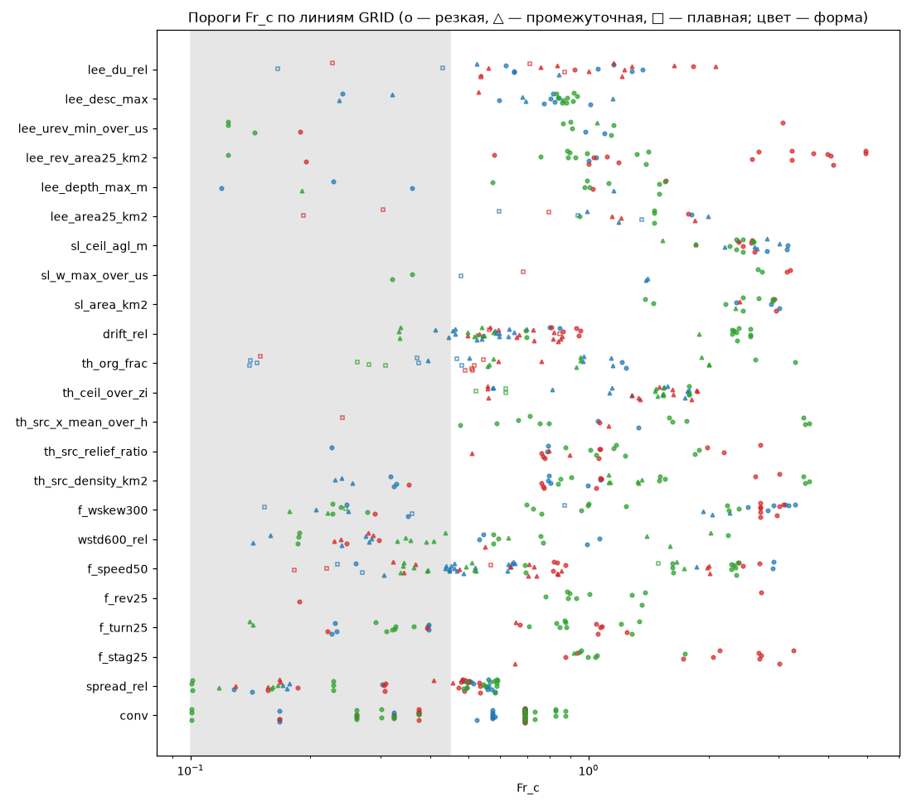
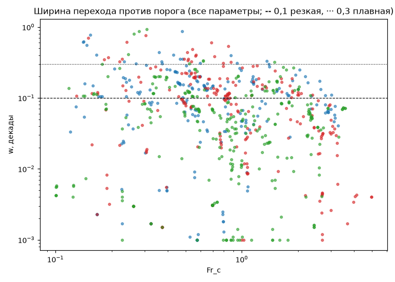
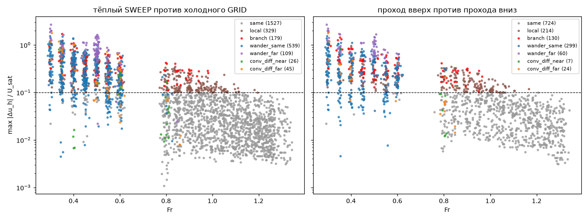
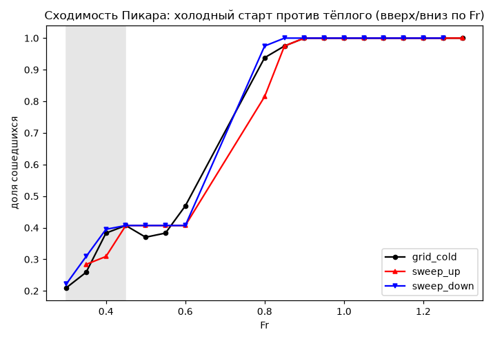

# Границы фаз на идеальном рельефе (GRID), резкость, второй старт и гистерезис (SWEEP)

`PY=/home/greg/deltaplan-air-synth/tools/research/air_nn_pilot/.venv/bin/python; $PY tools/research/air_phase/analysis/AP-8/run.py --workers 16` (CPU, ≈ 70 мин; стадии `--stage pairs|fits|fits_ok|report`)

## Вывод

1. **Почти все границы, которые видят следующие слои, резкие и стоят в узкой полосе Fr ≈ 0,85–1,1** (по сошедшимся
   решениям, 81 линия GRID). Это: исчезновение обратного течения и застоя перед двумерными препятствиями (уступ,
   хребет), исчезновение разрешённого ротора и глубины подветренной зоны, сход опускания за вершиной, а у термиков —
   привязка источников к рельефу и их густота. Ширины w ≈ 0,01–0,04 декады, то есть ±2–10 % по Fr. Почти половина
   из них уже шага сетки по Fr (0,05 на 0,8–1,3, то есть 0,02 декады): ширина не разрешена, известна только сверху.
2. **Плавные или промежуточные (w ≈ 0,1–0,25 декады)** — интегральные величины: среднее торможение у земли, снос
   термиков (средний ветер 0…z_i / U), потолок термиков / z_i, доля организованного подъёма, скачок слоя смешения ΔU,
   площадь подветренной зоны. Потолок термиков следует не Fr, а −z_i/L: в GRID при H > 0 ось Fr — это одновременно
   ось U и −z_i/L ∝ U⁻³. Порог Fr_c ≈ 1,5 соответствует −z_i/L ≈ 35, и он сдвигается с H и h/z_i так, как требует
   конвективный масштаб.
3. **Порог сходимости Пикара (Fr ≈ 0,6–0,8, у h/z_i = 0,3 — 0,32) — резкий, но это свойство решателя, а не фаза**
   (AP-13: численный цикл; AP-7: порог по N при данном U). Поэтому все параметры порядка и метрики слоёв подогнаны
   только по сошедшимся точкам. У H = 0 ниже Fr ≈ 0,7 сошедшихся точек почти нет: нижняя сторона границ блокирования
   в GRID не видна. Границы, у которых x_c попал в этот пропуск, помечены `in_gap` и в основную таблицу не входят.
4. **Гистерезиса нет.** Критерий в коде: |lg Fr_c↑ − lg Fr_c↓| > 2·max(w↑, w↓, шаг сетки Fr у x_c) и
   раздельные 95 % бутстрэп-ДИ x_c двух проходов. Он сработал в 4 парах из 501 (параметр × линия), и все 4
   объяснены (см. ниже). Плоский критерий §9 (> 2·max(w↑, w↓), без шага и ДИ) срабатывает в 51 паре: 22 из них —
   сходимость (решатель), остальные 29 — сдвиги на один-два шага сетки (медиана |Δlg| 0,042 при шаге 0,026 дек). Медиана |Δlg Fr_c| по параметрам — 0–0,05 декады при 2w ≈ 0,05–0,25.
   Полосы ±w для гистерезиса классификатору не нужны: хватает обычных сигмоид.
5. **Второй старт.** При Fr ≥ 0,8 тёплый старт даёт то же решение в 97 % пар (1468 совпадают во всём, ещё 182
   отличаются в отдельных клетках, а метрики слоёв при этом не меняются). Расхождение > 0,1 U_sat в ≥ 1 % объёма —
   у 27 пар (1,6 %), все они у порога сходимости (Fr 0,8–1,0). Расхождение сошедшихся решений плавно растёт к порогу
   (p99 |Δu| 0,045 м/с при Fr 1,3 → 0,10 м/с при 0,8–0,9 → 0,2–0,28 м/с при 0,3–0,6), холодный старт там требует
   в 3–6 раз больше итераций. Это признак критического замедления: при абсолютном критерии остановки ошибка ~ε/(1−ρ)
   растёт, когда ρ → 1. Отдельных устойчивых ветвей это не доказывает. Единственный устойчивый случай — уступ
   (STEP_UP), H = 0, h/z_i = 1, Fr 0,85–0,95, все три s. Там проход вверх сохраняет застой и обратное течение перед
   уступом (f_rev25 = 0,27 при Fr 0,9), проход вниз их теряет (0,07), холодный старт — посередине (0,14). Три
   разных «сошедшихся» состояния и 380–780 итераций у холодного старта говорят скорее о медленном многообразии, чем
   о двух ветвях. Это кандидат, он не подтверждён (проверка — ниже).
6. **Что видят слои при другом старте.** Термики (источники, сила, потолок, снос) и подъём у склонов от старта не
   почти не зависят: в основных классах изменилось ≤ 5 % пар (до 14–20 % только в малых группах с разной сходимостью, n = 24–26), медиана IoU карт — 1,0. Подветренные зоны чувствительны:
   среди сошедшихся пар изменилось 2–4 %, при блуждании в той же области — 15–27 %, при блуждании в разных
   областях — 34–47 %, у кандидатов в ветви — 11–15 % (площадь, глубина, обратное течение).

## Числа

### Главные границы (GRID, только сошедшиеся точки; без штилевой полосы Fr ≤ 0,45 и без пропусков данных)

Fr_c и w — медианы по линиям (в скобках 25–75 %); класс — по §9 п. 6: резкая — w < 0,1 декады (или один скачок
соседних точек > 3σ шума стартов и ≥ ½ всего перехода), плавная — w > 0,3. «Не разр.» — w меньше местного шага
сетки. U10 — ветер на 10 м в точке Fr_c (в GRID U_sat = 5·Fr).

| параметр (слой) | линий с границей / всего | Fr_c | w, дек | резк./пром./плавн. (не разр.) | U10 при Fr_c, м/с | от чего зависит |
|---|---|---|---|---|---|---|
| сходимость Пикара (решатель) | 50 / 81 | 0,69 (0,6–0,8) | < 0,13 (пропуск сетки 0,6–0,8) | 50/0/0 (50) | 1,5 | h/z_i = 0,3: 0,32; H = 250: 0,55; формы и s — нет |
| разброс поздних итераций / U | 35 / 81 | 0,53 (0,49–0,56) | 0,07 | 33/2/0 (2) | 1,1 | слабо |
| обход f_turn25 (D) | 16 / 81 | 0,96 (0,84–1,11) | 0,03 | 15/1/0 (4) | 2,1 | уступ 0,88, хребет 1,06; у холма нет; ещё 16 линий — в штиле (≈ 0,2–0,3, ср. AP-7) |
| обратное течение f_rev25 (B, D) | 10 / 81 | 0,97 (0,89–1,34) | 0,02 | 10/0/0 (7) | 2,1 | почти только уступ (9 из 10) |
| застой f_stag25 (D) | 18 / 81 | 1,39 (0,95–2,5) | 0,03 | 16/2/0 (13) | 3,0 | уступ 0,99; хребет 2,1 |
| ротор: площадь u·e < 0 на 25 м (lee) | 26 / 81 | 1,25 (0,99–3,2) | 0,02 | 26/0/0 (19) | 2,7 | уступ 0,93, холм 1,0, хребет 3,2 (s = 0,5: 2,7); H = 100–250 сдвигает вверх |
| ротор: min u·e / U (lee) | 9 / 81 | 1,05 (0,91–1,14) | 0,04 | 8/1/0 (4) | 2,3 | — |
| глубина подветренной зоны (lee) | 11 / 81 | 1,13 (1,0–1,5) | 0,01 | 10/1/0 (10) | 2,4 | h/z_i = 3: 1,5 |
| наклон опускания s_d (lee) | 19 / 81 | 0,84 (0,81–0,90) | 0,04 | 15/4/0 (1) | 1,8 | почти не зависит (0,77–0,92 по всем факторам) |
| скачок слоя смешения ΔU / U (lee) | 25 / 81 | 0,92 (0,65–1,23) | 0,15 | 9/13/3 (5) | 2,0 | h/z_i: 0,65 → 1,21 (0,3 → 3) |
| площадь подветренной зоны (lee) | 16 / 81 | 1,28 (0,98–1,54) | 0,16 | 6/6/4 (6) | 2,7 | при H = 0 резкая (0,03), при H > 0 плавная (0,26–0,31) |
| густота источников термиков (th) | 29 / 54 | 1,08 (0,85–1,5) | 0,03 | 23/6/0 (18) | 2,3 | h/z_i = 3: 0,82 |
| привязка источников к рельефу (th) | 22 / 54 | 1,05 (0,79–1,22) | 0,03 | 19/3/0 (12) | 2,3 | — |
| смещение источников по ветру (th) | 14 / 54 | 1,23 (0,86–1,73) | 0,03 | 13/1/0 (10) | 2,6 | — |
| потолок термиков / z_i (th) | 36 / 54 | 1,50 (1,05–1,66) | 0,15 | 3/30/3 (3) | 3,2 | −z_i/L при Fr_c ≈ 35; H = 100: 1,16, 250: 1,62; h/z_i = 3: 0,97 |
| доля организованного подъёма (th) | 27 / 54 | 0,93 (0,53–1,18) | 0,20 | 4/16/7 (2) | 2,0 | плавная у h/z_i = 3 (0,34) |
| снос термиков: ветер 0…z_i / U (th) | 52 / 81 | 0,68 (0,56–0,88) | 0,12 | 16/34/2 (9) | 1,5 | H = 0: 2,1; H > 0: 0,6–0,8 |
| среднее торможение f_speed50 (A, D; относительная величина*) | 50 / 81 | 0,83 (0,63–2,0) | 0,12 | 18/30/2 (14) | 1,8 | H = 0: 2,0; H > 0: 0,6–0,8 |
| σ_w на 600 м / U (волны, C) | 13 / 81 | 0,63 (0,58–1,4) | 0,07 | 8/5/0 (5) | 1,3 | мало линий |
| асимметрия w на 300 м (F) | 28 / 81 | 2,45 (1,18–2,84) | 0,03 | 24/3/1 (24) | 5,2 | H > 0: −z_i/L ≈ 3 при Fr_c (конвекция → вынужденный поток); H = 0: 1,0 |
| площадь подъёма > 1 м/с у склона (sl) | 15 / 27 | 2,44 (2,34–2,90) | 0,07 | 13/2/0 (12) | 5,2 | s = 0,15: 2,9; 0,5: 2,2 — порог игры, не фаза |
| потолок подъёма у склона (sl) | 24 / 27 | 2,50 (2,35–2,62) | 0,08 | 16/8/0 (15) | 5,3 | то же |
| сила ядра термика w0 (th) | 0 / 54 | — | — | — | — | перехода нет: w0 = 1,24 w*, от ветра почти не зависит (|Δ| < 0,2 м/с) |

\* f_speed50 = средняя |u_h| на 50 м / U_b (опорный профиль притока `phase_stats.field_features`). Медиана 2,8 > 1:
U_b не совпадает с решённым профилем, поэтому величина годится только как относительная — для положения
перехода по Fr, но не как «разгон» в долях притока.

Полный список — `summary.json` → `boundaries` (733 подгонки, принятые по критерию: x_c и бутстрэп-ДИ внутри
диапазона Fr, |Δy| ≥ физического минимума параметра, R² ≥ 0,5, w ≤ 1 декады). По каждой: форма, s, H, h/z_i,
Fr_c с 95 % ДИ, w с ДИ, класс, флаги `unresolved`, `calm`, `in_gap`, U10 и −z_i/L в точке Fr_c.
Агрегаты по факторам — `aggregate.<параметр>.clean.by`. Подгонка по всем точкам, включая несошедшиеся
(late_mean численного цикла), — `allpoints_compare`. По всем точкам пороги lee_* и f_rev/f_turn уходят в штиль
(0,17–0,3): несошедшиеся поля дают ложные «роторы» и «обход», поэтому без отбора по сходимости границы ниже
Fr ≈ 0,7 читать нельзя.

### Второй старт (SWEEP против GRID; тёплый старт от соседней точки, проходы вверх и вниз на Fr 0,3–1,3)

Классы пар в одной точке: сошлись оба — «совпадают» (max |Δu_h| ≤ 0,1 U_sat), «местное» (max > 0,1, но p99 ≤ 0,1
в слое ≤ 600 м), «ветвь?» (p99 > 0,1, то есть ≥ 1 % объёма); не сошлись оба — «та же область блуждания» (p90 |Δu|
на 50 м ≤ разброса поздних итераций), иначе «другая»; разный статус — «разная сходимость».

| пары | полоса Fr | n | совпадают | местное | ветвь? | блуждание: та же / другая | разная сходимость |
|---|---|---|---|---|---|---|---|
| тёплый − холодный | ≤ 0,45 (штиль) | 567 | 21 | 72 | 84 | 335 / 33 | 22 |
| | 0,5–0,6 | 486 | 38 | 75 | 68 | 196 / 75 | 34 |
| | ≥ 0,8 | 1701 | 1468 | 182 | 27 | 8 / 1 | 15 |
| вверх − вниз | ≤ 0,45 | 324 | 3 | 31 | 62 | 193 / 21 | 14 |
| | 0,5–0,6 | 243 | 5 | 48 | 45 | 104 / 39 | 2 |
| | ≥ 0,8 | 891 | 716 | 135 | 23 | 2 / 0 | 15 |

- Холодный старт повторяется побитно (162 пары «холодный SWEEP − холодный GRID»: max |Δu| = 0).
- Сошедшиеся пары по Fr (тёплый − холодный, медиана p99 |Δu_h|): 0,045 м/с (1,3), 0,055 (1,2), 0,075 (1,0),
  0,10 (0,8–0,9), 0,19–0,29 (0,3–0,6). Итераций у тёплого старта 31–90, у холодного 80–300.
  В штиле (U_sat 1,5–2,25 м/с) такое расхождение превышает 0,1 U, хотя «ветвей» там нет: это допуск остановки,
  усиленный замедлением.
- Смещение «вверх − вниз» у сошедшихся пар систематическое, но мало для слоёв. f_speed50 вверх выше на 0,04
  (Fr 0,8–1,3) и на 0,09 (0,3–0,6), снос — на 0,9 % U, |t| > 20. Доля пар, где разность превышает физический
  минимум, — 0 % для слоёв и 12–33 % для f_speed50. Это память начального приближения при раннем выходе по
  критерию, а не гистерезис.
- Сходимость (доля сошедшихся): при Fr 0,8 холодный старт — 0,94, тёплый снизу — 0,82, тёплый сверху — 0,975.
  Старт с сошедшегося решения сверху проходит в полосу несходимости на один шаг сетки дальше, старт снизу (из
  численного цикла) — хуже. При Fr 0,35–0,6 разница ≤ 0,08 (0,26–0,47 против 0,28–0,41). Сходимость в штилевой
  полосе от старта почти не зависит. «Другая ветвь» там не выделяется: 335 из 567 пар — та же область блуждания.
- `summary.json` → `second_start`: `pairs`, `converged_pairs_by_fr`, `up_minus_down_bias`, `layer_diff` (доля пар,
  где метрика слоя изменилась больше физического минимума, по классам), `branches` (список 309 пар класса «ветвь?»),
  `conv_by_fr`.

### Гистерезис (сигмоиды отдельно на проходах вверх и вниз, по сошедшимся точкам)

Критерий: |lg Fr_c↑ − lg Fr_c↓| > 2·max(w↑, w↓, шаг сетки Fr у x_c, дек) **и** 95 % ДИ x_c проходов не
перекрываются (`summary.json` → `criteria.hysteresis`). Ограничение шагом сетки оправдано физически: ширина
меньше шага не разрешена (сигмоида на ступеньке между двумя соседними точками даёт w → 0,001), а порог внутри
шага не определён, поэтому разность порогов меньше одного шага не измерима. По плоскому критерию §9 (> 2w без
шага и ДИ) любой сдвиг ступеньки на одну точку сетки выглядел бы гистерезисом: так выходит 51 срабатывание из 501
(22 — сходимость Пикара, 29 — остальные параметры; у 15 из этих 29 |Δlg| ≤ одного шага, у 22 — ≤ двух шагов;
`hysteresis.n_flat_2w`, по параметрам — `hysteresis.summary.*.n_flat_2w`).

| параметр | линий (обе стороны) | срабатываний (по шагу и ДИ / плоский §9) | медиана / max \|Δlg Fr_c\|, дек | медиана 2w, дек |
|---|---|---|---|---|
| сходимость Пикара | 61 | 1 / 22 | 0,00 / 0,15 | 0,25 |
| f_rev25 | 8 | 0 / 1 | 0,017 / 0,030 | 0,051 |
| f_turn25 | 19 | 0 / 3 | 0,016 / 0,067 | 0,066 |
| ротор (площадь) | 15 | 0 / 2 | 0,009 / 0,19 | 0,050 |
| подветренная зона (площадь) | 31 | 0 / 1 | 0,005 / 0,065 | 0,088 |
| глубина зоны | 14 | 1 / 5 | 0,001 / 0,17 | 0,042 |
| густота источников | 13 | 0 / 1 | 0,002 / 0,084 | 0,053 |
| снос | 58 | 0 / 1 | 0,054 / 0,29 | 0,24 |
| асимметрия w | 36 | 2 / 3 | 0,007 / 0,19 | 0,054 |

Четыре срабатывания, все объяснены:
- (1) сходимость, холм s = 0,15, h/z_i = 0,3: вверх 0,42, вниз 0,30, холодный 0,37 — это решатель (AP-13);
- (2–3) асимметрия w, уступ s = 0,15 и 0,3, h/z_i = 1: кривая немонотонна (провал при Fr 0,9–0,95), и сигмоида
  на разных проходах выбирает разные склоны провала;
- (4) глубина зоны, холм s = 0,5, h/z_i = 0,3: штилевая полоса, мало сошедшихся точек.

Ещё одно место на грани — f_rev25 у уступа при h/z_i = 1 (см. вывод, п. 5). Там Fr_c↑ ≈ 0,92, Fr_c↓ ≈ 0,86,
Δlg ≈ 0,03 ≈ 2w: критерий не выполнен.

Резкость по признакам (все 733 принятые границы): по w < 0,1 декады — 455; только по скачку (> 3σ шума и ≥ ½
перехода при w ≥ 0,1) — 1 (`aggregate.*.n_sharp_by_w`, `n_sharp_by_jump`).

## Компактно для классификатора (§15.1 air_phase_experts.md)

- **Резкие (w ≤ 0,05 дек, полоса ±w ≈ ±10 % по Fr), стоят у Fr ≈ 0,85–1,1:**
  - застой, обход и обратное течение перед двумерными препятствиями (уступ ≈ 0,9–1,0, хребет ≈ 1,1–2);
  - разрешённый ротор и глубина подветренной зоны (≈ 1,0–1,25; у хребта с s ≥ 0,3 ротор держится до Fr ≈ 3 —
    сверить с AP-10);
  - сход опускания за вершиной (0,84, универсально);
  - привязка и густота источников термиков (≈ 1,05).

  Для веса фазы достаточно ступеньки или узкой сигмоиды. Ширина на сетке 400 м не разрешена: шаг Fr 0,05 = 0,02 дек.
- **Промежуточные (w ≈ 0,1–0,2):** торможение и снос (H > 0: Fr_c 0,6–0,8; H = 0: ≈ 2), ΔU слоя смешения (0,9),
  площадь подветренной зоны (1,3), потолок термиков. Потолок задаётся по −z_i/L ≈ 35, а не по Fr: классификатору —
  ось −z_i/L.
- **Плавные (w > 0,3):** доля организованного подъёма при h/z_i = 3, подветренная зона при H > 0. Из AP-7 — обход на
  оси Fr при фиксированном U (Fr_c 0,29–0,35, w 0,55–0,8 дек). Вероятно, в GRID это та же граница, что ≈ 0,2–0,3
  в штилевой полосе.
- **Не фазы:**
  - сходимость Пикара (0,6–0,8; 0,32 при h/z_i = 0,3) — решатель;
  - подъём у склона > 1 м/с (Fr 2,4–2,5 ⇔ U10 ≈ 5,2 м/с) — пересечение порога игры (min_sink 1 м/с) плавно растущей
    величиной w ≈ U·s.
- **Гистерезис:** полосы наследования ветви по Fr не нужны. Флаг «ненадёжно» — у порога сходимости (Fr 0,6–1,0) и
  у уступа или хребта при h/z_i ≈ 1, Fr 0,85–0,95.
- **Зависимости:**
  - форма — главный фактор для D/B: у холма застоя и обратного течения перед препятствием на сошедшихся решениях
    нет, у уступа и хребта есть;
  - s — слабый фактор, кроме ротора хребта (s = 0,5) и подъёма у склона;
  - H — через −z_i/L сдвигает торможение и снос к Fr 0,6–0,8 и размывает подветренную зону;
  - h/z_i = 0,3 снижает порог сходимости до 0,32 и сдвигает ΔU и s_d вниз, h/z_i = 3 — вверх (ΔU 1,2, глубина 1,5).

## Оговорки и границы модели

- **Клетка 400 м, Δz = 105 м:** формы с s = 0,5 недоразрешены (a ≈ 0,86 км — 2 клетки). Пузырь срыва — 1–2 клетки,
  обратное течение видно только на 25 м как слабый сигнал. Ширины переходов < 0,02 декады сеткой по Fr не
  разрешены и даны как верхняя оценка.
- **K-замыкание:** валов и ячеек нет, «термики» в метриках — по формулам масштаба 2 игры поверх среднего поля.
  Асимметрия w — свойство среднего поля, а не турбулентности.
- **Перенос 1-го порядка:** численная вязкость ~UΔx/2 ≈ 1000 м²/с при U = 5 м/с, Re_eff ≈ 10–50. Срыв вихрей
  и часть нестационарности подавлены, часть стационарности — свойство схемы (air_phase.md §4.3). Резкость границ
  при такой вязкости — скорее нижняя оценка.
- **Сцепление осей в GRID:**
  - Fr ∝ U: при Fr ≤ 0,45 U10 < 1 м/с (штиль, фаза H), поэтому блокирование D здесь от штиля не отделить
    (это делает ap_v2, AP-7);
  - при H > 0 вдоль линии меняется и −z_i/L (от ~10⁵ при Fr 0,1 до ~0,2 при Fr 5);
  - пороги, зависящие от U (порог игры у склона, потолок термиков), выглядят как пороги по Fr.
- **Несходимость без нагрева — отказ решателя (AP-13).** Подгонки — по сошедшимся точкам, и нижняя сторона границ
  у H = 0 (Fr < 0,7) не наблюдается. Доля несходимости как параметр порядка фазы не используется: строка таблицы
  дана только для полноты, как свойство решателя.
- **Критерий сходимости абсолютный** (как в P4). Расхождения сошедшихся пар у порога — следствие допуска при
  критическом замедлении. Кандидат в ветви у уступа (h/z_i = 1, Fr 0,85–0,95) не подтверждён и
  остаётся открытым вопросом (отдельной задачей не ставится). Предложенная проверка дешёвая, но на CPU не делается: 6–9 случаев (холодный, вверх, вниз при Fr 0,85/0,9/0,95) досчитать с критерием в 10 раз
  строже (или относительным, серия RELAX (в)). Если три состояния сойдутся к одному — ветви нет; если нет — это
  гидравлическая бистабильность уступа под инверсией.
- **Шум между стартами** — 1,4826·MAD разностей тёплого и холодного старта у сошедшихся пар. У долей клеток он часто
  равен нулю (поля почти совпадают), поэтому критерий «скачок > 3σ» из §9 п. 6 засчитывается, только если скачок
  несёт ≥ ½ перехода. Флаг из `fit_sigmoid` сохранён как `sharp_p6`: по нему резкими были бы почти все границы.

## Рисунки

-  — s = 0,3, H = 0, h/z_i = 1, три формы; o — сошлось, x — нет.
-  — все принятые границы; цвет — форма, значок — класс.
- 
-  — тёплый − холодный и вверх − вниз, классы пар.
-  — Fr_c на проходах вверх и вниз.
- 
