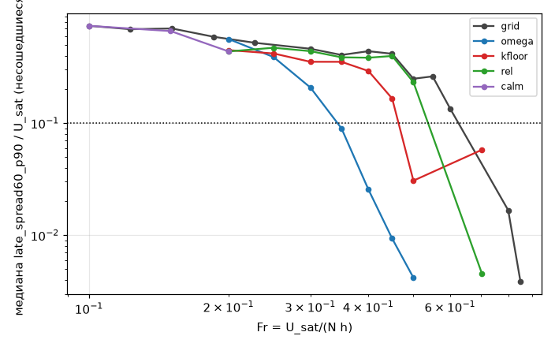
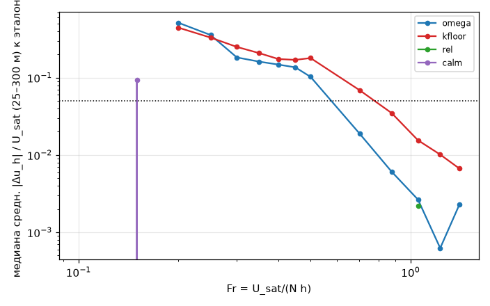
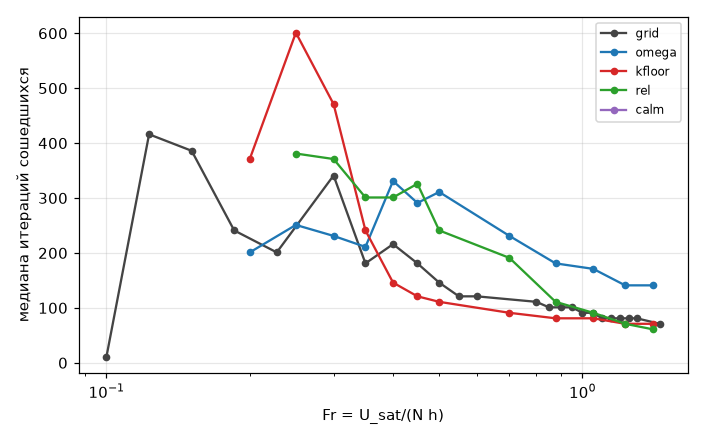
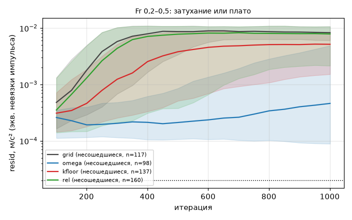
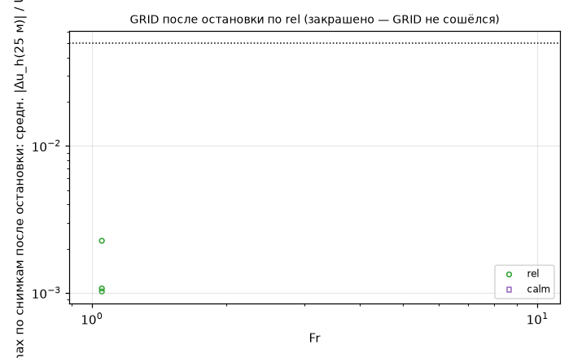

# Штилевая граница несходимости: решатель или физика (серия RELAX, AP-9)

Воспроизведение: `/home/greg/deltaplan-air-synth/tools/research/air_nn_pilot/.venv/bin/python tools/research/air_phase/analysis/AP-9/run.py` (CPU, ~1 мин; читает `~/air_synth_data/phase/ap_v1` и `ap_v1__s1-74644c4`, пишет `summary.json`, `cases.csv`, `fig_*.png`).

## Вывод

**Граница смешанная (`calm_boundary = mixed`), и между её частями есть порог.**

- **Fr 0,3–0,5 (U10 0,6–1,1 м/с) — в основном численная.** Недорелаксирование ω = 0,5 находит неподвижную точку
  в 39 % случаев, где GRID не сошёлся (36 из 93). Доля сошедшихся растёт с 0,31 до 0,58, при Fr 0,5 — с 0,37 до 0,89.
  У оставшихся блуждание падает с 0,46 до 0,07 U_sat (медиана). Там, где сходятся оба счёта, поле одно и то же:
  средняя |Δu| = 0,012 U_sat. Так и должно быть: ω не меняет неподвижную точку, а только гасит раскачку итерации.
  Значит, стационарное решение модели есть, а Пикар с ω = 1 его не находит.
- **Fr ≤ 0,25 (U10 ≤ 0,5 м/с) — физическая (фаза H).** Здесь не помогает ни один из трёх рычагов. С ω = 0,5 сходится
  0,19–0,30, блуждание 0,39–0,56 U_sat. Невязка выходит на плато (наклон log₁₀ resid ≈ 0 за 100 итераций), а не
  затухает. В штиле (Fr 0,1–0,2, относительный критерий) не сошёлся ни один случай из 81, блуждание 0,63 U_sat.
  Это в 4–6 раз больше порога §9 п. 4 (~0,1 U).
- **Гипотеза N1 (§5.3) в своей причинной части опровергнута.** Нижний предел K = 10 м²/с несходимость не лечит:
  исправил 7 случаев, испортил 7. При этом он меняет само поле там, где сошлось всё: средняя |Δu| = 0,06 U_sat,
  σ_w на 300 м меняется на 10 %. То есть это другая физика, а не способ сходимости. Абсолютный критерий тоже не
  виноват: при U_sat < 5 м/с он **мягче** относительного (порог 4e-4·U_sat²/a при U_sat = 1,5 м/с — 1,8e-6 против
  2e-5 м/с²). Относительный критерий ничего не объявил сошедшимся раньше GRID, зато забраковал 14 случаев,
  сошедшихся по абсолютному.

**Что из этого следует для сборки по фазам.**
- Фаза H начинается при Fr ≲ 0,25, что здесь соответствует U10 ≲ 0,5 м/с (h = 500 м, N = 0,01). Стационарного решения
  у Пикара там нет. Масштаб 1 должен давать среднее и разброс (late_mean ± late_spread), и поле в этом режиме надо
  считать статистикой, а не решением. В игре это штиль, где всё решают термики.
- В переходной полосе Fr 0,3–0,5 (U10 0,6–1,1 м/с) Пикар годится, если включить недорелаксирование. Порядок такой:
  сначала ω = 1, и если к 300 итерациям нет сходимости — продолжение с ω = 0,5. ω = 0,5 не испортил ни одного
  сошедшегося случая, но медленнее: медиана итераций 296 против 181 при Fr 0,3–0,5 и 181 против 101 при Fr 0,7–1,4.
  Поэтому ставить его всегда нельзя.
- Сейчас поле в переходной полосе берётся как late_mean блуждающей итерации, и оно заметно отличается от найденной
  неподвижной точки. Средняя |Δu| = 0,14 U_sat, максимальная 0,49 U_sat. Для слоёв: σ_w на 300 м меняется на 17 %
  (медиана модуля, знак случайный), max w на 300 м — на 0,065 м/с (p90 0,19 м/с), |Δw| на 300 м — до 0,12 U_sat.
  Для подъёма у склонов и источников термиков это заметно.

## Числа

27 линий GRID с s = 0,3 (3 формы × H 0/100/250 Вт/м² × h/z_i 0,3/1/3), холодный старт. Эталон — GRID той же линии.
Варианты RELAX: `omega` (ω_u = ω_k = 0,5; ω_k умножает релаксацию K 0,1), `kfloor` (k_fa = 10 м²/с), `rel`
(resid·a/U_sat² < 4e-4), `calm` (rel на Fr 0,1/0,15/0,2).

**Доля сошедшихся по U10** (в серии U10 и Fr связаны: Fr = U_sat/(N h) при постоянных N, h):

| U10, м/с | GRID | ω = 0,5 | K_min = 10 | rel |
|---|---|---|---|---|
| < 1 (Fr 0,2–0,45) | 0,18 (n 243; блужд. 0,57 U) | 0,41 (0,19 U) | 0,27 (0,36 U) | 0,12 (0,42 U) |
| 1–1,5 (Fr 0,5–0,7) | 0,40 (0,23 U) | 0,89 (0,00 U) | 0,33 | 0,33 |
| 1,5–2 | 0,96 | 1,00 | 0,96 | 0,85 |
| ≥ 2 | 1,00 | 1,00 | 1,00 | 1,00 |

В скобках — медиана late_spread60_p90/U_sat у несошедшихся. Окно «U10 1,5–3 м/с» на идеальных формах с s = 0,3 уже
сходится почти полностью. Граница здесь проходит при U10 ≈ 1–1,5 м/с, а не 2–2,5, как на реальном рельефе SY-12.

**По Fr** (доля сошедшихся GRID → ω = 0,5; блуждание ω = 0,5):
Fr 0,2: 0,11 (GRID 0,1855–0,2279) → 0,19, 0,56 U · 0,25: → 0,30, 0,39 U · 0,3: 0,19 → 0,33, 0,21 U ·
0,35: 0,22 → 0,41, 0,09 U · 0,4: 0,37 → 0,52, 0,03 U · 0,45: 0,41 → 0,74, 0,01 U · 0,5: 0,37 → 0,89, 0,004 U.

**По h/z_i при Fr 0,3–0,5** (GRID → ω = 0,5): 0,3 — 0,82 → 0,91; 1 — 0,09 → 0,44; 3 — 0,02 → 0,38. Остаток при ω = 0,5
почти сошёлся: 0,05–0,08 U. Сильнее всего не сходится рельеф, пробивающий слой перемешивания в устойчивую атмосферу.
Нагрев помогает слабо: H 0/100/250 даёт 0,27/0,33/0,33 → 0,49/0,60/0,64. По форме хуже всего хребет:
0,24 → 0,40 (уступ 0,40 → 0,76).

**Траектории невязки** (поздние снимки 500–1000):
- GRID, несошедшиеся при Fr ≤ 0,5: медианный наклон log₁₀ resid +0,001 за 100 итераций, затухающих 0–3 %.
  Экстраполяция до порога ≤ 2000 итераций — у 0–2 %. Значит, это блуждание, а не медленная сходимость.
- Амплитуда поздних снимков на 25 м — 0,30–0,54 U_sat. AR(1) снимков с шагом 50 итераций низкая и меняет знак
  (−0,35…0,4), то есть итерация быстро колеблется, а не медленно дрейфует.
- С ω = 0,5 при Fr 0,3–0,5 у оставшихся AR(1) = 0,64, амплитуда 0,05 U, затухающих 21 %. Это медленная сходимость:
  итерация на пути к точке.
- Шумный предвестник в GRID по Fr немонотонен: AR(1) 0,80–0,87 при Fr 0,35 и 0,5, −0,35 при Fr 0,3 и 0,45. На 27
  случаях на точку он ненадёжен. Монотонный предвестник — амплитуда поздних снимков: 0,57 U (Fr 0,1) → 0,35 (0,3) →
  0,17 (0,5) → 0,01 (0,8). Её и стоит использовать как «расстояние до границы» вместе с числом итераций.

**Относительный критерий в штиле.**
- Calm: из 81 случая не сошёлся ни один, блуждание 0,63 U_sat (p90 1,23).
- Ретро-проверка по снимкам всех 810 случаев GRID: порог rel не достигнут ни разу при Fr < 0,95. Он не объявляет
  блуждание сходимостью, то есть ничего не скрывает, но и не помогает.
- Продолжение GRID после остановки rel проверено на 3 случаях (Fr 1,05): отклонение 0,001–0,002 U.
- Повторяемость late_mean у блуждающих: calm Fr 0,15 против GRID Fr 0,151 (разница Fr 0,7 %) — средняя |Δu| = 0,09 U.
  Calm Fr 0,1 против GRID Fr 0,1 — 0 (та же траектория). Late_mean блуждающего решения устойчив только до ~0,1 U.

**Проверка AP-5** (весь GRID, 2430 случаев):
- U10 < 1 м/с — несходимость 0,82 (ДИ 0,79–0,84). Совпадает с 0,8–0,9 в AP-5 и с 0,79 в SY-12.
- U10 ≥ 1 — 0,089 (ДИ 0,076–0,103), а не 3 %. Всё это даёт полоса 1–1,5 м/с (0,59); при 1,5–2 — 0,029, при ≥ 2 — 0.

**Метрики слоёв.** `layer_diff` (P6, AP-6) ещё не влит. Вместо него — параметры порядка P3 (`order`):
- σ_w и max w на 300 м — заместитель подъёма у склонов и силы термиков;
- f_rev25 и f_stag25 — обратное течение и застой у земли, заместитель подветренной зоны.

Итог:
- ω = 0,5 там, где сошлось всё: σ_w на 300 м меняется на 0,8 %, то есть слои видят то же поле.
- ω = 0,5 против late_mean GRID в исправленных случаях — 17 % (см. вывод).
- K_min = 10 там, где сошлось всё: 10 %.
- rel: 0.
- f_rev25 и f_stag25 почти не меняются: медиана 0, p90 ≤ 0,03 доли площади.

**Добавить после AP-6:** `layer_diff` для пар ω/GRID и K_min/GRID. `run.py` подхватит `layer_metrics.py` сам
(столбцы `ld_*` в `cases.csv`).

## Оговорки и границы модели

- **Fr и U10 в серии не разделены.** N = 0,01 и h = 500 м постоянны, Fr меняется только через U. Значит, «Fr ≤ 0,25»
  и «U10 ≤ 0,5 м/с» здесь одно и то же. Какая ось задаёт физическую часть — блокирование D или штиль H, — решает
  AP-7 (ap_v2, FIXED_U). Сильная зависимость от h/z_i при одном Fr показывает, что роль играет и стратификация.
- **«Численная» значит: неподвижная точка дискретной RANS-модели (клетка 400 м, перенос 1-го порядка, K(Ri))
  существует.** Устойчива ли она физически, по Пикару не видно: псевдовремя итерации — не физическое время.
  Нестационарный отрыв за формой этот счёт не разрешает. Утверждение «стационарного решения нет» тоже относится
  к модели, а не к атмосфере.
- **Порог 0,05 U §9 п. 4 нельзя проверить там, где эталон блуждает.** Late_mean GRID воспроизводится только до
  ~0,09 U. Поэтому «поле не меняется» проверено там, где сходятся оба счёта (0,012 U), а расхождение 0,14 U
  с late_mean — это ошибка late_mean, а не ω.
- **Эталон при Fr 0,2, 0,25 и 0,7–1,4 (кроме 1,05).** Этих Fr нет в GRID, поэтому эталон для ω и K_min — вариант rel
  того же Fr: те же итерации, отличается только остановка. При Fr ≤ 0,25 оба блуждают, и разница полей там (0,36–0,52 U)
  не значима. Парные числа («исправил N из M», «поле то же») — только по точным совпадениям Fr 0,3–0,5 и 1,05
  (162 пары) и штиль 0,1/0,151.
- **ω проверено одно (0,5) и сразу на u и K.** Вклад ω_k отдельно не выделен. Помогло бы ω = 0,3 при Fr ≤ 0,25 —
  не проверено. Сходимость там медленная: исправленные случаи сходятся за медиану 431 итерацию, так что часть
  «несходимости» при Fr ≤ 0,25 может оказаться очень медленной сходимостью за 1000. Затухающих там 5–9 %.
- **s = 0,3 и холодный старт.** Крутизна 0,15/0,5 и два старта (SWEEP) в RELAX не входили.
- AR(1) снимков с шагом 50 итераций — грубая мера: период колебаний итерации короче 50 даёт случайный знак.

## Рисунки

-  — доля сошедшихся по Fr для GRID и вариантов.
-  — late_spread60_p90/U_sat несошедшихся; пунктир — 0,1 U.
-  — средняя |Δu_h| на 25–300 м к эталону; пунктир — 0,05 U.
-  — медиана итераций сошедшихся (критическое замедление; цена ω = 0,5).
-  — невязка несошедшихся при Fr 0,2–0,5: плато GRID и снижение с ω.
-  — отклонение GRID после остановки rel от итога rel.
